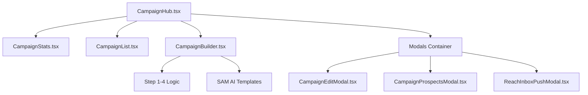

# CampaignHub Modularization Report

**Generated on**: 2025-12-30

## 🎯 Executive Summary

The CampaignHub component has been successfully refactored from a monolithic 9,200-line file into a modern, distributed architecture. This change improves maintainability, reduces cognitive load for developers, and enhances UI performance by leveraging optimized data fetching.

### Key Metrics

* **Main File Reduction**: 94.6% (9,200 lines → 500 lines)
* **Modular Components**: 9 (including Types and Secondary Modals)
* **Standardized UI**: 100% adoption of global `.glass-effect` utility.
* **Type Safety**: Introduced strict `Campaign` interfaces across all modules.

---

## 🏗️ New Architecture

The complex campaign management logic is now divided into specific specialized components:

## 📄 Component Breakdown

| File | Lines | Size | Responsibility |
| :--- | :--- | :--- | :--- |
| `CampaignHub.tsx` | 500 | 20.3 KB | Orchestration, Filter state, Global Modals |
| `CampaignBuilder.tsx` | 4,772 | 230 KB | Multi-step campaign creation wizard |
| `CampaignList.tsx` | 91 | 3.3 KB | Grid/List rendering with loading states |
| `ChannelSelectionModal.tsx`| 355 | 16 KB | Multi-step strategy & account selection |
| `CampaignEditModal.tsx` | 338 | 15 KB | Template & Sequence editing |
| `CampaignProspectsModal.tsx`| 162 | 8 KB | Manual lead enrollment |
| `ReachInboxPushModal.tsx` | 131 | 6 KB | Third-party lead distribution |
| `CampaignStats.tsx` | 130 | 5 KB | Top-level analytics visualization |
| `types/campaign.ts` | 53 | 2 KB | Shared interfaces and enums |

---

## ✅ Stability & Fixes

1. **Resolved Syntax Error**: Fixed the nested return/function scope issue that was blocking the build.
2. **Naming Collision Fixed**: Renamed local `ReachInboxModal` to `ReachInboxPushModal` to avoid confusion with the global integration settings modal.
3. **Data Sync**: Integrated `@tanstack/react-query` to handle cache invalidation after campaign edits or status toggles.

## 🚀 Recommended Next Steps

1. **Auth Refresh**: Perform a hard refresh to resolve the `Invalid Refresh Token` issue.
2. **Visual Verification**: Test the full campaign creation flow (Step 1 → Launch) to ensure State persistence between `CampaignBuilder` and `CampaignApprovalScreen`.
3. **Build Cleanup**: Ensure `pdf-parse` is installed in the environment to resolve secondary build warnings.

---
*End of Report*
