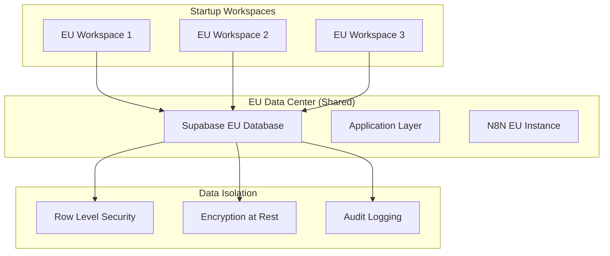
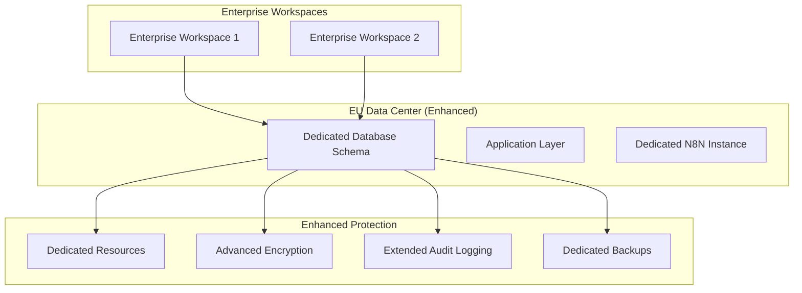

# SAM AI GDPR Compliance Strategy

**Version:** 1.0  
**Date:** September 2025  
**Status:** Design Phase

## 🎯 Overview

SAM AI implements a **comprehensive GDPR compliance framework** that balances cost-effective shared infrastructure for Startup tier customers with strict data separation requirements for SME/Enterprise clients, while ensuring full compliance with European data protection regulations.

**Core Compliance Principles:**
- **Data Minimization:** Collect only necessary data for legitimate business purposes
- **Purpose Limitation:** Process data only for specified, explicit purposes
- **Storage Limitation:** Retain data only as long as necessary
- **Data Subject Rights:** Full implementation of GDPR individual rights
- **Privacy by Design:** Built-in privacy protection from system architecture level

---

## 🏗️ Multi-Tier Compliance Architecture

### Startup Tier: Shared Infrastructure with RLS Isolation

**Target:** Self-service customers ($99/month)  
**Data Location:** EU region for EU customers, shared infrastructure  
**Compliance Level:** Standard GDPR compliance



**Key Features:**
- ✅ EU-region hosted infrastructure (Frankfurt/Ireland)
- ✅ Row Level Security (RLS) for tenant isolation
- ✅ Shared Unipile instances with workspace separation
- ✅ Encrypted data at rest and in transit
- ✅ Complete audit trail of data access
- ✅ Standard data retention policies (24 months)

### SME/Enterprise Tier: Enhanced Data Separation

**Target:** Managed customers ($399-$899/month)  
**Data Location:** Dedicated EU region with enhanced isolation  
**Compliance Level:** Enhanced GDPR with sector-specific requirements



**Key Features:**
- ✅ Dedicated database schemas per enterprise customer
- ✅ Separate Unipile instances per workspace
- ✅ Enhanced encryption with customer-managed keys
- ✅ Extended audit logging (7 years retention)
- ✅ Dedicated backup and disaster recovery
- ✅ Custom data retention policies

---

## 📊 Data Classification & Processing Framework

### Personal Data Categories

#### Category 1: Contact Information (High Sensitivity)
```sql
-- Examples of Category 1 data
contact_email VARCHAR(255),
contact_phone VARCHAR(50),
contact_linkedin_url TEXT,
contact_name VARCHAR(255)
```

**Processing Basis:** Legitimate Interest (B2B outreach)  
**Retention Period:** 24 months after last contact  
**Special Handling:** Encrypted at field level

#### Category 2: Professional Information (Medium Sensitivity)
```sql
-- Examples of Category 2 data  
company_name VARCHAR(255),
contact_title VARCHAR(255),
company_industry VARCHAR(100),
company_size VARCHAR(50)
```

**Processing Basis:** Legitimate Interest (Business prospecting)  
**Retention Period:** 36 months for approved prospects  
**Special Handling:** Standard encryption

#### Category 3: Behavioral Data (Medium Sensitivity)
```sql
-- Examples of Category 3 data
email_opened BOOLEAN,
email_replied BOOLEAN,
linkedin_viewed BOOLEAN,
last_engagement_date TIMESTAMP
```

**Processing Basis:** Legitimate Interest (Campaign optimization)  
**Retention Period:** 12 months after campaign completion  
**Special Handling:** Aggregated and anonymized after retention period

#### Category 4: System Metadata (Low Sensitivity)
```sql
-- Examples of Category 4 data
created_at TIMESTAMP,
updated_at TIMESTAMP,
data_source VARCHAR(100),
enrichment_status VARCHAR(50)
```

**Processing Basis:** Legitimate Interest (System operation)  
**Retention Period:** Indefinite (operational requirement)  
**Special Handling:** Standard storage

### Data Processing Lawful Bases

#### Legitimate Interest Assessment
**Primary Basis:** Article 6(1)(f) GDPR - Legitimate Interest

**Legitimate Interest Test:**
1. **Purpose Test:** B2B marketing and customer acquisition
2. **Necessity Test:** Contact data necessary for outreach effectiveness
3. **Balancing Test:** Business interests balanced against individual privacy rights

**Documentation:** Complete Legitimate Interest Assessment (LIA) documented per GDPR requirements

#### Consent Management (Optional Upgrade Path)
**Enhanced Basis:** Article 6(1)(a) GDPR - Consent

**Consent Requirements:**
- ✅ Freely given, specific, informed, unambiguous
- ✅ Granular consent for different processing purposes
- ✅ Easy withdrawal mechanism
- ✅ Consent renewal every 12 months

---

## 🔐 Technical Privacy Protection Measures

### Encryption Strategy

#### Data at Rest Encryption
```sql
-- Database-level encryption
CREATE TABLE prospects (
    id uuid PRIMARY KEY,
    workspace_id uuid REFERENCES workspaces(id),
    
    -- Encrypted fields using Supabase vault
    contact_email TEXT ENCRYPTED,
    contact_phone TEXT ENCRYPTED,
    contact_name TEXT ENCRYPTED,
    
    -- Standard encrypted fields
    company_name TEXT,
    contact_title TEXT,
    
    -- Metadata (not encrypted)
    created_at TIMESTAMP DEFAULT NOW(),
    data_source VARCHAR(100)
);
```

#### Data in Transit Protection
- ✅ TLS 1.3 for all API communications
- ✅ Certificate pinning for mobile applications
- ✅ End-to-end encryption for sensitive API payloads
- ✅ VPN requirements for administrative access

### Access Control Framework

#### Role-Based Access Control (RBAC)
```sql
-- GDPR-compliant access roles
CREATE TYPE user_role AS ENUM (
    'workspace_admin',     -- Full workspace data access
    'workspace_member',    -- Limited workspace data access
    'data_processor',      -- Processing operations only
    'data_controller',     -- Policy and compliance management
    'gdpr_officer'         -- Data protection oversight
);

-- RLS policy with GDPR compliance
CREATE POLICY gdpr_workspace_isolation ON prospects
    FOR ALL USING (
        workspace_id IN (
            SELECT workspace_id 
            FROM workspace_members 
            WHERE user_id = auth.uid()
            AND role IN ('workspace_admin', 'workspace_member')
        )
        AND 
        -- Additional GDPR checks
        NOT EXISTS (
            SELECT 1 FROM data_deletion_requests 
            WHERE prospect_id = prospects.id 
            AND status = 'pending'
        )
    );
```

#### Audit Logging Requirements
```sql
-- GDPR audit trail table
CREATE TABLE gdpr_audit_log (
    id uuid PRIMARY KEY DEFAULT gen_random_uuid(),
    workspace_id uuid REFERENCES workspaces(id),
    
    -- Data subject information
    data_subject_id uuid,
    data_subject_email TEXT,
    
    -- Access details
    user_id uuid REFERENCES auth.users(id),
    user_role user_role,
    
    -- Operation details
    operation_type TEXT, -- 'read', 'write', 'delete', 'export'
    table_name TEXT,
    record_id uuid,
    
    -- GDPR compliance fields
    processing_purpose TEXT,
    lawful_basis TEXT,
    data_categories TEXT[],
    
    -- Technical details
    ip_address INET,
    user_agent TEXT,
    api_endpoint TEXT,
    
    -- Timestamps
    created_at TIMESTAMP DEFAULT NOW()
);
```

---

## 🔄 Data Subject Rights Implementation

### Right of Access (Article 15)

#### Data Export API
```typescript
// API endpoint: /api/gdpr/data-export
export async function POST(request: NextRequest) {
  const { workspace_id, data_subject_email } = await request.json();
  
  // Comprehensive data collection
  const personalData = await collectPersonalData(workspace_id, data_subject_email);
  
  return {
    data_subject: data_subject_email,
    collection_date: new Date().toISOString(),
    data_categories: {
      contact_information: personalData.contacts,
      professional_information: personalData.professional,
      behavioral_data: personalData.behavioral,
      campaign_interactions: personalData.campaigns
    },
    processing_purposes: [
      "B2B marketing and outreach",
      "Customer relationship management", 
      "Campaign performance optimization"
    ],
    retention_periods: {
      contact_data: "24 months",
      behavioral_data: "12 months",
      campaign_data: "36 months"
    },
    third_parties: [
      "Unipile (messaging service)",
      "ReachInbox (email delivery)", 
      "N8N (workflow automation)"
    ]
  };
}
```

### Right to Rectification (Article 16)

#### Data Correction Workflow
```typescript
// API endpoint: /api/gdpr/data-correction
export async function POST(request: NextRequest) {
  const { workspace_id, data_subject_email, corrections } = await request.json();
  
  // Validate correction request
  const validationResult = await validateCorrectionRequest(corrections);
  
  if (validationResult.valid) {
    // Apply corrections with audit trail
    await applyDataCorrections(workspace_id, data_subject_email, corrections);
    
    // Notify all integrated systems
    await notifyIntegratedSystems(workspace_id, data_subject_email, corrections);
    
    // Log GDPR compliance action
    await logGDPRAction('rectification', workspace_id, data_subject_email);
  }
  
  return { status: 'corrected', applied_changes: corrections };
}
```

### Right to Erasure (Article 17)

#### Data Deletion Framework
```sql
-- Data deletion request tracking
CREATE TABLE data_deletion_requests (
    id uuid PRIMARY KEY DEFAULT gen_random_uuid(),
    workspace_id uuid REFERENCES workspaces(id),
    
    -- Request details
    data_subject_email TEXT NOT NULL,
    request_date TIMESTAMP DEFAULT NOW(),
    requested_by uuid REFERENCES auth.users(id),
    
    -- Processing status
    status TEXT DEFAULT 'pending' CHECK (status IN ('pending', 'processing', 'completed', 'rejected')),
    processed_at TIMESTAMP,
    processed_by uuid REFERENCES auth.users(id),
    
    -- Deletion scope
    deletion_scope JSONB, -- Which data categories to delete
    retention_override BOOLEAN DEFAULT FALSE, -- Legal retention requirements
    
    -- Audit trail
    deletion_confirmation TEXT, -- Proof of deletion
    third_party_notifications JSONB -- External system notifications
);

-- Cascading deletion function
CREATE OR REPLACE FUNCTION process_data_deletion(
    p_workspace_id uuid,
    p_data_subject_email text
) RETURNS void AS $$
BEGIN
    -- Delete from all tables containing personal data
    DELETE FROM prospect_interactions WHERE prospect_email = p_data_subject_email;
    DELETE FROM campaign_recipients WHERE recipient_email = p_data_subject_email;
    DELETE FROM email_engagement_tracking WHERE contact_email = p_data_subject_email;
    DELETE FROM linkedin_message_history WHERE contact_email = p_data_subject_email;
    DELETE FROM approved_prospects WHERE contact_email = p_data_subject_email;
    
    -- Anonymize retained data where legal retention applies
    UPDATE campaign_analytics 
    SET contact_email = 'anonymized@deleted.user',
        contact_name = 'Deleted User'
    WHERE contact_email = p_data_subject_email 
    AND retention_required = TRUE;
    
    -- Log deletion completion
    INSERT INTO gdpr_audit_log (
        workspace_id, operation_type, data_subject_email, 
        processing_purpose, created_at
    ) VALUES (
        p_workspace_id, 'erasure', p_data_subject_email,
        'GDPR Right to Erasure compliance', NOW()
    );
END;
$$ LANGUAGE plpgsql;
```

### Right to Data Portability (Article 20)

#### Structured Data Export
```typescript
// Export in machine-readable format
interface GDPRDataExport {
  metadata: {
    export_date: string;
    data_subject: string;
    workspace: string;
    format_version: string;
  };
  
  contacts: ContactData[];
  campaigns: CampaignInteraction[];
  preferences: UserPreferences;
  
  // Machine-readable format compliance
  format: 'JSON' | 'CSV' | 'XML';
  schema_url: string; // Link to data schema documentation
}
```

### Right to Object (Article 21)

#### Opt-out Management
```sql
-- Objection and opt-out tracking
CREATE TABLE data_processing_objections (
    id uuid PRIMARY KEY DEFAULT gen_random_uuid(),
    workspace_id uuid REFERENCES workspaces(id),
    
    -- Objection details
    data_subject_email TEXT NOT NULL,
    objection_date TIMESTAMP DEFAULT NOW(),
    objection_scope TEXT[], -- Which processing activities to stop
    
    -- Processing basis evaluation
    legitimate_interest_override BOOLEAN DEFAULT FALSE,
    override_justification TEXT,
    
    -- Status tracking
    status TEXT DEFAULT 'active' CHECK (status IN ('active', 'overridden', 'withdrawn')),
    reviewed_by uuid REFERENCES auth.users(id),
    review_date TIMESTAMP
);
```

---

## 🌍 Cross-Border Data Transfer Compliance

### Adequacy Decisions & Transfer Mechanisms

#### EU-UK Data Transfers
**Status:** UK Adequacy Decision (Valid until June 2025)  
**Mechanism:** Direct transfer permitted  
**Monitoring:** Ongoing adequacy status monitoring

#### EU-US Data Transfers  
**Status:** No adequacy decision  
**Mechanism:** Standard Contractual Clauses (SCCs) + Transfer Impact Assessments  
**Requirements:**
- ✅ EU Commission SCCs implemented
- ✅ Transfer Impact Assessment (TIA) completed
- ✅ US data processing agreement signed
- ✅ Technical and organizational measures documented

#### Data Localization Strategy
```yaml
# Regional data deployment strategy
regions:
  eu_customers:
    primary_region: "eu-central-1" # Frankfurt
    backup_region: "eu-west-1"    # Ireland
    data_residency: "eu_only"
    
  uk_customers:
    primary_region: "eu-west-2"   # London
    backup_region: "eu-central-1" # Frankfurt  
    data_residency: "uk_eu_only"
    
  us_customers:
    primary_region: "us-east-1"   # Virginia
    backup_region: "us-west-2"    # Oregon
    data_residency: "us_only"
```

### Cross-Border Transfer Documentation

#### Standard Contractual Clauses Implementation
```typescript
// SCC compliance tracking
interface SCCImplementation {
  contract_parties: {
    data_exporter: {
      name: "SAM AI GmbH";
      address: "Frankfurt, Germany";
      role: "data_controller";
    };
    data_importer: {
      name: "SAM AI Inc.";
      address: "Delaware, USA";
      role: "data_processor";
    };
  };
  
  scc_version: "2021/914"; // EU Commission SCCs
  signature_date: "2025-01-15";
  effective_date: "2025-02-01";
  
  transfer_categories: [
    "contact_information",
    "professional_data", 
    "engagement_metrics"
  ];
  
  technical_measures: [
    "encryption_in_transit_tls13",
    "encryption_at_rest_aes256",
    "access_logging",
    "regular_security_audits"
  ];
  
  organizational_measures: [
    "staff_training_gdpr",
    "incident_response_procedures",
    "data_breach_notification_procedures",
    "regular_compliance_audits"
  ];
}
```

---

## 📋 Data Retention & Deletion Policies

### Retention Schedule by Data Category

#### Contact Information (24 Month Retention)
```sql
-- Automated retention enforcement
CREATE OR REPLACE FUNCTION enforce_contact_retention()
RETURNS void AS $$
BEGIN
    -- Archive contacts older than 24 months
    INSERT INTO archived_contacts 
    SELECT * FROM approved_prospects 
    WHERE last_contact_date < NOW() - INTERVAL '24 months';
    
    -- Delete from active tables
    DELETE FROM approved_prospects 
    WHERE last_contact_date < NOW() - INTERVAL '24 months';
    
    -- Log retention action
    INSERT INTO gdpr_audit_log (operation_type, processing_purpose) 
    VALUES ('retention_enforcement', 'Automated data retention compliance');
END;
$$ LANGUAGE plpgsql;

-- Schedule retention enforcement
SELECT cron.schedule('contact-retention', '0 2 * * 0', 'SELECT enforce_contact_retention();');
```

#### Campaign Data (36 Month Retention)
```sql
-- Campaign data retention with legal hold exceptions
CREATE OR REPLACE FUNCTION enforce_campaign_retention()
RETURNS void AS $$
BEGIN
    -- Check for legal holds before deletion
    DELETE FROM campaign_executions 
    WHERE completed_at < NOW() - INTERVAL '36 months'
    AND NOT EXISTS (
        SELECT 1 FROM legal_holds 
        WHERE table_name = 'campaign_executions' 
        AND record_id = campaign_executions.id
        AND status = 'active'
    );
END;
$$ LANGUAGE plpgsql;
```

#### Behavioral Data (12 Month Retention)
```sql
-- Behavioral data anonymization
CREATE OR REPLACE FUNCTION anonymize_behavioral_data()
RETURNS void AS $$
BEGIN
    -- Anonymize instead of delete for analytics
    UPDATE email_engagement_tracking 
    SET contact_email = 'anonymized@' || EXTRACT(YEAR FROM created_at) || '.user',
        contact_name = NULL
    WHERE created_at < NOW() - INTERVAL '12 months';
END;
$$ LANGUAGE plpgsql;
```

---

## 🚨 Data Breach Response Framework

### Incident Classification & Response

#### Breach Severity Levels
```typescript
enum BreachSeverity {
  LOW = "low",       // Technical breach, no personal data exposure
  MEDIUM = "medium", // Limited personal data exposure, low risk
  HIGH = "high",     // Significant personal data exposure
  CRITICAL = "critical" // Large-scale exposure, high risk to individuals
}

interface DataBreachReport {
  incident_id: string;
  severity: BreachSeverity;
  
  // Discovery details
  discovered_at: Date;
  discovered_by: string;
  discovery_method: string;
  
  // Breach details
  affected_data_categories: string[];
  affected_individuals_count: number;
  affected_workspaces: string[];
  
  // Response actions
  containment_actions: string[];
  containment_completed_at?: Date;
  
  // Notification requirements
  supervisory_authority_notification_required: boolean;
  individual_notification_required: boolean;
  notification_deadline: Date;
  
  // Impact assessment
  risk_to_individuals: 'low' | 'medium' | 'high';
  mitigation_measures: string[];
}
```

#### 72-Hour Notification Compliance
```typescript
// Automated breach notification system
export async function processDataBreach(breach: DataBreachReport) {
  // Immediate containment
  await containmentActions(breach);
  
  // Risk assessment
  const riskAssessment = await assessBreachRisk(breach);
  
  // Supervisory authority notification (72 hours)
  if (breach.supervisory_authority_notification_required) {
    await scheduleAuthorityNotification(breach, riskAssessment);
  }
  
  // Individual notification (without undue delay if high risk)
  if (breach.individual_notification_required) {
    await scheduleIndividualNotifications(breach, riskAssessment);
  }
  
  // Internal documentation
  await documentBreachResponse(breach, riskAssessment);
}
```

---

## 📊 Compliance Monitoring & Auditing

### Automated Compliance Checks

#### Daily Compliance Monitoring
```sql
-- Daily GDPR compliance check function
CREATE OR REPLACE FUNCTION daily_gdpr_compliance_check()
RETURNS TABLE(check_name TEXT, status TEXT, details JSONB) AS $$
BEGIN
    RETURN QUERY
    
    -- Check 1: Data retention compliance
    SELECT 
        'data_retention'::TEXT,
        CASE WHEN COUNT(*) = 0 THEN 'PASS' ELSE 'FAIL' END::TEXT,
        jsonb_build_object('overdue_records', COUNT(*))
    FROM approved_prospects 
    WHERE last_contact_date < NOW() - INTERVAL '24 months'
    
    UNION ALL
    
    -- Check 2: Deletion request processing
    SELECT 
        'deletion_requests'::TEXT,
        CASE WHEN COUNT(*) = 0 THEN 'PASS' ELSE 'FAIL' END::TEXT,
        jsonb_build_object('pending_requests', COUNT(*))
    FROM data_deletion_requests 
    WHERE status = 'pending' AND request_date < NOW() - INTERVAL '30 days'
    
    UNION ALL
    
    -- Check 3: Consent expiry monitoring
    SELECT 
        'consent_renewal'::TEXT,
        CASE WHEN COUNT(*) = 0 THEN 'PASS' ELSE 'WARNING' END::TEXT,
        jsonb_build_object('expiring_consent', COUNT(*))
    FROM workspace_members wm
    JOIN user_consent uc ON wm.user_id = uc.user_id
    WHERE uc.expires_at < NOW() + INTERVAL '30 days';
    
END;
$$ LANGUAGE plpgsql;
```

#### Weekly Compliance Reports
```typescript
// Automated compliance reporting
interface WeeklyComplianceReport {
  reporting_period: {
    start_date: string;
    end_date: string;
  };
  
  data_processing_summary: {
    total_data_subjects: number;
    new_data_subjects: number;
    deleted_data_subjects: number;
  };
  
  rights_requests: {
    access_requests: number;
    rectification_requests: number;
    erasure_requests: number;
    portability_requests: number;
    objection_requests: number;
  };
  
  compliance_violations: {
    retention_violations: number;
    access_violations: number;
    security_violations: number;
  };
  
  risk_assessment: {
    overall_risk_level: 'low' | 'medium' | 'high';
    key_risks: string[];
    mitigation_actions: string[];
  };
}
```

---

## 🛡️ Security & Technical Measures

### Encryption Standards

#### Database Encryption
```sql
-- Field-level encryption for sensitive data
CREATE EXTENSION IF NOT EXISTS pg_crypto;

-- Encrypted contact information
CREATE TABLE encrypted_contacts (
    id uuid PRIMARY KEY DEFAULT gen_random_uuid(),
    workspace_id uuid REFERENCES workspaces(id),
    
    -- Encrypted fields
    contact_email_encrypted BYTEA, -- AES-256 encrypted
    contact_phone_encrypted BYTEA,
    contact_name_encrypted BYTEA,
    
    -- Encryption metadata
    encryption_key_id TEXT NOT NULL,
    encryption_algorithm TEXT DEFAULT 'AES-256-GCM',
    encrypted_at TIMESTAMP DEFAULT NOW(),
    
    -- Non-encrypted fields
    company_name TEXT,
    contact_title TEXT,
    created_at TIMESTAMP DEFAULT NOW()
);

-- Encryption function
CREATE OR REPLACE FUNCTION encrypt_contact_data(
    plaintext TEXT,
    key_id TEXT
) RETURNS BYTEA AS $$
DECLARE
    encryption_key BYTEA;
BEGIN
    -- Retrieve encryption key from secure key vault
    SELECT key_data INTO encryption_key 
    FROM encryption_keys 
    WHERE id = key_id AND status = 'active';
    
    -- Encrypt using AES-256-GCM
    RETURN pgp_sym_encrypt(plaintext, encryption_key);
END;
$$ LANGUAGE plpgsql SECURITY DEFINER;
```

#### API Security
```typescript
// GDPR-compliant API security middleware
export function gdprSecurityMiddleware(req: NextRequest, res: NextResponse) {
  // Rate limiting for data access
  const rateLimit = rateLimit({
    windowMs: 15 * 60 * 1000, // 15 minutes
    max: 100, // limit each IP to 100 requests per windowMs
    message: 'Rate limit exceeded for data access'
  });
  
  // Enhanced logging for GDPR compliance
  logGDPRAccess({
    user_id: req.user?.id,
    ip_address: req.ip,
    endpoint: req.url,
    data_accessed: extractDataCategories(req),
    processing_purpose: extractProcessingPurpose(req),
    timestamp: new Date()
  });
  
  // Data access authorization
  if (!hasValidGDPRPermissions(req.user, req.params.workspace_id)) {
    return NextResponse.json(
      { error: 'Insufficient GDPR permissions' }, 
      { status: 403 }
    );
  }
}
```

---

## 📈 Performance & Scalability Considerations

### GDPR-Compliant Performance Optimization

#### Efficient Data Deletion
```sql
-- Partitioned tables for efficient deletion
CREATE TABLE prospect_interactions (
    id uuid DEFAULT gen_random_uuid(),
    workspace_id uuid,
    contact_email TEXT,
    interaction_date DATE,
    interaction_type TEXT,
    
    PRIMARY KEY (id, interaction_date)
) PARTITION BY RANGE (interaction_date);

-- Monthly partitions for efficient retention enforcement
CREATE TABLE prospect_interactions_2025_01 PARTITION OF prospect_interactions
    FOR VALUES FROM ('2025-01-01') TO ('2025-02-01');

-- Efficient partition dropping for retention
DROP TABLE prospect_interactions_2023_01; -- Instant deletion of old data
```

#### Caching Strategy with Privacy Protection
```typescript
// GDPR-compliant caching
class GDPRCache {
  private sensitiveDataTTL = 300; // 5 minutes for personal data
  private anonymizedDataTTL = 3600; // 1 hour for anonymized data
  
  async cacheData(key: string, data: any, category: DataCategory) {
    const ttl = this.getTTLByCategory(category);
    
    // Never cache if deletion request pending
    if (await this.hasPendingDeletionRequest(data.contact_email)) {
      return; // Don't cache
    }
    
    // Anonymize cached data if required
    const cacheData = this.anonymizeForCache(data, category);
    
    await this.redis.setex(key, ttl, JSON.stringify(cacheData));
  }
  
  private anonymizeForCache(data: any, category: DataCategory): any {
    if (category === DataCategory.PERSONAL) {
      return {
        ...data,
        contact_email: this.hashEmail(data.contact_email),
        contact_name: null, // Remove from cache
        contact_phone: null
      };
    }
    return data;
  }
}
```

---

## 🎯 Success Metrics & KPIs

### Compliance Metrics

#### Operational Metrics
- **Data Subject Request Response Time:** <30 days (GDPR requirement)
- **Breach Notification Compliance:** 100% within 72 hours
- **Data Retention Compliance:** 99.9% automated enforcement
- **Access Request Accuracy:** >99% complete data export

#### Risk Metrics
- **Privacy Impact Assessment Coverage:** 100% of high-risk processing
- **Staff GDPR Training Completion:** 100% annual completion
- **Third-Party DPA Coverage:** 100% of data processors
- **Audit Findings Remediation:** <30 days average resolution

#### Business Metrics
- **Customer Trust Score:** >4.8/5 for data handling
- **Compliance Cost per Customer:** <€10/month
- **Data Portability Success Rate:** >99% successful exports
- **Customer Data Deletion Rate:** <2% annual churn due to privacy concerns

---

## 🚀 Implementation Roadmap

### Phase 1: Foundation (Weeks 1-2)
- ✅ Database schema with RLS policies
- ✅ Basic encryption implementation
- ✅ Audit logging system
- 🔄 Data retention automation
- 🔄 Cross-border transfer documentation

### Phase 2: Rights Implementation (Weeks 3-4)
- 🔄 Data access API endpoints
- 🔄 Deletion request processing
- 🔄 Data correction workflows
- 🔄 Opt-out management system

### Phase 3: Advanced Features (Weeks 5-6)
- 🔄 Automated compliance monitoring
- 🔄 Breach response automation
- 🔄 Advanced encryption (customer-managed keys)
- 🔄 Cross-region data synchronization

### Phase 4: Testing & Certification (Weeks 7-8)
- 🔄 Third-party GDPR audit
- 🔄 Penetration testing with privacy focus
- 🔄 Load testing of deletion systems
- 🔄 Documentation finalization and certification

---

This GDPR compliance strategy ensures SAM AI meets all European data protection requirements while maintaining operational efficiency and cost-effectiveness across different service tiers. The approach balances strict privacy protection with business scalability requirements.