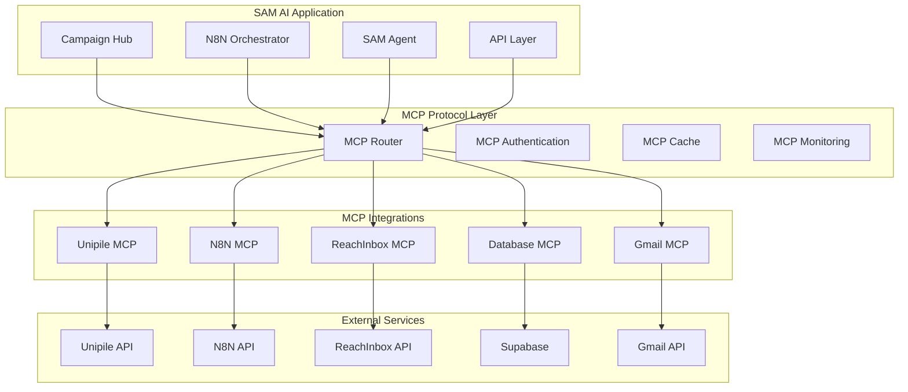

# SAM AI MCP Integration Strategy

**Version:** 1.0  
**Date:** September 2025  
**Status:** Implementation Phase

## 🎯 Overview

SAM AI leverages **Model Context Protocol (MCP)** as the primary integration standard for connecting external services, ensuring consistent, reliable, and maintainable integrations across the entire platform.

**Core MCP Philosophy:**
- **Universal Connectivity:** Single protocol for all external integrations
- **Standardized Interface:** Consistent API patterns across services
- **Enhanced Reliability:** Built-in error handling and retry mechanisms
- **Simplified Maintenance:** Centralized integration management

---

## 🏗️ MCP Architecture Overview



---

## 🔌 Current MCP Integrations

### 1. Unipile MCP (✅ Available)

**Purpose:** LinkedIn and email messaging through Unipile  
**Status:** Production Ready  
**Features:**
- Get connected accounts
- Send LinkedIn messages
- Send emails  
- Retrieve message history
- Monitor replies

**Usage Example:**
```typescript
import { mcp__unipile__unipile_get_accounts } from '@/lib/mcp';

// Get all connected accounts for a workspace
const accounts = await mcp__unipile__unipile_get_accounts();

// Get recent messages from specific account
const messages = await mcp__unipile__unipile_get_recent_messages({
  account_id: "linkedin_account_123",
  batch_size: 50
});
```

**Integration Points:**
- ✅ Campaign Hub → Unipile account validation
- ✅ N8N → Message sending
- ✅ SAM Agent → Reply monitoring
- ✅ HITL System → Reply processing

### 2. Database MCP (🔄 Custom Implementation Needed)

**Purpose:** Standardized database operations  
**Status:** Design Phase  
**Planned Features:**
- Workspace-scoped queries
- RLS-aware operations
- Transaction management
- Audit logging

**Proposed Interface:**
```typescript
interface DatabaseMCP {
  // Workspace-aware query execution
  query(sql: string, params: any[], workspace_id: string): Promise<any[]>;
  
  // Campaign data operations
  getCampaignConfig(campaign_id: string): Promise<CampaignConfig>;
  updateCampaignStatus(campaign_id: string, status: string): Promise<void>;
  
  // Prospect data operations
  getApprovedProspects(workspace_id: string, filters?: any): Promise<Prospect[]>;
  
  // Integration configurations
  getWorkspaceIntegrations(workspace_id: string): Promise<IntegrationConfig>;
}
```

### 3. N8N MCP (🔄 Custom Implementation Needed)

**Purpose:** N8N workflow management and execution  
**Status:** Design Phase  
**Planned Features:**
- Campaign workflow triggering
- Execution status monitoring
- Dynamic workflow configuration
- Error handling and recovery

**Proposed Interface:**
```typescript
interface N8NMCP {
  // Workflow execution
  triggerCampaign(payload: CampaignPayload): Promise<ExecutionResult>;
  getExecutionStatus(execution_id: string): Promise<ExecutionStatus>;
  
  // Workflow management
  deployWorkflow(template: WorkflowTemplate): Promise<WorkflowDeployment>;
  updateWorkflowConfig(workflow_id: string, config: any): Promise<void>;
  
  // Monitoring
  getWorkflowHealth(): Promise<HealthStatus>;
  getExecutionLogs(execution_id: string): Promise<LogEntry[]>;
}
```

### 4. ReachInbox MCP (🔄 Custom Implementation Needed)

**Purpose:** High-volume email delivery for SME/Enterprise tiers  
**Status:** Design Phase  
**Planned Features:**
- Email campaign launching
- Delivery status tracking
- Domain/account management
- Rate limit enforcement

**Proposed Interface:**
```typescript
interface ReachInboxMCP {
  // Email operations
  sendEmail(email: EmailPayload): Promise<SendResult>;
  sendBulkEmails(emails: EmailPayload[]): Promise<BulkSendResult>;
  
  // Account management
  getEmailAccounts(workspace_id: string): Promise<EmailAccount[]>;
  validateDomainSetup(domain: string): Promise<DomainStatus>;
  
  // Monitoring
  getDeliveryStats(campaign_id: string): Promise<DeliveryStats>;
  getRateLimitStatus(account_id: string): Promise<RateLimitStatus>;
}
```

### 5. Gmail MCP (🔄 Custom Implementation Needed)

**Purpose:** Central reply inbox monitoring  
**Status:** Design Phase  
**Planned Features:**
- Reply monitoring and classification
- Thread management
- Auto-forwarding setup
- Integration with HITL system

**Proposed Interface:**
```typescript
interface GmailMCP {
  // Reply monitoring
  getNewReplies(since: Date): Promise<EmailReply[]>;
  classifyReply(email: EmailReply): Promise<ReplyClassification>;
  
  // Thread management
  getEmailThread(thread_id: string): Promise<EmailThread>;
  markAsProcessed(email_id: string): Promise<void>;
  
  // Setup and configuration
  setupForwarding(workspace_id: string, gmail_address: string): Promise<void>;
  validateInboxAccess(gmail_address: string): Promise<boolean>;
}
```

---

## 🏃‍♂️ MCP Implementation Roadmap

### Phase 1: Core Database MCP (Week 1)
**Priority:** Critical - Foundation for all operations

**Tasks:**
- [x] Design Database MCP interface
- [ ] Implement workspace-scoped query wrapper
- [ ] Add RLS validation layer
- [ ] Create audit logging integration
- [ ] Build connection pooling management

**Deliverables:**
- `@/lib/mcp/database.ts` - Database MCP implementation
- Unit tests for all database operations
- Integration tests with existing queries

### Phase 2: N8N Workflow MCP (Week 2)
**Priority:** High - Required for campaign orchestration

**Tasks:**
- [x] Design N8N MCP interface
- [ ] Implement webhook triggering
- [ ] Add execution status monitoring
- [ ] Create error handling and retry logic
- [ ] Build workflow template management

**Deliverables:**
- `@/lib/mcp/n8n.ts` - N8N MCP implementation
- Campaign launch integration
- Real-time status updates

### Phase 3: ReachInbox MCP (Week 3)
**Priority:** Medium - SME/Enterprise tier requirement

**Tasks:**
- [x] Design ReachInbox MCP interface
- [ ] Implement email sending operations
- [ ] Add delivery tracking
- [ ] Create rate limit management
- [ ] Build account validation

**Deliverables:**
- `@/lib/mcp/reachinbox.ts` - ReachInbox MCP implementation
- Integration with enterprise campaigns
- Delivery analytics dashboard

### Phase 4: Gmail MCP (Week 4)
**Priority:** Medium - Reply management system

**Tasks:**
- [x] Design Gmail MCP interface
- [ ] Implement reply monitoring
- [ ] Add classification algorithms
- [ ] Create HITL integration
- [ ] Build forwarding automation

**Deliverables:**
- `@/lib/mcp/gmail.ts` - Gmail MCP implementation
- Reply processing automation
- HITL workflow integration

---

## 🔧 MCP Implementation Standards

### Authentication Strategy

**Unified Authentication Pattern:**
```typescript
interface MCPAuthentication {
  // Workspace-scoped authentication
  authenticate(workspace_id: string, service: string): Promise<AuthToken>;
  
  // Token refresh and validation
  refreshToken(service: string, refresh_token: string): Promise<AuthToken>;
  validateToken(service: string, token: string): Promise<boolean>;
  
  // Multi-tenant token management
  getServiceCredentials(workspace_id: string, service: string): Promise<Credentials>;
}
```

**Security Requirements:**
- ✅ Workspace-scoped token isolation
- ✅ Encrypted credential storage
- ✅ Automatic token refresh
- ✅ Audit trail for all authentications

### Error Handling Standards

**Consistent Error Interface:**
```typescript
interface MCPError {
  code: string;              // Standardized error code
  message: string;           // Human-readable message
  service: string;           // Which MCP service failed
  workspace_id?: string;     // Tenant context
  retry_after?: number;      // Rate limit recovery time
  details?: any;             // Service-specific error details
}
```

**Error Categories:**
- `AUTHENTICATION_FAILED` - Invalid or expired credentials
- `RATE_LIMIT_EXCEEDED` - Service rate limits hit
- `WORKSPACE_NOT_FOUND` - Invalid workspace context
- `SERVICE_UNAVAILABLE` - External service down
- `VALIDATION_ERROR` - Invalid input parameters

### Monitoring & Observability

**MCP Metrics Collection:**
```typescript
interface MCPMetrics {
  // Performance metrics
  request_duration: number;
  request_count: number;
  error_rate: number;
  
  // Service health
  service_availability: number;
  last_successful_request: Date;
  
  // Workspace usage
  workspace_id: string;
  operation_type: string;
  data_volume: number;
}
```

**Monitoring Dashboard:**
- Real-time MCP service health
- Per-workspace usage analytics
- Error rate tracking and alerting
- Performance bottleneck identification

---

## 🔄 MCP Usage Patterns

### Campaign Launch Flow

```typescript
// Example: Launch campaign using multiple MCP services
async function launchCampaign(campaign_config: CampaignConfig) {
  try {
    // 1. Validate workspace integrations via Database MCP
    const integrations = await DatabaseMCP.getWorkspaceIntegrations(
      campaign_config.workspace_id
    );
    
    // 2. Get prospect data via Database MCP
    const prospects = await DatabaseMCP.getApprovedProspects(
      campaign_config.workspace_id,
      campaign_config.target_criteria
    );
    
    // 3. Validate Unipile accounts via Unipile MCP
    const accounts = await UnipileMCP.getAccounts();
    
    // 4. Trigger N8N workflow via N8N MCP
    const execution = await N8NMCP.triggerCampaign({
      ...campaign_config,
      prospects,
      integrations,
      accounts
    });
    
    // 5. Update campaign status via Database MCP
    await DatabaseMCP.updateCampaignStatus(
      campaign_config.id,
      'running'
    );
    
    return execution;
    
  } catch (error) {
    // Standardized error handling across all MCP services
    throw new MCPError({
      code: 'CAMPAIGN_LAUNCH_FAILED',
      message: `Failed to launch campaign: ${error.message}`,
      service: error.service || 'unknown',
      workspace_id: campaign_config.workspace_id,
      details: error
    });
  }
}
```

### Reply Processing Flow

```typescript
// Example: Process incoming replies using multiple MCP services
async function processReplies() {
  try {
    // 1. Get new replies from Gmail MCP
    const replies = await GmailMCP.getNewReplies(
      new Date(Date.now() - 300000) // Last 5 minutes
    );
    
    // 2. Process each reply
    for (const reply of replies) {
      // Classify reply intent
      const classification = await GmailMCP.classifyReply(reply);
      
      // Get campaign context via Database MCP
      const campaign_context = await DatabaseMCP.getCampaignContext(
        reply.thread_id
      );
      
      // Generate SAM response
      const sam_response = await SAMAgent.generateReply(
        reply,
        classification,
        campaign_context
      );
      
      // Submit for HITL approval via Database MCP
      await DatabaseMCP.createHITLSession({
        original_message: reply,
        suggested_response: sam_response,
        workspace_id: campaign_context.workspace_id
      });
      
      // Mark as processed
      await GmailMCP.markAsProcessed(reply.id);
    }
    
  } catch (error) {
    // Centralized error handling
    console.error('Reply processing failed:', error);
    throw error;
  }
}
```

---

## 📊 Performance Optimization

### Connection Pooling

**Database MCP Pooling:**
```typescript
class DatabaseMCPPool {
  private pool: Map<string, Connection> = new Map();
  
  async getConnection(workspace_id: string): Promise<Connection> {
    const key = `${workspace_id}`;
    
    if (!this.pool.has(key)) {
      const connection = await this.createConnection(workspace_id);
      this.pool.set(key, connection);
    }
    
    return this.pool.get(key)!;
  }
}
```

### Response Caching

**MCP Response Caching Strategy:**
```typescript
interface MCPCache {
  // Cache frequently accessed data
  get<T>(key: string): Promise<T | null>;
  set<T>(key: string, value: T, ttl?: number): Promise<void>;
  
  // Workspace-specific caching
  getWorkspaceData<T>(workspace_id: string, key: string): Promise<T | null>;
  invalidateWorkspace(workspace_id: string): Promise<void>;
}
```

**Caching Policies:**
- **Workspace configurations:** 15 minutes TTL
- **Integration status:** 5 minutes TTL
- **Rate limit status:** 1 minute TTL
- **Campaign configurations:** 30 minutes TTL

### Batch Operations

**Bulk Operation Support:**
```typescript
// Batch multiple operations for efficiency
interface MCPBatchOperation {
  operations: MCPOperation[];
  workspace_id: string;
  timeout?: number;
}

// Example: Batch prospect data fetching
const batch_results = await DatabaseMCP.executeBatch([
  { type: 'getProspects', params: { workspace_id, status: 'approved' } },
  { type: 'getCampaignConfig', params: { campaign_id } },
  { type: 'getIntegrations', params: { workspace_id } }
]);
```

---

## 🚀 Deployment & Configuration

### Environment Configuration

**MCP Service Configuration:**
```bash
# Core MCP Settings
MCP_ROUTER_URL=https://mcp.samai.com
MCP_AUTH_TOKEN=<secure_token>
MCP_TIMEOUT=30000
MCP_RETRY_ATTEMPTS=3

# Service-Specific MCP Endpoints
UNIPILE_MCP_ENDPOINT=https://unipile-mcp.samai.com
N8N_MCP_ENDPOINT=https://n8n-mcp.samai.com
REACHINBOX_MCP_ENDPOINT=https://reachinbox-mcp.samai.com
GMAIL_MCP_ENDPOINT=https://gmail-mcp.samai.com

# Database MCP Settings
DATABASE_MCP_POOL_SIZE=20
DATABASE_MCP_TIMEOUT=10000
```

### Health Monitoring

**MCP Health Check Endpoints:**
- `/health/mcp/all` - Overall MCP system health
- `/health/mcp/unipile` - Unipile MCP status
- `/health/mcp/database` - Database MCP status
- `/health/mcp/n8n` - N8N MCP status

**Health Check Response:**
```json
{
  "status": "healthy",
  "services": {
    "unipile": { "status": "healthy", "response_time": 45 },
    "database": { "status": "healthy", "response_time": 12 },
    "n8n": { "status": "degraded", "response_time": 3400 }
  },
  "overall_health": 95.5
}
```

---

## 🎯 Success Metrics

### Technical Metrics
- **MCP Availability:** >99.9% uptime
- **Response Time:** <100ms average
- **Error Rate:** <0.1% of all operations
- **Cache Hit Rate:** >80% for cached operations

### Integration Metrics
- **Service Coverage:** 100% external integrations via MCP
- **Maintenance Overhead:** <2 hours/month per integration
- **Debug Time:** <15 minutes average issue resolution
- **Deployment Speed:** <5 minutes for MCP updates

This MCP integration strategy ensures SAM AI maintains consistent, reliable, and scalable connections to all external services while providing a unified development experience.