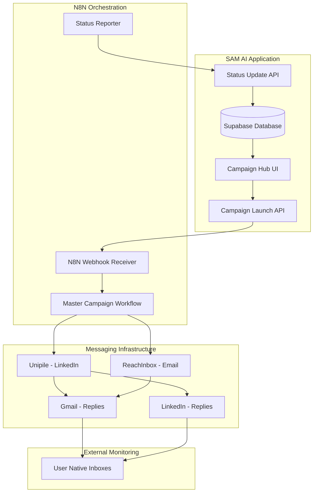
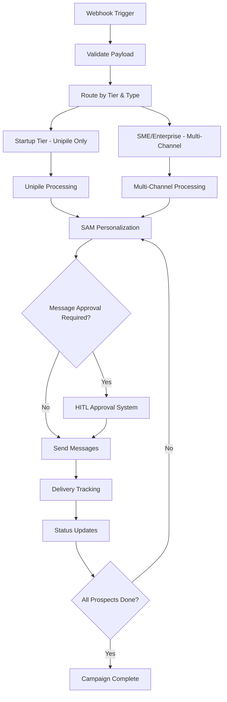
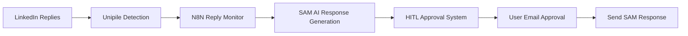
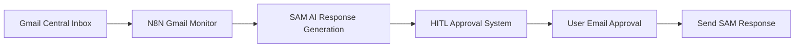

# N8N ↔ Campaign Hub Integration Flow

**Version:** 1.0  
**Date:** September 2025  
**Status:** Design Phase

## 🎯 Overview

This document details the **bidirectional integration flow** between N8N workflow automation and SAM AI's Campaign Hub. The integration enables seamless campaign orchestration with real-time status updates, while allowing users to monitor replies in their native LinkedIn and Gmail inboxes.

**Core Integration Principles:**
- **Single N8N master funnel** serves all tenants with workspace isolation
- **Real-time bidirectional communication** between N8N and Campaign Hub
- **Native reply monitoring** - users handle replies in LinkedIn/Gmail directly
- **No in-app reply interface needed** - simplified architecture
- **Comprehensive status tracking** and progress reporting

---

## 🏗️ Integration Architecture Overview



---

## 🚀 Campaign Launch Flow (Campaign Hub → N8N)

### 1. Campaign Configuration in Campaign Hub

```typescript
// Campaign configuration payload
interface CampaignConfig {
  // Basic campaign details
  campaignName: string;
  campaignType: 'email_only' | 'linkedin_only' | 'multi_channel';
  description?: string;
  
  // Target audience
  targetAudience: {
    prospectIds: string[];
    criteria?: {
      industries?: string[];
      titles?: string[];
      companySize?: string[];
      regions?: string[];
    };
  };
  
  // Messaging configuration
  messagingTemplates: {
    emailSubject?: string;
    emailBody?: string;
    linkedinMessage?: string;
    followUpSequence?: MessageTemplate[];
  };
  
  // Campaign settings
  launchImmediately: boolean;
  requireMessageApproval: boolean;
  dailySendLimit?: number;
  timeZone: string;
  sendingSchedule?: {
    startTime: string; // "09:00"
    endTime: string;   // "17:00"
    workingDays: string[]; // ["monday", "tuesday", ...]
  };
}
```

### 2. Campaign Launch API Processing

```typescript
// /app/api/campaign/launch/route.ts
export async function POST(request: NextRequest) {
  const campaignConfig = await request.json();
  
  // 1. Validate workspace and tier
  const workspaceTier = await getWorkspaceTier(workspaceId);
  
  // 2. Get integration configurations
  const integrations = await getIntegrationConfigs(workspaceId, workspaceTier);
  
  // 3. Fetch prospect data
  const prospects = await getProspectData(campaignConfig.targetAudience);
  
  // 4. Get knowledge base for personalization
  const knowledgeBase = await getKnowledgeBase(workspaceId);
  
  // 5. Create N8N payload
  const n8nPayload = {
    workspace_id: workspaceId,
    campaign_execution_id: campaignExecutionId,
    campaign: campaignConfig,
    prospects: prospects,
    integrations: integrations,
    knowledge_base: knowledgeBase,
    callbacks: {
      status_update: `${APP_URL}/api/campaign/status-update`,
      completion: `${APP_URL}/api/campaign/completion`
    }
  };
  
  // 6. Send to N8N webhook
  const n8nResponse = await fetch(N8N_WEBHOOK_URL, {
    method: 'POST',
    headers: {
      'Content-Type': 'application/json',
      'Authorization': `Bearer ${N8N_API_KEY}`
    },
    body: JSON.stringify(n8nPayload)
  });
  
  return { campaign_execution_id, status: 'launched' };
}
```

### 3. N8N Webhook Processing

```javascript
// N8N Webhook Node - Campaign Launch Receiver
{
  "webhook_path": "/campaign/launch",
  "method": "POST",
  "authentication": "bearer",
  "response_mode": "sync"
}

// N8N Workflow Processing Steps:
// 1. Validate workspace and campaign data
// 2. Route to appropriate messaging service (Unipile/ReachInbox)
// 3. Initialize campaign execution tracking
// 4. Begin prospect processing loop
// 5. Send status updates back to Campaign Hub
```

---

## 📊 Real-Time Status Updates (N8N → Campaign Hub)

### Status Update Types

```typescript
interface CampaignStatusUpdate {
  campaign_execution_id: string;
  workspace_id: string;
  update_type: 'progress' | 'completion' | 'error' | 'pause' | 'resume';
  timestamp: string;
  
  // Progress updates
  progress?: {
    prospects_processed: number;
    total_prospects: number;
    messages_sent: number;
    current_stage: string;
    estimated_completion: string;
  };
  
  // Channel-specific metrics
  channel_metrics?: {
    linkedin: {
      sent: number;
      delivered: number;
      connection_requests: number;
    };
    email: {
      sent: number;
      delivered: number;
      bounced: number;
    };
  };
  
  // Error information
  error?: {
    error_code: string;
    error_message: string;
    affected_prospects: string[];
    retry_possible: boolean;
  };
  
  // Completion data
  completion?: {
    status: 'completed' | 'failed' | 'cancelled';
    final_metrics: CampaignMetrics;
    execution_summary: string;
  };
}
```

### Status Update API Endpoint

```typescript
// /app/api/campaign/status-update/route.ts
export async function POST(request: NextRequest) {
  const statusUpdate: CampaignStatusUpdate = await request.json();
  
  // Validate the update source (N8N authentication)
  if (!validateN8NAuthentication(request)) {
    return NextResponse.json({ error: 'Unauthorized' }, { status: 401 });
  }
  
  // Update campaign execution record
  await supabase
    .from('n8n_campaign_executions')
    .update({
      execution_status: statusUpdate.update_type,
      prospects_processed: statusUpdate.progress?.prospects_processed,
      messages_sent: statusUpdate.progress?.messages_sent,
      linkedin_sent: statusUpdate.channel_metrics?.linkedin?.sent,
      email_sent: statusUpdate.channel_metrics?.email?.sent,
      error_message: statusUpdate.error?.error_message,
      updated_at: new Date().toISOString()
    })
    .eq('id', statusUpdate.campaign_execution_id);
  
  // Real-time UI updates via Supabase realtime
  await broadcastStatusUpdate(statusUpdate);
  
  return NextResponse.json({ status: 'updated' });
}
```

---

## 🔄 Campaign Execution Workflow in N8N

### Master N8N Workflow Structure



### N8N Workflow Nodes Configuration

#### 1. Webhook Trigger Node
```json
{
  "node_type": "webhook",
  "settings": {
    "path": "campaign-launch",
    "method": "POST",
    "authentication": "bearer_token",
    "response_mode": "sync"
  }
}
```

#### 2. Workspace Routing Node
```javascript
// JavaScript Code Node
const { workspace_id, campaign, integrations } = $input.all()[0].json;

// Determine routing based on tier
const tier = integrations.tier;
const campaignType = campaign.type;

if (tier === 'startup') {
  // Route to Unipile-only processing
  return [{
    json: {
      route: 'unipile_only',
      ...input
    }
  }];
} else {
  // Route to multi-channel processing
  return [{
    json: {
      route: 'multi_channel',
      ...input
    }
  }];
}
```

#### 3. SAM Personalization Node
```javascript
// SAM AI Integration Node
const prospects = $input.all()[0].json.prospects;
const knowledgeBase = $input.all()[0].json.knowledge_base;
const messageTemplates = $input.all()[0].json.campaign.messagingTemplates;

const personalizedMessages = [];

for (const prospect of prospects) {
  // Call SAM AI API for personalization
  const personalizedMessage = await $http.request({
    method: 'POST',
    url: 'https://api.samai.com/v1/personalize',
    headers: {
      'Authorization': `Bearer ${SAM_API_KEY}`,
      'Content-Type': 'application/json'
    },
    body: {
      prospect: prospect,
      template: messageTemplates,
      knowledge_base: knowledgeBase,
      personalization_level: 'high'
    }
  });
  
  personalizedMessages.push({
    prospect_id: prospect.id,
    personalized_content: personalizedMessage.data
  });
}

return [{ json: { personalized_messages: personalizedMessages } }];
```

#### 4. Message Delivery Node (Unipile)
```javascript
// Unipile Integration Node
const messages = $input.all()[0].json.personalized_messages;
const integrations = $input.all()[0].json.integrations;

const deliveryResults = [];

for (const message of messages) {
  if (message.channel === 'linkedin') {
    // Send LinkedIn message via Unipile
    const result = await $http.request({
      method: 'POST',
      url: `${integrations.unipile.instance_url}/api/messages/send`,
      headers: {
        'Authorization': `Bearer ${integrations.unipile.api_key}`,
        'Content-Type': 'application/json'
      },
      body: {
        recipient: message.prospect.linkedin_url,
        content: message.personalized_content.linkedin_message,
        type: 'linkedin_message'
      }
    });
    
    deliveryResults.push({
      prospect_id: message.prospect_id,
      channel: 'linkedin',
      status: result.data.status,
      message_id: result.data.message_id
    });
  }
  
  if (message.channel === 'email') {
    // Send email via Unipile or ReachInbox based on tier
    const emailResult = await sendEmail(message, integrations);
    deliveryResults.push(emailResult);
  }
}

return [{ json: { delivery_results: deliveryResults } }];
```

#### 5. Status Update Node
```javascript
// Status Update Node
const campaignExecutionId = $input.all()[0].json.campaign_execution_id;
const deliveryResults = $input.all()[0].json.delivery_results;

// Calculate metrics
const totalSent = deliveryResults.length;
const linkedinSent = deliveryResults.filter(r => r.channel === 'linkedin').length;
const emailSent = deliveryResults.filter(r => r.channel === 'email').length;

// Send status update to Campaign Hub
await $http.request({
  method: 'POST',
  url: `${CAMPAIGN_HUB_URL}/api/campaign/status-update`,
  headers: {
    'Authorization': `Bearer ${N8N_API_KEY}`,
    'Content-Type': 'application/json'
  },
  body: {
    campaign_execution_id: campaignExecutionId,
    update_type: 'progress',
    progress: {
      prospects_processed: totalSent,
      messages_sent: totalSent,
      current_stage: 'message_delivery'
    },
    channel_metrics: {
      linkedin: { sent: linkedinSent },
      email: { sent: emailSent }
    }
  }
});

return [{ json: { status: 'updated' } }];
```

---

## 📈 Real-Time Progress Monitoring

### Campaign Hub Dashboard Updates

```typescript
// Real-time campaign monitoring component
import { useEffect, useState } from 'react';
import { supabase } from '@/lib/supabase';

export function CampaignProgressMonitor({ campaignExecutionId }: { campaignExecutionId: string }) {
  const [campaignStatus, setCampaignStatus] = useState<CampaignExecution | null>(null);
  
  useEffect(() => {
    // Subscribe to real-time updates
    const subscription = supabase
      .channel('campaign-updates')
      .on('postgres_changes', {
        event: 'UPDATE',
        schema: 'public',
        table: 'n8n_campaign_executions',
        filter: `id=eq.${campaignExecutionId}`
      }, (payload) => {
        setCampaignStatus(payload.new as CampaignExecution);
      })
      .subscribe();
    
    return () => {
      subscription.unsubscribe();
    };
  }, [campaignExecutionId]);
  
  if (!campaignStatus) return <div>Loading campaign status...</div>;
  
  return (
    <div className="bg-gray-800 border border-gray-700 rounded-lg p-6">
      <h3 className="text-lg font-semibold text-white mb-4">
        Campaign Progress: {campaignStatus.campaign_name}
      </h3>
      
      <div className="grid grid-cols-2 md:grid-cols-4 gap-4 mb-6">
        <MetricCard 
          title="Status" 
          value={campaignStatus.execution_status}
          color={getStatusColor(campaignStatus.execution_status)}
        />
        <MetricCard 
          title="Prospects Processed" 
          value={`${campaignStatus.prospects_processed}/${campaignStatus.target_audience_size}`}
        />
        <MetricCard 
          title="Messages Sent" 
          value={campaignStatus.messages_sent}
        />
        <MetricCard 
          title="Progress" 
          value={`${Math.round((campaignStatus.prospects_processed / campaignStatus.target_audience_size) * 100)}%`}
        />
      </div>
      
      <ProgressBar 
        current={campaignStatus.prospects_processed}
        total={campaignStatus.target_audience_size}
      />
      
      <div className="grid grid-cols-2 gap-4 mt-6">
        <ChannelMetrics 
          title="LinkedIn"
          sent={campaignStatus.linkedin_sent}
          delivered={campaignStatus.linkedin_delivered}
        />
        <ChannelMetrics 
          title="Email"
          sent={campaignStatus.email_sent}
          delivered={campaignStatus.email_delivered}
        />
      </div>
    </div>
  );
}
```

### Progressive Status States

```typescript
enum CampaignExecutionStatus {
  QUEUED = 'queued',           // Campaign created, waiting to start
  STARTING = 'starting',       // N8N workflow initializing
  PROCESSING = 'processing',   // Prospects being processed
  PERSONALIZING = 'personalizing', // SAM generating personalized messages
  SENDING = 'sending',         // Messages being sent
  PAUSED = 'paused',          // Campaign temporarily paused
  COMPLETED = 'completed',     // All prospects processed successfully
  FAILED = 'failed',          // Campaign failed with errors
  CANCELLED = 'cancelled'      // User cancelled campaign
}
```

---

## 🤖 Automated Reply Monitoring (N8N + SAM AI)

N8N will monitor replies and use SAM AI to generate automated responses, providing intelligent reply handling while maintaining human oversight:

### LinkedIn Reply Monitoring via N8N


**Automated Workflow:**
1. N8N monitors LinkedIn replies via Unipile
2. SAM AI analyzes reply context and generates response
3. HITL system sends email approval to user
4. User approves/modifies/rejects via email reply
5. Approved responses sent automatically

### Gmail Reply Monitoring via N8N


**Automated Workflow:**
1. N8N monitors central Gmail inbox for replies
2. SAM AI analyzes reply context and generates response
3. HITL system sends email approval to user
4. User approves/modifies/rejects via email reply  
5. Approved responses sent automatically

### Benefits of N8N Reply Monitoring
- ✅ **Intelligent Automation** - SAM AI handles reply generation
- ✅ **Human Oversight** - HITL approval prevents mistakes
- ✅ **Faster Response Times** - Automated detection and generation
- ✅ **Consistent Quality** - SAM AI maintains brand voice
- ✅ **Scalable Processing** - Handle high reply volumes
- ✅ **Context Preservation** - Full conversation history analysis

---

## 🔧 Error Handling & Recovery

### N8N Error Handling

```javascript
// Error handling in N8N workflows
try {
  // Message sending logic
  const result = await sendMessage(prospect, message);
  
  return [{ 
    json: { 
      status: 'success', 
      result: result 
    } 
  }];
  
} catch (error) {
  // Log error and continue with next prospect
  console.error(`Error sending to ${prospect.id}:`, error);
  
  // Send error update to Campaign Hub
  await $http.request({
    method: 'POST',
    url: `${CAMPAIGN_HUB_URL}/api/campaign/status-update`,
    body: {
      campaign_execution_id: campaignExecutionId,
      update_type: 'error',
      error: {
        error_code: error.code,
        error_message: error.message,
        affected_prospects: [prospect.id],
        retry_possible: isRetryableError(error)
      }
    }
  });
  
  return [{ 
    json: { 
      status: 'error', 
      prospect_id: prospect.id,
      error: error.message 
    } 
  }];
}
```

### Campaign Hub Error Display

```typescript
// Error handling in Campaign Hub UI
function CampaignErrors({ campaignExecutionId }: { campaignExecutionId: string }) {
  const [errors, setErrors] = useState<CampaignError[]>([]);
  
  useEffect(() => {
    // Fetch campaign errors
    const fetchErrors = async () => {
      const { data } = await supabase
        .from('campaign_execution_errors')
        .select('*')
        .eq('campaign_execution_id', campaignExecutionId)
        .order('created_at', { ascending: false });
      
      setErrors(data || []);
    };
    
    fetchErrors();
  }, [campaignExecutionId]);
  
  if (errors.length === 0) return null;
  
  return (
    <div className="bg-red-900/20 border border-red-500 rounded-lg p-4 mt-4">
      <h4 className="text-red-400 font-semibold mb-2">Campaign Errors</h4>
      <div className="space-y-2">
        {errors.map(error => (
          <div key={error.id} className="text-sm text-red-300">
            <span className="font-medium">{error.error_code}:</span> {error.error_message}
            {error.retry_possible && (
              <button 
                className="ml-2 text-blue-400 hover:text-blue-300"
                onClick={() => retryFailedProspects(error.affected_prospects)}
              >
                Retry
              </button>
            )}
          </div>
        ))}
      </div>
    </div>
  );
}
```

---

## 📊 Campaign Completion Flow

### N8N Campaign Completion

```javascript
// Final completion node in N8N workflow
const campaignExecutionId = $input.all()[0].json.campaign_execution_id;
const allResults = $input.all()[0].json.all_delivery_results;

// Calculate final metrics
const finalMetrics = {
  total_prospects: allResults.length,
  successful_sends: allResults.filter(r => r.status === 'sent').length,
  failed_sends: allResults.filter(r => r.status === 'failed').length,
  linkedin_total: allResults.filter(r => r.channel === 'linkedin').length,
  email_total: allResults.filter(r => r.channel === 'email').length
};

// Send completion notification to Campaign Hub
await $http.request({
  method: 'POST',
  url: `${CAMPAIGN_HUB_URL}/api/campaign/completion`,
  headers: {
    'Authorization': `Bearer ${N8N_API_KEY}`,
    'Content-Type': 'application/json'
  },
  body: {
    campaign_execution_id: campaignExecutionId,
    update_type: 'completion',
    completion: {
      status: 'completed',
      final_metrics: finalMetrics,
      execution_summary: `Campaign completed successfully. ${finalMetrics.successful_sends}/${finalMetrics.total_prospects} messages sent.`
    }
  }
});

return [{ json: { status: 'campaign_completed', metrics: finalMetrics } }];
```

### Campaign Hub Completion Handling

```typescript
// /app/api/campaign/completion/route.ts
export async function POST(request: NextRequest) {
  const completionData = await request.json();
  
  // Update campaign execution status
  await supabase
    .from('n8n_campaign_executions')
    .update({
      execution_status: 'completed',
      completed_at: new Date().toISOString(),
      prospects_processed: completionData.completion.final_metrics.total_prospects,
      messages_sent: completionData.completion.final_metrics.successful_sends,
      linkedin_sent: completionData.completion.final_metrics.linkedin_total,
      email_sent: completionData.completion.final_metrics.email_total
    })
    .eq('id', completionData.campaign_execution_id);
  
  // Send completion notification to user
  await sendCampaignCompletionEmail(completionData);
  
  return NextResponse.json({ status: 'completed' });
}
```

---

## 🎯 Success Metrics & Monitoring

### Campaign Performance Metrics

```typescript
interface CampaignMetrics {
  // Delivery metrics
  total_prospects: number;
  messages_sent: number;
  delivery_rate: number;
  
  // Channel-specific metrics
  linkedin_metrics: {
    sent: number;
    connection_requests: number;
    acceptance_rate?: number; // User tracks manually
  };
  
  email_metrics: {
    sent: number;
    delivered: number;
    bounced: number;
    open_rate?: number; // If tracking available
  };
  
  // Business metrics (user-reported)
  replies_received?: number;
  qualified_leads?: number;
  meetings_booked?: number;
  opportunities_created?: number;
}
```

### Integration Health Monitoring

```typescript
// N8N integration health check
export async function GET() {
  try {
    // Test N8N connectivity
    const n8nHealth = await fetch(`${N8N_BASE_URL}/healthz`, {
      headers: { 'Authorization': `Bearer ${N8N_API_KEY}` }
    });
    
    // Test integration endpoints
    const integrationHealth = await Promise.all([
      testUnipileIntegration(),
      testReachInboxIntegration(),
      testDatabaseConnectivity()
    ]);
    
    return NextResponse.json({
      status: 'healthy',
      n8n_status: n8nHealth.ok ? 'up' : 'down',
      integrations: integrationHealth,
      last_check: new Date().toISOString()
    });
    
  } catch (error) {
    return NextResponse.json({
      status: 'unhealthy',
      error: error.message,
      last_check: new Date().toISOString()
    }, { status: 500 });
  }
}
```

---

This integration flow provides a robust, scalable foundation for campaign orchestration while maintaining simplicity through native reply monitoring. The architecture supports real-time progress tracking and comprehensive error handling without requiring complex reply management interfaces.