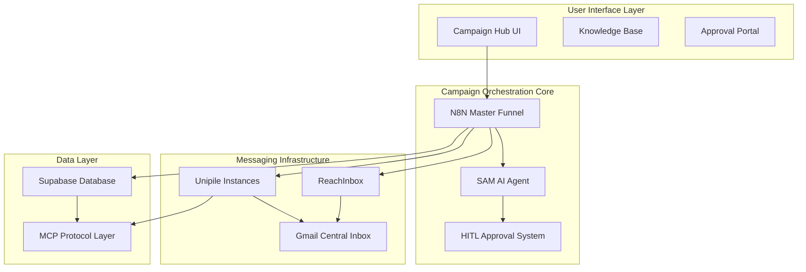
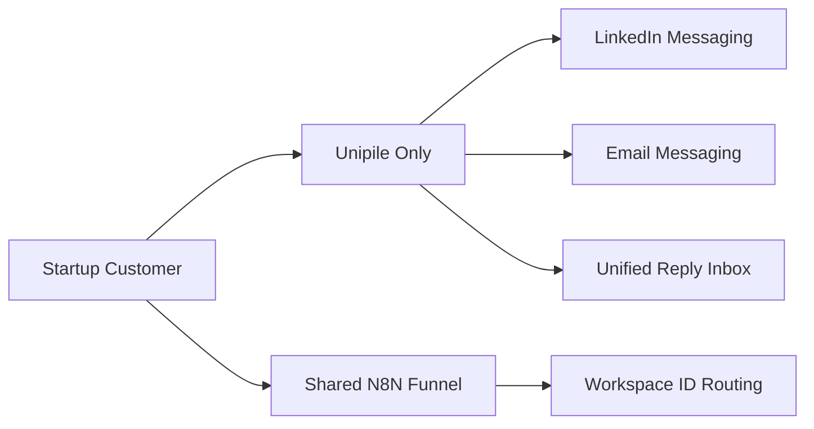
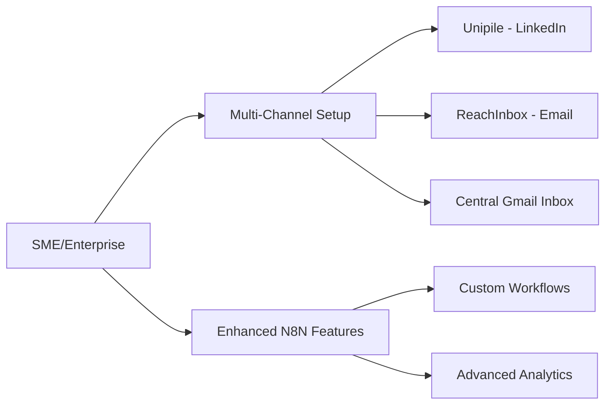
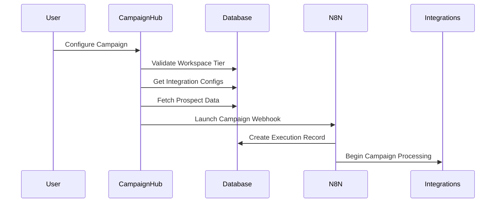
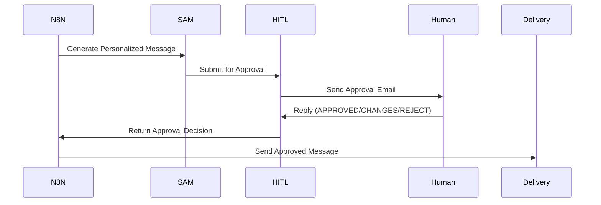
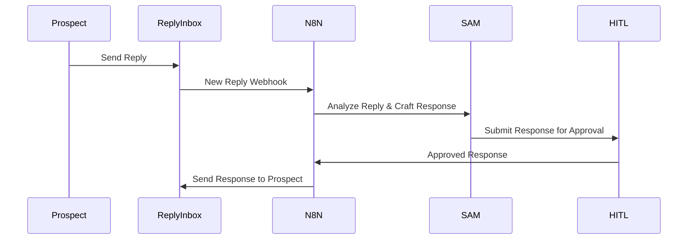

# SAM AI Campaign Orchestration Architecture

**Version:** 1.0  
**Date:** September 2025  
**Status:** Design Phase

## 🎯 Executive Summary

SAM AI implements a **multi-tenant campaign orchestration system** that combines N8N workflow automation, Unipile messaging integration, ReachInbox email delivery, and HITL (Human-in-the-Loop) approval processes to deliver scalable B2B outreach campaigns.

**Key Principles:**
- **Single N8N funnel** serves all tenants with workspace isolation
- **Tiered service model** (Startup/SME/Enterprise) with different integration strategies
- **GDPR-compliant data separation** with shared infrastructure for cost efficiency
- **MCP-first integration** approach for universal connectivity
- **Self-service onboarding** for Startup tier, full-service for SME/Enterprise

---

## 🏗️ System Architecture Overview



---

## 🎨 Service Tier Architecture

### Startup Tier (Self-Service)
**Target:** $99/month self-service customers  
**Infrastructure:** Shared with strict isolation



**Key Features:**
- ✅ Automated Unipile onboarding via OAuth
- ✅ LinkedIn + Email messaging through single provider
- ✅ Rate limiting: 50 LinkedIn/day, 200 emails/day
- ✅ Basic HITL approval via email
- ✅ Shared N8N funnel with tenant isolation

### SME/Enterprise Tier (Full Service)
**Target:** $399-$899/month managed customers  
**Infrastructure:** Enhanced with dedicated components



**Key Features:**
- ✅ ReachInbox high-volume email (2K/day)
- ✅ Unipile for LinkedIn + reply monitoring
- ✅ Manual account setup and management
- ✅ Advanced HITL workflows
- ✅ Custom funnel configuration options

---

## 🔄 Campaign Flow Architecture

### 1. Campaign Setup & Launch



### 2. Message Processing & Approval



### 3. Reply Management & Follow-up



---

## 🗄️ Database Architecture

### Core Tables

#### Workspace Service Tiers
```sql
workspace_tiers (
    workspace_id,
    tier_type ('startup', 'sme', 'enterprise'),
    tier_status,
    monthly_email_limit,
    monthly_linkedin_limit,
    max_campaigns,
    billing_info
)
```

#### Integration Configurations
```sql
workspace_unipile_integrations (
    workspace_id,
    unipile_instance_url,     -- Separate instance per tenant
    linkedin_accounts JSONB,  -- Connected LinkedIn accounts
    email_accounts JSONB,     -- Connected email accounts
    rate_limits,
    current_usage,
    oauth_status
)

workspace_reachinbox_integrations (
    workspace_id,
    reachinbox_api_key,
    domain_1, domain_2,       -- Up to 2 domains
    email_accounts JSONB,     -- 5 accounts per domain
    reply_inbox_email,        -- Central Gmail for replies
    rate_limits,
    current_usage
)
```

#### Campaign Execution Tracking
```sql
n8n_campaign_executions (
    workspace_id,
    campaign_name,
    campaign_type,
    campaign_config JSONB,    -- Complete N8N payload
    execution_status,
    n8n_execution_id,
    prospects_processed,
    messages_sent,
    replies_received,
    channel_specific_metrics
)
```

#### HITL Approval System
```sql
hitl_reply_approval_sessions (
    workspace_id,
    campaign_execution_id,
    original_message_content,
    sam_suggested_reply,
    approval_status,
    final_approved_message,
    approval_method ('email', 'ui')
)
```

---

## 🔌 Integration Strategy

### N8N Master Funnel Integration

**Single Shared Workflow Approach:**
- One N8N workflow handles all tenants
- Workspace ID routing for tenant isolation
- Dynamic integration selection based on tier
- Real-time status updates back to Campaign Hub

**Key N8N Nodes:**
1. **Webhook Trigger** - Receives campaign launch requests
2. **Database Lookup** - Fetches tenant configurations
3. **Prospect Processing** - Data enrichment and scoring
4. **SAM Integration** - Message personalization
5. **Channel Router** - Unipile vs ReachInbox routing
6. **HITL Orchestration** - Approval workflow management
7. **Delivery Management** - Message sending and tracking
8. **Reply Monitoring** - Incoming message processing

### MCP (Model Context Protocol) Integration

**Primary MCP Integrations:**
- ✅ **Unipile MCP** - Already available for messaging
- 🔄 **N8N MCP** - Custom MCP for workflow management
- 🔄 **ReachInbox MCP** - Email delivery integration
- 🔄 **Database MCP** - Supabase data operations

**MCP Benefits:**
- Universal connectivity standard
- Simplified integration maintenance
- Enhanced reliability and error handling
- Standardized authentication flows

### Unipile Integration Architecture

**Separate Instances per Tenant:**
- Each workspace gets dedicated Unipile instance
- Format: `https://workspace-{id}.unipile.com`
- OAuth flow during onboarding connects accounts
- Master API key can access all instances

**Account Management:**
- LinkedIn: 1-5 accounts per workspace
- Email: 1-10 accounts per workspace
- Rate limiting enforced per account
- Health monitoring and reconnection

### ReachInbox Integration Architecture (SME/Enterprise)

**Multi-Domain Setup:**
- 2 domains per workspace (typically)
- 5 email accounts per domain = 10 total
- 2K messages/day distributed across accounts
- Central Gmail inbox for all replies

**Reply Processing:**
- All replies → Single Gmail account
- N8N monitors Gmail via API/webhook
- Reply classification and routing
- Context preservation for conversations

---

## 🔐 Security & Compliance

### GDPR Compliance Strategy

**Data Separation:**
- **Startup Tier:** Shared infrastructure with RLS isolation
- **SME/Enterprise:** Enhanced separation options
- **EU Customers:** EU-region deployment mandatory
- **Audit Trails:** Complete data access logging

**Technical Measures:**
- Row Level Security (RLS) for all database tables
- Encrypted data at rest and in transit
- Separate Unipile instances prevent data mixing
- API rate limiting and access controls

**Organizational Measures:**
- Data Processing Agreements with all vendors
- Regular compliance audits and assessments
- Data retention and deletion policies
- GDPR rights implementation (access, deletion, portability)

### Authentication & Authorization

**Workspace-Based Access Control:**
```sql
-- RLS Policy Example
CREATE POLICY workspace_data_isolation ON campaigns
FOR ALL USING (
    workspace_id IN (
        SELECT workspace_id FROM workspace_members 
        WHERE user_id = auth.uid()
    )
);
```

**API Security:**
- JWT-based authentication
- Workspace-scoped API keys
- Rate limiting per workspace
- Audit logging for all operations

---

## 📊 Rate Limiting & Performance

### Rate Limit Architecture

**Per-Workspace Limits:**
```sql
-- Startup Tier Example
linkedin_daily_limit: 50
linkedin_hourly_limit: 10
email_daily_limit: 200
email_hourly_limit: 50

-- Enterprise Tier Example
linkedin_daily_limit: 200
email_daily_limit: 2000
```

**Implementation:**
- Database counters with automatic reset
- Real-time validation before message sending
- Graceful degradation when limits approached
- Usage analytics and alerting

### Performance Optimization

**Database Optimization:**
- Indexed queries for real-time lookups
- Materialized views for analytics
- Connection pooling and caching
- Read replicas for reporting

**N8N Optimization:**
- Async processing for non-blocking operations
- Queue management for high-volume campaigns
- Error handling and retry mechanisms
- Resource monitoring and scaling

---

## 🚀 Deployment & Scalability

### Infrastructure Requirements

**Core Services:**
- **Supabase:** Database, authentication, real-time subscriptions
- **N8N:** Self-hosted workflow automation
- **Vercel/Netlify:** Frontend application hosting
- **Unipile:** Messaging service (per-tenant instances)
- **ReachInbox:** Email delivery service

**Scaling Considerations:**
- Horizontal N8N scaling for increased load
- Database sharding strategies for large datasets
- CDN for global performance
- Monitoring and alerting infrastructure

### Environment Configuration

**Required Environment Variables:**
```bash
# Database
SUPABASE_URL=
SUPABASE_ANON_KEY=
SUPABASE_SERVICE_KEY=

# N8N Integration
N8N_WEBHOOK_URL=
N8N_API_KEY=

# Unipile Master Integration
UNIPILE_MASTER_API_KEY=

# ReachInbox Integration  
REACHINBOX_MASTER_API_KEY=

# HITL Email System
HITL_SMTP_CONFIG=
```

---

## 📋 Implementation Roadmap

### Phase 1: Foundation (Weeks 1-2)
- ✅ Database schema implementation
- ✅ Basic Campaign Hub UI
- ✅ N8N master funnel setup
- ✅ Unipile MCP integration

### Phase 2: Core Features (Weeks 3-4)
- 🔄 Campaign launch API
- 🔄 Prospect data transfer
- 🔄 Basic HITL email approval
- 🔄 Startup tier implementation

### Phase 3: Advanced Features (Weeks 5-6)
- 🔄 ReachInbox integration
- 🔄 SME/Enterprise tier features
- 🔄 Advanced HITL workflows
- 🔄 Comprehensive monitoring

### Phase 4: Scale & Polish (Weeks 7-8)
- 🔄 Performance optimization
- 🔄 Advanced analytics
- 🔄 Self-service onboarding
- 🔄 Production deployment

---

## 🔍 Testing Strategy

### Integration Testing
- End-to-end campaign flow testing
- Multi-tenant isolation verification
- Rate limiting validation
- GDPR compliance testing

### Performance Testing
- Load testing with concurrent campaigns
- Database performance under load
- N8N workflow scalability testing
- Message delivery throughput testing

### Security Testing
- Penetration testing of API endpoints
- Data isolation verification
- Authentication bypass testing
- GDPR compliance auditing

---

## 📞 Support & Monitoring

### Operational Monitoring
- Campaign execution status dashboards
- Rate limit utilization tracking
- Integration health monitoring
- Error rate and performance metrics

### Customer Support Integration
- Real-time campaign status visibility
- Customer-accessible usage analytics
- Self-service diagnostic tools
- Escalation workflows for issues

---

## 🎯 Success Metrics

### Technical Metrics
- **Uptime:** 99.9% availability target
- **Performance:** <2s campaign launch time
- **Throughput:** 10K+ messages/hour capability
- **Accuracy:** >95% message delivery rate

### Business Metrics
- **Self-Service Adoption:** 80% Startup tier automation
- **Customer Satisfaction:** >4.5/5 rating
- **Scalability:** 1000+ concurrent workspaces
- **Compliance:** 100% GDPR audit pass rate

---

This architecture document serves as the foundation for implementing SAM AI's campaign orchestration system. All implementation decisions should reference this document to ensure consistency with the overall architecture vision.