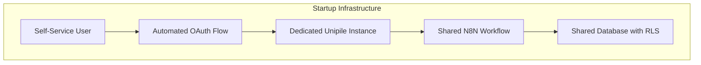
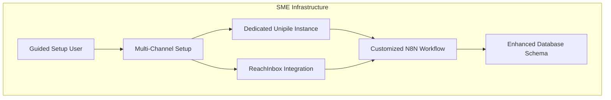
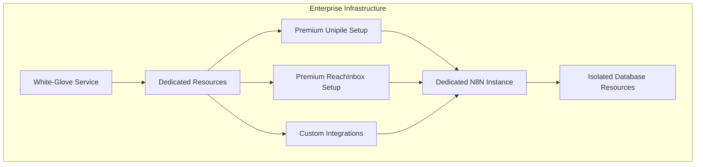

# SAM AI Service Tier Feature Matrix

**Version:** 1.0  
**Date:** September 2025  
**Status:** Design Phase

## 🎯 Overview

This document provides a comprehensive feature comparison across SAM AI's three service tiers: **Startup ($99/month)**, **SME ($399/month)**, and **Enterprise ($899/month)**. The matrix defines technical capabilities, integration options, and service levels for multi-tenant campaign orchestration.

---

## 📊 Complete Feature Comparison Matrix

### Core Campaign Orchestration

| Feature | Startup | SME | Enterprise |
|---------|---------|-----|------------|
| **Campaign Types** | LinkedIn + Email via Unipile | LinkedIn via Unipile + Email via ReachInbox | LinkedIn via Unipile + Email via ReachInbox |
| **Daily Message Limits** | 50 LinkedIn, 200 Email | 200 LinkedIn, 2000 Email | 500 LinkedIn, 5000 Email |
| **Hourly Rate Limits** | 10 LinkedIn, 50 Email | 25 LinkedIn, 200 Email | 50 LinkedIn, 500 Email |
| **Campaign Orchestration** | Shared N8N funnel | Shared N8N funnel | Dedicated N8N instance option |
| **Message Personalization** | Basic SAM AI | Advanced SAM AI | Premium SAM AI with custom training |
| **A/B Testing** | ❌ | ✅ Basic (2 variants) | ✅ Advanced (unlimited variants) |
| **Campaign Scheduling** | Basic time windows | Advanced scheduling | Smart send-time optimization |
| **Multi-Channel Sequencing** | ❌ | ✅ Cross-channel sequences | ✅ Advanced attribution tracking |

### Integration Architecture

| Integration | Startup | SME | Enterprise |
|-------------|---------|-----|------------|
| **Unipile Instance** | ✅ Dedicated instance | ✅ Dedicated instance | ✅ Dedicated instance |
| **LinkedIn Accounts** | 1-2 accounts | 2-5 accounts | 5-10 accounts |
| **Email Infrastructure** | Unipile email only | ReachInbox primary | ReachInbox + backup options |
| **Email Domains** | 1 domain via Unipile | 2 domains via ReachInbox | 3+ domains via ReachInbox |
| **Email Accounts per Domain** | 3 accounts | 5 accounts | 10 accounts |
| **Reply Monitoring** | N8N + SAM AI | N8N + SAM AI | N8N + SAM AI + analytics |
| **HITL Approval System** | Email-based approval | Email + UI approval | Advanced approval workflows |
| **MCP Protocol Usage** | ✅ All available MCPs | ✅ All available MCPs | ✅ All available MCPs |

### Data & Analytics

| Feature | Startup | SME | Enterprise |
|---------|---------|-----|------------|
| **Prospect Database** | 2,000 contacts | 10,000 contacts | 30,000 contacts |
| **Knowledge Base Items** | 50 items | 500 items | Unlimited |
| **Campaign Analytics** | Basic metrics | Advanced analytics | Custom reporting |
| **Real-time Dashboards** | ✅ Campaign Hub | ✅ Campaign Hub + widgets | ✅ Custom dashboards |
| **Export Capabilities** | CSV export | CSV + JSON export | API access + custom exports |
| **Data Retention** | 12 months | 24 months | 36 months |
| **GDPR Compliance** | Standard (shared infra) | Enhanced (isolated schemas) | Premium (dedicated resources) |

### Automation & Workflows

| Feature | Startup | SME | Enterprise |
|---------|---------|-----|------------|
| **N8N Workflow Access** | Shared master workflow | Shared with customization | Dedicated workflow instances |
| **Custom Integrations** | ❌ | 🔄 Limited custom MCPs | ✅ Unlimited custom MCPs |
| **Webhook Support** | ❌ | ✅ Standard webhooks | ✅ Advanced webhook routing |
| **API Rate Limits** | 1,000 requests/hour | 10,000 requests/hour | 100,000 requests/hour |
| **Workflow Customization** | ❌ | ✅ Limited customization | ✅ Full workflow control |
| **Reply Auto-Processing** | SAM + manual approval | SAM + smart approval | SAM + ML approval patterns |

### Support & Service Level

| Feature | Startup | SME | Enterprise |
|---------|---------|-----|------------|
| **Onboarding** | Self-service setup | Guided setup call | Dedicated implementation |
| **Setup Time** | 24 hours automated | 3-5 business days | 1-2 weeks |
| **Support Channel** | Email support | Email + chat support | Dedicated account manager |
| **Response Time SLA** | 24 hours | 4 business hours | 2 business hours |
| **Technical Implementation** | Self-service | Assisted setup | White-glove service |
| **Training & Documentation** | Standard docs | Video training | Custom training sessions |
| **Performance Monitoring** | Basic uptime monitoring | Advanced monitoring | 24/7 monitoring + alerts |

---

## 🏗️ Technical Implementation Differences

### Startup Tier: Self-Service Architecture



**Key Characteristics:**
- ✅ **Automated Setup:** Complete onboarding in 24 hours
- ✅ **Cost Efficiency:** Shared infrastructure with tenant isolation
- ✅ **Simple Configuration:** Limited but sufficient feature set
- ✅ **Unipile Only:** LinkedIn + email through single provider
- ✅ **Basic HITL:** Email-based approval system

### SME Tier: Hybrid Professional Architecture



**Key Characteristics:**
- ✅ **Guided Implementation:** 3-5 day setup with assistance
- ✅ **Multi-Channel:** ReachInbox for email, Unipile for LinkedIn
- ✅ **Enhanced Features:** A/B testing, advanced scheduling
- ✅ **Workflow Customization:** Tailored N8N configurations
- ✅ **Advanced HITL:** UI + email approval options

### Enterprise Tier: Dedicated Premium Architecture



**Key Characteristics:**
- ✅ **White-Glove Service:** 1-2 week dedicated implementation
- ✅ **Dedicated Resources:** Optional dedicated N8N instances
- ✅ **Custom Integrations:** Unlimited custom MCP development
- ✅ **Premium Support:** Dedicated account manager
- ✅ **Advanced HITL:** ML-powered approval pattern learning

---

## 💾 Database Schema Differences by Tier

### Startup Tier: Shared Tables with RLS

```sql
-- Startup tier uses shared tables with strict RLS
CREATE POLICY startup_workspace_isolation ON prospects
    FOR ALL USING (
        workspace_id IN (
            SELECT workspace_id FROM workspace_members 
            WHERE user_id = auth.uid()
        )
        AND EXISTS (
            SELECT 1 FROM workspace_tiers 
            WHERE workspace_id = prospects.workspace_id 
            AND tier_type = 'startup'
        )
    );
```

### SME Tier: Enhanced Schema Features

```sql
-- SME tier gets additional tables and features
CREATE TABLE sme_campaign_analytics (
    id uuid PRIMARY KEY DEFAULT gen_random_uuid(),
    workspace_id uuid REFERENCES workspaces(id),
    campaign_id uuid,
    
    -- A/B testing support
    variant_name TEXT,
    variant_performance JSONB,
    
    -- Advanced metrics
    attribution_data JSONB,
    conversion_tracking JSONB,
    
    created_at TIMESTAMP DEFAULT NOW()
) PARTITION BY RANGE (created_at);

-- Restricted to SME and Enterprise tiers
CREATE POLICY sme_analytics_access ON sme_campaign_analytics
    FOR ALL USING (
        workspace_id IN (
            SELECT workspace_id FROM workspace_tiers 
            WHERE tier_type IN ('sme', 'enterprise')
        )
    );
```

### Enterprise Tier: Dedicated Schema Options

```sql
-- Enterprise can have dedicated schemas
CREATE SCHEMA IF NOT EXISTS enterprise_workspace_12345;

-- Dedicated tables for enterprise customers
CREATE TABLE enterprise_workspace_12345.prospects (
    -- Same structure as shared table but isolated
    id uuid PRIMARY KEY DEFAULT gen_random_uuid(),
    -- ... full prospect schema
    
    -- Enterprise-specific fields
    custom_fields JSONB,
    advanced_scoring DECIMAL,
    integration_metadata JSONB
);
```

---

## 🔧 Configuration Templates by Tier

### Startup Tier Configuration

```yaml
# Startup tier default configuration
workspace_config:
  tier: "startup"
  onboarding: "self_service"
  
  integrations:
    unipile:
      instance_type: "dedicated"
      linkedin_accounts: 2
      email_accounts: 3
      
  rate_limits:
    linkedin_daily: 50
    linkedin_hourly: 10
    email_daily: 200
    email_hourly: 50
    
  features:
    ab_testing: false
    custom_workflows: false
    api_access: false
    advanced_analytics: false
    
  support:
    channel: "email"
    sla_hours: 24
```

### SME Tier Configuration

```yaml
# SME tier configuration
workspace_config:
  tier: "sme"
  onboarding: "guided_setup"
  
  integrations:
    unipile:
      instance_type: "dedicated"
      linkedin_accounts: 5
      
    reachinbox:
      domains: 2
      email_accounts_per_domain: 5
      
  rate_limits:
    linkedin_daily: 200
    linkedin_hourly: 25
    email_daily: 2000
    email_hourly: 200
    
  features:
    ab_testing: true
    ab_variants: 2
    custom_workflows: "limited"
    api_access: "standard"
    advanced_analytics: true
    
  support:
    channel: "email_chat"
    sla_hours: 4
```

### Enterprise Tier Configuration

```yaml
# Enterprise tier configuration
workspace_config:
  tier: "enterprise"
  onboarding: "white_glove"
  
  integrations:
    unipile:
      instance_type: "dedicated_premium"
      linkedin_accounts: 10
      
    reachinbox:
      domains: 3
      email_accounts_per_domain: 10
      backup_providers: true
      
    custom_mcps: "unlimited"
    
  rate_limits:
    linkedin_daily: 500
    linkedin_hourly: 50
    email_daily: 5000
    email_hourly: 500
    
  features:
    ab_testing: true
    ab_variants: "unlimited"
    custom_workflows: "full_control"
    api_access: "premium"
    advanced_analytics: true
    custom_reporting: true
    dedicated_resources: "optional"
    
  support:
    channel: "dedicated_manager"
    sla_hours: 2
    monitoring: "24_7"
```

---

## 🚀 Upgrade Pathways & Migration

### Natural Upgrade Triggers

#### Startup → SME Triggers
1. **Volume Limits:** Hitting 50 LinkedIn or 200 email daily limits
2. **Email Deliverability:** Need for dedicated email infrastructure  
3. **Analytics Needs:** Requiring A/B testing and advanced metrics
4. **Support Requirements:** Need for faster response times

#### SME → Enterprise Triggers
1. **Scale Requirements:** Need for 500+ LinkedIn or 5000+ email daily
2. **Integration Complexity:** Custom MCP or integration requirements
3. **Compliance Needs:** Enhanced GDPR or sector-specific requirements
4. **Performance Requirements:** Need for dedicated resources

### Migration Process

```typescript
// Automated tier migration workflow
interface TierMigration {
  from_tier: 'startup' | 'sme';
  to_tier: 'sme' | 'enterprise';
  migration_steps: MigrationStep[];
  estimated_duration: string;
  data_migration: boolean;
  service_interruption: boolean;
}

const startupToSME: TierMigration = {
  from_tier: 'startup',
  to_tier: 'sme',
  migration_steps: [
    'setup_reachinbox_integration',
    'configure_multi_channel_workflows',
    'enable_ab_testing_features',
    'upgrade_analytics_schema',
    'migrate_campaign_data'
  ],
  estimated_duration: '2-3 business days',
  data_migration: true,
  service_interruption: false
};
```

---

## 📊 Pricing & Value Proposition

### Cost Per Feature Analysis

| Feature Category | Startup ($99) | SME ($399) | Enterprise ($899) |
|------------------|---------------|------------|-------------------|
| **Per Contact** | $0.05 (2K limit) | $0.04 (10K limit) | $0.03 (30K limit) |
| **Per LinkedIn Message** | $1.98 (50/day) | $0.66 (200/day) | $0.60 (500/day) |
| **Per Email Message** | $0.50 (200/day) | $0.067 (2K/day) | $0.06 (5K/day) |
| **Support Hours** | $4.13/hour (24h SLA) | $99.75/hour (4h SLA) | $449.50/hour (2h SLA) |

### ROI Calculation Framework

```typescript
interface TierROI {
  monthly_cost: number;
  max_monthly_messages: {
    linkedin: number;
    email: number;
  };
  estimated_response_rate: number;
  estimated_conversion_value: number;
  break_even_conversions: number;
}

const tierROI: Record<string, TierROI> = {
  startup: {
    monthly_cost: 99,
    max_monthly_messages: { linkedin: 1500, email: 6000 },
    estimated_response_rate: 0.02, // 2%
    estimated_conversion_value: 500, // $500 per conversion
    break_even_conversions: 1 // Need 1 conversion to break even
  },
  
  sme: {
    monthly_cost: 399,
    max_monthly_messages: { linkedin: 6000, email: 60000 },
    estimated_response_rate: 0.025, // 2.5% (better personalization)
    estimated_conversion_value: 500,
    break_even_conversions: 1 // Need 1 conversion to break even
  },
  
  enterprise: {
    monthly_cost: 899,
    max_monthly_messages: { linkedin: 15000, email: 150000 },
    estimated_response_rate: 0.03, // 3% (premium personalization)
    estimated_conversion_value: 500,
    break_even_conversions: 2 // Need 2 conversions to break even
  }
};
```

---

## 🎯 Implementation Priority by Tier

### Phase 1: Startup Tier Foundation (Weeks 1-2)
- ✅ Shared N8N workflow with workspace routing
- ✅ Unipile-only integration
- ✅ Basic HITL email approval
- ✅ Self-service onboarding flow
- ✅ Standard database schema with RLS

### Phase 2: SME Tier Enhancement (Weeks 3-4)
- 🔄 ReachInbox integration for email delivery
- 🔄 A/B testing framework
- 🔄 Advanced analytics schema
- 🔄 Guided setup workflows
- 🔄 Enhanced HITL approval system

### Phase 3: Enterprise Tier Premium (Weeks 5-6)
- 🔄 Dedicated N8N instance options
- 🔄 Custom MCP development framework
- 🔄 Advanced ML approval patterns
- 🔄 Custom reporting capabilities
- 🔄 White-glove onboarding process

---

This feature matrix provides the complete framework for implementing SAM AI's multi-tier service architecture, ensuring clear differentiation while maintaining cost-effective shared infrastructure where appropriate.