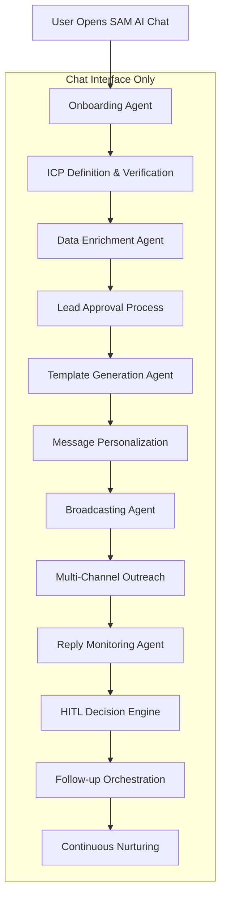

# SAM AI - Complete Chat-Based Workflow System

## 🎯 Executive Summary

SAM AI operates as a **conversational sales automation platform** where the entire workflow - from onboarding to follow-up - happens inside the chat interface. Users interact with specialized AI agents through natural conversation, with each agent handling specific stages of the sales process seamlessly.

**Core Philosophy: Chat-First Everything**
- **No dashboards** - All interactions via chat interface
- **Conversational onboarding** - ICP setup through guided conversation
- **Real-time data approval** - Review and approve leads in chat
- **Message generation in chat** - Templates and personalization via conversation
- **Live broadcasting updates** - Real-time outreach status in chat
- **HITL via chat** - Human-in-the-loop decision making through conversation
- **Follow-up orchestration** - Automated nurturing with chat oversight

## 🏗️ Chat-Based Workflow Architecture

### Complete User Journey (100% Chat-Based)



## 🚀 Phase 1: Conversational Onboarding

### Initial Chat Experience
```typescript
// Onboarding conversation flow via SAM AI chat
const onboardingConversation = {
  initial_greeting: `
    👋 Hi! I'm Sam, your AI sales assistant. 
    
    Let's get you set up with a powerful outreach system in just 5 minutes.
    
    I'll help you:
    ✅ Define your Ideal Customer Profile
    ✅ Generate 2,000 enriched leads per month
    ✅ Create personalized outreach campaigns
    ✅ Automate LinkedIn & email outreach
    ✅ Handle replies intelligently
    
    Ready to start? Tell me about your business and who you want to reach.
  `,
  
  icp_discovery: [
    "What industry are you targeting? (e.g., SaaS, Manufacturing, Healthcare)",
    "What job titles are you looking for? (e.g., VP Sales, Marketing Director, CEO)",
    "What company size works best for you? (e.g., 50-500 employees)",
    "Which geographic regions? (e.g., US, Canada, UK, Europe)",
    "Any specific technologies they should use? (e.g., Salesforce, HubSpot)"
  ]
};

// ICP Verification Agent - Real-time conversation
async function handleICPVerification(userMessage: string, chatHistory: ChatMessage[]): Promise<string> {
  const icpData = extractICPFromConversation(chatHistory);
  
  // Validate ICP via MCP servers in real-time
  const validation = await mcp.call('mcp__apify__validate_target_market', {
    industry: icpData.industry,
    job_titles: icpData.job_titles,
    company_size: icpData.company_size,
    locations: icpData.locations,
    sample_size: 100 // Test with small sample first
  });

  if (validation.viable_leads > 50) {
    return `
      🎯 Great! I found ${validation.viable_leads} potential leads matching your criteria:
      
      **Your ICP Summary:**
      • Industry: ${icpData.industry}
      • Job Titles: ${icpData.job_titles.join(', ')}
      • Company Size: ${icpData.company_size}
      • Locations: ${icpData.locations.join(', ')}
      
      **Sample leads preview:**
      ${validation.sample_leads.slice(0, 3).map(lead => 
        `• ${lead.name} - ${lead.title} at ${lead.company}`
      ).join('\n')}
      
      Ready to generate your full 2,000 lead database? Type 'yes' to continue.
    `;
  } else {
    return `
      ⚠️ I only found ${validation.viable_leads} leads with these criteria. 
      
      Let's refine your targeting:
      ${validation.suggestions.map(s => `• ${s}`).join('\n')}
      
      Would you like to adjust any of these criteria?
    `;
  }
}
```

### ICP Definition Chat Flow
```typescript
// Interactive ICP refinement through conversation
interface ICPChatSession {
  stage: 'industry' | 'titles' | 'company_size' | 'locations' | 'validation' | 'approved';
  icp_data: ICPCriteria;
  conversation_history: ChatMessage[];
}

async function processICPConversation(
  message: string, 
  session: ICPChatSession
): Promise<{ response: string, next_stage: string }> {
  
  switch (session.stage) {
    case 'industry':
      const industry = extractIndustryFromMessage(message);
      session.icp_data.industry = industry;
      
      return {
        response: `
          Perfect! Targeting ${industry} companies. 
          
          Now, what job titles should I focus on? 
          
          Common high-converting titles in ${industry}:
          • Chief Executive Officer / Founder
          • VP Sales / Chief Revenue Officer  
          • Marketing Director / VP Marketing
          • Head of Business Development
          
          You can list multiple titles, or tell me the department (e.g., "sales leadership").
        `,
        next_stage: 'titles'
      };
      
    case 'titles':
      const titles = extractTitlesFromMessage(message);
      session.icp_data.job_titles = titles;
      
      // Real-time validation via Apify MCP
      const titleValidation = await mcp.call('mcp__apify__count_linkedin_profiles', {
        job_titles: titles,
        industry: session.icp_data.industry
      });
      
      return {
        response: `
          Excellent! I found ${titleValidation.total_profiles} profiles with those titles in ${session.icp_data.industry}.
          
          **Your target titles:**
          ${titles.map(title => `• ${title} (${titleValidation.breakdown[title]} profiles)`).join('\n')}
          
          What company size works best for your solution?
          • Startup (1-50 employees) - Often eager to try new solutions
          • Mid-market (51-500 employees) - Good budget and decision speed  
          • Enterprise (500+ employees) - Large budgets but longer sales cycles
          
          Or give me a specific range like "100-1000 employees".
        `,
        next_stage: 'company_size'
      };
      
    case 'validation':
      if (message.toLowerCase().includes('yes') || message.toLowerCase().includes('approve')) {
        // Start data generation
        await initiateDataGeneration(session.icp_data);
        
        return {
          response: `
            🚀 Perfect! I'm now generating your 2,000 enriched leads.
            
            **Data Sources Being Used:**
            • LinkedIn profiles via Apify (high-quality contact data)
            • Company intelligence via Bright Data (firmographics)
            • Contact verification via Apollo (email validation)
            
            **Timeline:**
            • Initial 500 leads: ~10 minutes
            • Full 2,000 leads: ~45 minutes
            • Enrichment & validation: ~60 minutes
            
            I'll update you in real-time as the data comes in. You can continue chatting with me while this runs in the background.
            
            Want to start preparing your outreach messages while we wait?
          `,
          next_stage: 'data_generation'
        };
      }
  }
}
```

## 📊 Phase 2: Real-Time Data Enrichment & Approval

### Live Data Generation Updates
```typescript
// Real-time data generation progress via chat
async function streamDataGenerationUpdates(
  chatSession: string,
  icpCriteria: ICPCriteria
): Promise<void> {
  
  // Start data generation via multiple MCP servers
  const dataGenerationJobs = await Promise.all([
    // LinkedIn scraping via Apify MCP
    mcp.call('mcp__apify__run_bulk_linkedin_scraper', {
      search_criteria: icpCriteria,
      target_count: 2000,
      include_contact_info: true
    }),
    
    // Company data via Bright Data MCP
    mcp.call('mcp__brightdata__enrich_company_database', {
      industries: [icpCriteria.industry],
      company_sizes: icpCriteria.company_size_range,
      target_count: 2000
    }),
    
    // Contact validation via Apollo MCP (when available)
    // Note: Using Apify as proxy since Apollo MCP not yet available
    mcp.call('mcp__apify__apollo_contact_enrichment', {
      validation_required: true,
      email_finder: true,
      phone_finder: true
    })
  ]);

  // Stream progress updates to chat
  const progressInterval = setInterval(async () => {
    const progress = await checkDataGenerationProgress(dataGenerationJobs);
    
    await sendChatMessage(chatSession, `
      📈 **Data Generation Progress**
      
      LinkedIn Profiles: ${progress.linkedin_count}/2000 (${Math.round(progress.linkedin_percent)}%)
      Company Data: ${progress.company_count}/2000 (${Math.round(progress.company_percent)}%)
      Contact Enrichment: ${progress.enriched_count}/2000 (${Math.round(progress.enriched_percent)}%)
      
      **Quality Metrics:**
      • Email addresses found: ${progress.emails_found}
      • Phone numbers found: ${progress.phones_found}
      • LinkedIn profiles accessible: ${progress.linkedin_accessible}
      
      ${progress.is_complete ? '✅ Generation complete! Ready for your review.' : '⏳ Still processing...'}
    `);
    
    if (progress.is_complete) {
      clearInterval(progressInterval);
      await initiateDataApprovalProcess(chatSession, progress.final_dataset);
    }
  }, 30000); // Update every 30 seconds
}
```

### Interactive Data Approval Process
```typescript
// Chat-based lead approval with samples and filtering
async function initiateDataApprovalProcess(
  chatSession: string, 
  dataset: EnrichedLead[]
): Promise<void> {
  
  // Generate data quality report
  const qualityReport = analyzeDataQuality(dataset);
  
  await sendChatMessage(chatSession, `
    🎉 **Your 2,000 enriched leads are ready!**
    
    **Quality Summary:**
    • Total leads: ${dataset.length}
    • Email addresses: ${qualityReport.emails_found} (${qualityReport.email_rate}%)
    • Phone numbers: ${qualityReport.phones_found} (${qualityReport.phone_rate}%)
    • LinkedIn accessible: ${qualityReport.linkedin_accessible} (${qualityReport.linkedin_rate}%)
    • Company data complete: ${qualityReport.company_complete} (${qualityReport.company_rate}%)
    
    **Sample Preview:**
    ${dataset.slice(0, 5).map((lead, index) => `
    ${index + 1}. **${lead.name}** - ${lead.title}
       📍 ${lead.company} (${lead.company_size} employees)
       📧 ${lead.email || 'Email not found'}
       💼 ${lead.linkedin_url}
    `).join('\n')}
    
    **Would you like to:**
    1️⃣ Approve all leads and start outreach
    2️⃣ Review more samples first  
    3️⃣ Filter by specific criteria
    4️⃣ Regenerate with different parameters
    
    Just type the number or tell me what you'd like to do.
  `);
}

// Interactive filtering and refinement
async function handleDataFiltering(
  message: string,
  dataset: EnrichedLead[]
): Promise<string> {
  
  if (message.includes('filter') || message.includes('refine')) {
    return `
      🔍 **Data Filtering Options:**
      
      I can filter your leads by:
      • **Industry focus**: "Only show SaaS companies"
      • **Company size**: "Remove companies under 100 employees"  
      • **Job seniority**: "Focus on VP level and above"
      • **Contact quality**: "Only leads with email addresses"
      • **Location**: "US companies only"
      • **Recent activity**: "Leads who posted on LinkedIn recently"
      
      **Current Dataset:**
      • ${dataset.length} total leads
      • ${dataset.filter(l => l.email).length} with emails
      • ${dataset.filter(l => l.seniority_level === 'Senior').length} senior level
      • ${dataset.filter(l => l.recent_activity).length} recently active
      
      What filter would you like to apply?
    `;
  }
  
  if (message.includes('approve') || message.includes('start')) {
    // User approved - move to message creation
    await initiateMessageTemplateCreation(dataset);
    return `
      ✅ **Leads Approved!** 
      
      Great choice - your ${dataset.length} leads are locked and loaded.
      
      Now let's create compelling outreach messages that get responses.
      
      I'll help you build:
      📝 Personalized message templates
      🎯 A/B test variations  
      📊 Industry-specific hooks
      🔥 Compelling CTAs
      
      **First, tell me about your solution:**
      What problem do you solve for ${dataset[0]?.industry || 'your target'} companies?
    `;
  }
}
```

## ✉️ Phase 3: Message Template & Personalization Engine

### Conversational Template Creation
```typescript
// AI-powered template generation through chat
async function handleMessageTemplateCreation(
  userInput: string,
  leadSample: EnrichedLead[]
): Promise<string> {
  
  // Extract solution details from conversation
  const solutionDetails = extractSolutionFromMessage(userInput);
  
  // Generate multiple template variations via Claude/OpenAI
  const templates = await mcp.call('mcp__openai__generate_outreach_templates', {
    solution: solutionDetails,
    target_audience: {
      industry: leadSample[0].industry,
      job_titles: [...new Set(leadSample.slice(0, 10).map(l => l.title))],
      company_sizes: [...new Set(leadSample.slice(0, 10).map(l => l.company_size_category))]
    },
    template_count: 3,
    personalization_variables: [
      'first_name', 'company', 'title', 'industry', 
      'recent_activity', 'company_news', 'mutual_connections'
    ]
  });

  // Show templates with personalization preview
  const previewMessage = `
    🎯 **Generated Message Templates**
    
    I created 3 variations optimized for ${leadSample[0].industry} ${leadSample[0].title}s:
    
    **Template A: Problem-Focused** (Direct approach)
    ${templates[0].content}
    
    **Template B: Value-Driven** (Benefit-focused)  
    ${templates[1].content}
    
    **Template C: Social Proof** (Case study angle)
    ${templates[2].content}
    
    **Personalization Preview** (using ${leadSample[0].name} as example):
    ${await personalizeTemplate(templates[0], leadSample[0])}
    
    **Which template resonates with you?** 
    Or would you like me to:
    • Generate more variations
    • Combine elements from multiple templates  
    • Create industry-specific versions
    • Add more personalization variables
  `;
  
  return previewMessage;
}

// Real-time template personalization testing
async function personalizeTemplate(
  template: MessageTemplate, 
  lead: EnrichedLead
): Promise<string> {
  
  // Advanced personalization via multiple data sources
  const personalizationData = {
    // Basic variables
    first_name: lead.name.split(' ')[0],
    company: lead.company,
    title: lead.title,
    industry: lead.industry,
    
    // Advanced personalization via MCP data
    recent_activity: await getRecentLinkedInActivity(lead.linkedin_url),
    company_news: await getCompanyNews(lead.company),
    mutual_connections: await getMutualConnections(lead.linkedin_url),
    company_growth: await getCompanyGrowthSignals(lead.company_domain),
    tech_stack: await getCompanyTechStack(lead.company_domain)
  };

  // AI-powered contextual personalization
  const personalizedMessage = await mcp.call('mcp__openai__personalize_message', {
    template: template.content,
    personalization_data: personalizationData,
    tone: 'professional_friendly',
    length: 'medium' // ~150-200 words
  });

  return personalizedMessage;
}

// A/B testing setup through chat
async function handleTemplateOptimization(userMessage: string): Promise<string> {
  if (userMessage.includes('test') || userMessage.includes('a/b')) {
    return `
      🧪 **A/B Testing Setup**
      
      I'll automatically split your outreach for optimal results:
      
      **Testing Strategy:**
      • Template A: 33% of leads (Problem-focused approach)
      • Template B: 33% of leads (Value-driven approach)  
      • Template C: 34% of leads (Social proof approach)
      
      **Success Metrics I'll Track:**
      📊 Open rates (LinkedIn message views)
      💬 Response rates (positive replies)
      🔗 Click-through rates (if using links)
      📅 Meeting booking rates
      
      **Optimization Timeline:**
      • Week 1: Baseline performance measurement
      • Week 2: Statistical significance analysis
      • Week 3: Winner selection and full deployment
      
      I'll send you weekly performance reports and automatically optimize based on results.
      
      **Ready to start outreach?** Type 'launch' to begin sending!
    `;
  }
}
```

## 🚀 Phase 4: Multi-Channel Broadcasting System

### Live Broadcasting Status Updates
```typescript
// Real-time outreach broadcasting via chat interface
async function initiateBroadcastingSequence(
  approvedLeads: EnrichedLead[],
  selectedTemplates: MessageTemplate[]
): Promise<void> {
  
  const chatMessage = `
    🚀 **Launching Multi-Channel Outreach Campaign**
    
    **Campaign Overview:**
    • ${approvedLeads.length} targeted leads
    • ${selectedTemplates.length} message variations
    • 2 channels: LinkedIn + Email
    
    **Broadcasting Schedule:**
    • LinkedIn: ${approvedLeads.filter(l => l.linkedin_url).length} messages via Unipile
    • Email: ${approvedLeads.filter(l => l.email).length} messages via ReachInbox
    • Daily limit: 50 LinkedIn + 200 emails (to avoid spam flags)
    • Estimated completion: ${Math.ceil(approvedLeads.length / 250)} days
    
    **I'm starting the broadcast now...**
  `;
  
  await sendChatMessage(getCurrentChatSession(), chatMessage);
  
  // Start broadcasting via MCP servers
  const broadcastJob = await startMultiChannelBroadcast(approvedLeads, selectedTemplates);
  
  // Real-time progress streaming
  streamBroadcastProgress(broadcastJob);
}

async function startMultiChannelBroadcast(
  leads: EnrichedLead[],
  templates: MessageTemplate[]
): Promise<BroadcastJob> {
  
  const broadcastJob: BroadcastJob = {
    id: generateId(),
    leads_total: leads.length,
    leads_processed: 0,
    channels: ['linkedin', 'email'],
    status: 'running',
    started_at: new Date()
  };
  
  // Process leads in batches to respect rate limits
  const batchSize = 50; // LinkedIn daily limit
  
  for (let i = 0; i < leads.length; i += batchSize) {
    const batch = leads.slice(i, i + batchSize);
    
    await Promise.all([
      // LinkedIn outreach via Unipile MCP
      processBatchLinkedInOutreach(batch, templates),
      
      // Email outreach via ReachInbox MCP (simulated via Supabase for now)
      processBatchEmailOutreach(batch, templates)
    ]);
    
    broadcastJob.leads_processed += batch.length;
    
    // Update chat with progress
    await updateBroadcastProgress(broadcastJob);
    
    // Rate limiting delay
    if (i + batchSize < leads.length) {
      await delay(24 * 60 * 60 * 1000); // 24 hour delay between batches
    }
  }
  
  broadcastJob.status = 'completed';
  return broadcastJob;
}

async function processBatchLinkedInOutreach(
  leads: EnrichedLead[],
  templates: MessageTemplate[]
): Promise<void> {
  
  const results = await Promise.all(
    leads.map(async (lead, index) => {
      try {
        // Select template for A/B testing
        const template = templates[index % templates.length];
        
        // Personalize message via MCP
        const personalizedMessage = await personalizeTemplate(template, lead);
        
        // Send via Unipile LinkedIn MCP
        const result = await mcp.call('mcp__unipile__send_linkedin_message', {
          linkedin_profile_url: lead.linkedin_url,
          message: personalizedMessage,
          message_type: 'connection_request', // or 'direct_message' if already connected
          account_id: getCurrentLinkedInAccount()
        });
        
        // Log success
        await mcp.call('mcp__supabase__execute_sql', {
          query: `
            INSERT INTO sam_outreach_log 
            (lead_id, channel, template_id, message_content, status, sent_at)
            VALUES ($1, $2, $3, $4, $5, NOW())
          `,
          params: [lead.id, 'linkedin', template.id, personalizedMessage, result.success ? 'sent' : 'failed']
        });
        
        return { lead_id: lead.id, success: result.success, channel: 'linkedin' };
        
      } catch (error) {
        console.error(`LinkedIn outreach failed for ${lead.name}:`, error);
        return { lead_id: lead.id, success: false, error: error.message, channel: 'linkedin' };
      }
    })
  );
  
  // Send batch update to chat
  const successCount = results.filter(r => r.success).length;
  await sendChatMessage(getCurrentChatSession(), `
    ✅ **LinkedIn Batch Complete**
    • ${successCount}/${results.length} messages sent successfully
    • Failed sends will be retried tomorrow
    • View real-time responses in the monitoring section below
  `);
}
```

### Real-Time Broadcasting Dashboard (In Chat)
```typescript
// Live outreach performance updates via chat
async function streamBroadcastProgress(broadcastJob: BroadcastJob): Promise<void> {
  
  const progressInterval = setInterval(async () => {
    const stats = await getBroadcastStats(broadcastJob.id);
    
    const progressMessage = `
      📊 **Live Outreach Performance** (Updated: ${new Date().toLocaleTimeString()})
      
      **Overall Progress:**
      ${createProgressBar(stats.sent_count, stats.total_count)} 
      ${stats.sent_count}/${stats.total_count} messages sent (${Math.round(stats.sent_count/stats.total_count * 100)}%)
      
      **Channel Breakdown:**
      🔗 LinkedIn: ${stats.linkedin_sent}/${stats.linkedin_total} (${stats.linkedin_response_rate}% response rate)
      📧 Email: ${stats.email_sent}/${stats.email_total} (${stats.email_open_rate}% open rate)
      
      **Today's Results:**
      💬 New responses: ${stats.new_responses_today}
      👀 Profile views: ${stats.profile_views_today}
      📅 Meetings booked: ${stats.meetings_booked_today}
      
      **Live Activity Feed:**
      ${stats.recent_activity.slice(0, 3).map(activity => 
        `• ${activity.timestamp}: ${activity.lead_name} ${activity.action} (${activity.channel})`
      ).join('\n')}
      
      ${stats.status === 'completed' ? '✅ Campaign completed! Check your replies below.' : '⏳ Continuing to send...'}
    `;
    
    await updateChatMessage(getCurrentChatSession(), progressMessage);
    
    if (stats.status === 'completed') {
      clearInterval(progressInterval);
      await initializeReplyMonitoring();
    }
  }, 60000); // Update every minute
}

function createProgressBar(current: number, total: number): string {
  const percentage = Math.round((current / total) * 100);
  const filledBars = Math.round(percentage / 5);
  const emptyBars = 20 - filledBars;
  
  return '█'.repeat(filledBars) + '░'.repeat(emptyBars) + ` ${percentage}%`;
}
```

## 💬 Phase 5: Reply Agent & HITL Integration

### Intelligent Reply Monitoring
```typescript
// Real-time reply monitoring via Unipile MCP + IMAP
async function initializeReplyMonitoring(): Promise<void> {
  
  await sendChatMessage(getCurrentChatSession(), `
    🎯 **Reply Monitoring Active**
    
    I'm now monitoring for responses across:
    • LinkedIn messages via Unipile MCP
    • Gmail inbox via IMAP integration
    • ReachInbox campaign replies
    
    **Auto-Response Settings:**
    ✅ Positive replies → Schedule meetings automatically
    ✅ Questions → Provide helpful information
    ✅ Objections → Send relevant case studies
    ⚠️ Complex requests → Forward to you for review
    
    I'll notify you immediately when responses come in!
  `);
  
  // Set up real-time monitoring
  await Promise.all([
    startLinkedInReplyMonitoring(),
    startGmailIMAPMonitoring(),
    startReachInboxWebhookMonitoring()
  ]);
}

async function startLinkedInReplyMonitoring(): Promise<void> {
  
  // Poll for new LinkedIn messages via Unipile MCP
  setInterval(async () => {
    try {
      const newMessages = await mcp.call('mcp__unipile__get_recent_messages', {
        account_id: getCurrentLinkedInAccount(),
        platform: 'linkedin',
        since: getLastCheckTimestamp(),
        direction: 'inbound'
      });
      
      if (newMessages.length > 0) {
        await processLinkedInReplies(newMessages);
      }
      
    } catch (error) {
      console.error('LinkedIn monitoring error:', error);
    }
  }, 30000); // Check every 30 seconds
}

async function processLinkedInReplies(messages: LinkedInMessage[]): Promise<void> {
  
  for (const message of messages) {
    // Analyze reply sentiment and intent
    const analysis = await analyzeReplyIntent(message.content);
    
    // Send real-time notification to chat
    await sendChatMessage(getCurrentChatSession(), `
      📨 **New LinkedIn Reply!**
      
      **From:** ${message.sender_name} (${message.sender_title})
      **Company:** ${message.sender_company}
      **Message:** "${message.content}"
      
      **AI Analysis:**
      • Sentiment: ${analysis.sentiment} (${analysis.confidence}% confidence)
      • Intent: ${analysis.intent}
      • Suggested Response: ${analysis.suggested_response_type}
      
      ${analysis.requires_human ? '🔴 **Human review needed**' : '🤖 **Auto-responding**'}
    `);
    
    if (analysis.requires_human) {
      await initiateHumanInTheLoop(message, analysis);
    } else {
      await sendAutomatedResponse(message, analysis);
    }
  }
}

// AI-powered reply analysis
async function analyzeReplyIntent(messageContent: string): Promise<ReplyAnalysis> {
  
  const analysis = await mcp.call('mcp__openai__analyze_reply_intent', {
    message: messageContent,
    analysis_criteria: [
      'sentiment', 'buying_intent', 'objection_type', 
      'question_category', 'urgency_level', 'decision_maker_status'
    ],
    response_suggestions: true
  });
  
  // Determine if human review is needed
  const requiresHuman = 
    analysis.sentiment === 'negative' ||
    analysis.buying_intent === 'high' ||
    analysis.objection_type === 'price_complex' ||
    analysis.urgency_level === 'urgent' ||
    analysis.confidence < 0.8;
  
  return {
    ...analysis,
    requires_human: requiresHuman,
    suggested_response_type: getSuggestedResponseType(analysis)
  };
}
```

### Human-in-the-Loop Decision Engine
```typescript
// HITL integration via chat interface and email approval
async function initiateHumanInTheLoop(
  message: LinkedInMessage, 
  analysis: ReplyAnalysis
): Promise<void> {
  
  // Generate response options via AI
  const responseOptions = await mcp.call('mcp__openai__generate_response_options', {
    original_message: message.content,
    sender_context: {
      name: message.sender_name,
      title: message.sender_title,
      company: message.sender_company,
      previous_conversation: await getPreviousConversation(message.sender_id)
    },
    response_types: ['direct_answer', 'meeting_request', 'case_study_share', 'custom'],
    tone: 'professional_friendly'
  });
  
  // Present options in chat
  const hitlMessage = `
    🤔 **Human Decision Needed**
    
    **Original Message:** "${message.content}"
    **From:** ${message.sender_name} - ${message.sender_title} at ${message.sender_company}
    
    **AI Suggested Responses:**
    
    **Option 1: Direct Answer** (${responseOptions[0].confidence}% confidence)
    "${responseOptions[0].content}"
    
    **Option 2: Meeting Request** (${responseOptions[1].confidence}% confidence)  
    "${responseOptions[1].content}"
    
    **Option 3: Case Study Share** (${responseOptions[2].confidence}% confidence)
    "${responseOptions[2].content}"
    
    **Which response should I send?**
    • Type '1', '2', or '3' to select an option
    • Type 'custom' to write your own response
    • Type 'delay' to respond later
    • Type 'skip' to not respond
    
    ⏰ **Automatic fallback:** If no response in 2 hours, I'll send Option 1.
  `;
  
  await sendChatMessage(getCurrentChatSession(), hitlMessage);
  
  // Also send email notification for urgent cases
  if (analysis.urgency_level === 'urgent' || analysis.buying_intent === 'high') {
    await sendEmailNotification({
      to: getCurrentUserEmail(),
      subject: `🚨 Urgent LinkedIn Reply - ${message.sender_name} at ${message.sender_company}`,
      body: `
        High-priority LinkedIn reply requires your immediate attention:
        
        From: ${message.sender_name} (${message.sender_title})
        Company: ${message.sender_company}
        Message: "${message.content}"
        
        Respond here: ${generateChatDeepLink()}
        
        Auto-response in 2 hours if no action taken.
      `
    });
  }
  
  // Set up timeout for automatic response
  setTimeout(async () => {
    const userResponse = await checkForUserResponse(message.id);
    if (!userResponse) {
      await sendAutomatedResponse(message, { 
        ...analysis, 
        selected_response: responseOptions[0],
        response_method: 'timeout_fallback'
      });
    }
  }, 2 * 60 * 60 * 1000); // 2 hour timeout
}

// Handle user decision via chat
async function handleHITLResponse(
  userMessage: string, 
  pendingReply: PendingHITLDecision
): Promise<string> {
  
  if (userMessage === '1' || userMessage === '2' || userMessage === '3') {
    const selectedOption = parseInt(userMessage) - 1;
    const selectedResponse = pendingReply.response_options[selectedOption];
    
    // Send the selected response
    await sendLinkedInReply(pendingReply.original_message, selectedResponse.content);
    
    return `
      ✅ **Response Sent!**
      
      Sent to ${pendingReply.original_message.sender_name}:
      "${selectedResponse.content}"
      
      I'll continue monitoring for their reply and handle follow-ups automatically.
    `;
    
  } else if (userMessage.toLowerCase().includes('custom')) {
    return `
      ✏️ **Custom Response Mode**
      
      Please type your custom response to ${pendingReply.original_message.sender_name}.
      
      I'll send exactly what you write (after basic formatting).
      
      **Tip:** Include their name and reference their message for better personalization.
    `;
    
  } else if (userMessage.toLowerCase().includes('delay')) {
    // Schedule for later
    await scheduleDelayedResponse(pendingReply, 24 * 60 * 60 * 1000); // 24 hours
    
    return `
      ⏰ **Response Scheduled**
      
      I'll remind you about ${pendingReply.original_message.sender_name}'s message tomorrow.
      
      You can also type 'show pending' anytime to see delayed responses.
    `;
  }
}
```

## 🔄 Phase 6: Follow-Up Orchestration for Stalled Leads

### Intelligent Follow-Up System
```typescript
// Automated follow-up sequence via chat oversight
async function initializeFollowUpOrchestration(): Promise<void> {
  
  await sendChatMessage(getCurrentChatSession(), `
    🎯 **Follow-Up Engine Activated**
    
    I'm now monitoring all your outreach conversations and will automatically:
    
    **Stalled Lead Detection:**
    • No response after 3 days → Light follow-up
    • No response after 7 days → Value-add follow-up  
    • No response after 14 days → Breakup email
    • Opened but no reply → Interest-based follow-up
    
    **Smart Follow-Up Types:**
    📰 Industry news and insights
    📊 Relevant case studies and ROI data
    🎥 Personalized video messages
    📝 Resource sharing (templates, guides)
    💡 Problem-solution fit refinement
    
    **Current Pipeline Status:**
    • Active conversations: ${await getActiveConversationCount()}
    • Pending follow-ups: ${await getPendingFollowUpCount()}
    • Scheduled sequences: ${await getScheduledSequenceCount()}
    
    I'll send you daily summaries and flag high-priority follow-ups!
  `);
  
  // Start follow-up monitoring
  await startFollowUpMonitoring();
}

async function startFollowUpMonitoring(): Promise<void> {
  
  // Daily follow-up analysis and execution
  setInterval(async () => {
    const stalledLeads = await identifyStalledLeads();
    
    if (stalledLeads.length > 0) {
      await processStalledLeadFollowUps(stalledLeads);
    }
    
    // Send daily summary
    await sendDailyFollowUpSummary();
    
  }, 24 * 60 * 60 * 1000); // Daily execution
  
  // Real-time response monitoring
  setInterval(async () => {
    await checkForNewResponses();
    await processActiveFollowUps();
  }, 60 * 60 * 1000); // Hourly checks
}

async function identifyStalledLeads(): Promise<StalledLead[]> {
  
  const stalledLeads = await mcp.call('mcp__supabase__execute_sql', {
    query: `
      WITH lead_last_interaction AS (
        SELECT 
          lead_id,
          MAX(sent_at) as last_outreach,
          MAX(reply_received_at) as last_reply,
          COUNT(CASE WHEN reply_received_at IS NOT NULL THEN 1 END) as reply_count,
          COUNT(*) as outreach_count
        FROM sam_outreach_log 
        WHERE sent_at >= NOW() - INTERVAL '30 days'
        GROUP BY lead_id
      )
      SELECT 
        l.*,
        li.last_outreach,
        li.last_reply, 
        li.reply_count,
        li.outreach_count,
        EXTRACT(DAYS FROM (NOW() - li.last_outreach)) as days_since_outreach,
        CASE 
          WHEN li.reply_count = 0 AND EXTRACT(DAYS FROM (NOW() - li.last_outreach)) BETWEEN 3 AND 6 THEN 'light_followup'
          WHEN li.reply_count = 0 AND EXTRACT(DAYS FROM (NOW() - li.last_outreach)) BETWEEN 7 AND 13 THEN 'value_followup'
          WHEN li.reply_count = 0 AND EXTRACT(DAYS FROM (NOW() - li.last_outreach)) >= 14 THEN 'breakup_sequence'
          WHEN li.reply_count > 0 AND EXTRACT(DAYS FROM (NOW() - li.last_reply)) >= 5 THEN 'conversation_revival'
          ELSE NULL
        END as followup_type
      FROM sam_enriched_leads l
      JOIN lead_last_interaction li ON l.id = li.lead_id
      WHERE li.last_outreach >= NOW() - INTERVAL '30 days'
        AND li.outreach_count < 5  -- Avoid over-messaging
        AND (
          (li.reply_count = 0 AND EXTRACT(DAYS FROM (NOW() - li.last_outreach)) >= 3) OR
          (li.reply_count > 0 AND EXTRACT(DAYS FROM (NOW() - li.last_reply)) >= 5)
        )
      ORDER BY li.last_outreach ASC
      LIMIT 50
    `
  });
  
  return stalledLeads;
}

async function processStalledLeadFollowUps(stalledLeads: StalledLead[]): Promise<void> {
  
  const followUpResults = await Promise.all(
    stalledLeads.map(async (lead) => {
      try {
        const followUpMessage = await generateContextualFollowUp(lead);
        
        // Send follow-up via appropriate channel
        if (lead.preferred_channel === 'linkedin') {
          await sendLinkedInFollowUp(lead, followUpMessage);
        } else {
          await sendEmailFollowUp(lead, followUpMessage);
        }
        
        return { lead_id: lead.id, success: true, followup_type: lead.followup_type };
        
      } catch (error) {
        console.error(`Follow-up failed for ${lead.name}:`, error);
        return { lead_id: lead.id, success: false, error: error.message };
      }
    })
  );
  
  // Send batch summary to chat
  const successCount = followUpResults.filter(r => r.success).length;
  
  await sendChatMessage(getCurrentChatSession(), `
    🔄 **Daily Follow-Up Batch Complete**
    
    **Processed:** ${stalledLeads.length} stalled conversations
    **Sent:** ${successCount} follow-up messages
    **Failed:** ${stalledLeads.length - successCount} (will retry tomorrow)
    
    **Follow-Up Breakdown:**
    • Light follow-ups: ${followUpResults.filter(r => r.followup_type === 'light_followup').length}
    • Value-add follow-ups: ${followUpResults.filter(r => r.followup_type === 'value_followup').length}  
    • Breakup emails: ${followUpResults.filter(r => r.followup_type === 'breakup_sequence').length}
    • Conversation revivals: ${followUpResults.filter(r => r.followup_type === 'conversation_revival').length}
    
    I'll continue monitoring for responses and engagement!
  `);
}

// Advanced contextual follow-up generation
async function generateContextualFollowUp(lead: StalledLead): Promise<string> {
  
  // Gather additional context for personalization
  const context = await gatherFollowUpContext(lead);
  
  const followUpPrompt = `
    Generate a ${lead.followup_type} follow-up message for:
    
    Lead: ${lead.name} (${lead.title} at ${lead.company})
    Industry: ${lead.industry}
    Previous outreach: ${lead.outreach_count} messages
    Days since last contact: ${lead.days_since_outreach}
    Original message focus: ${lead.original_message_theme}
    
    Additional context:
    • Recent company news: ${context.company_news}
    • Industry trends: ${context.industry_trends}  
    • Mutual connections: ${context.mutual_connections}
    • Similar customer success: ${context.similar_customers}
    
    Follow-up type requirements:
    ${getFollowUpTypeRequirements(lead.followup_type)}
  `;
  
  const followUpMessage = await mcp.call('mcp__openai__generate_followup_message', {
    prompt: followUpPrompt,
    max_length: 200,
    tone: 'professional_helpful',
    include_cta: true
  });
  
  return followUpMessage;
}

function getFollowUpTypeRequirements(followupType: string): string {
  const requirements = {
    'light_followup': 'Brief, friendly bump. Reference original message. Ask if timing is better now.',
    'value_followup': 'Share relevant industry insight, case study, or resource. Provide value first.',
    'breakup_sequence': 'Professional goodbye. Leave door open for future. Mention key benefit one last time.',
    'conversation_revival': 'Reference previous conversation. Ask follow-up question or provide update.'
  };
  
  return requirements[followupType] || 'Standard follow-up approach.';
}
```

### Daily Pipeline Management
```typescript
// Daily conversation pipeline summary via chat
async function sendDailyFollowUpSummary(): Promise<void> {
  
  const pipelineStats = await mcp.call('mcp__supabase__execute_sql', {
    query: `
      SELECT 
        COUNT(CASE WHEN status = 'active' THEN 1 END) as active_conversations,
        COUNT(CASE WHEN status = 'stalled' THEN 1 END) as stalled_conversations,
        COUNT(CASE WHEN status = 'responded_today' THEN 1 END) as new_responses,
        COUNT(CASE WHEN status = 'meeting_booked' THEN 1 END) as meetings_booked,
        COUNT(CASE WHEN follow_up_scheduled::date = CURRENT_DATE THEN 1 END) as followups_sent_today,
        AVG(days_since_last_contact) as avg_days_stalled
      FROM sam_conversation_pipeline 
      WHERE created_at >= NOW() - INTERVAL '30 days'
    `
  });
  
  const topOpportunities = await mcp.call('mcp__supabase__execute_sql', {
    query: `
      SELECT lead_name, company, last_interaction_type, engagement_score
      FROM sam_conversation_pipeline 
      WHERE status IN ('warm', 'hot') 
      ORDER BY engagement_score DESC 
      LIMIT 5
    `
  });
  
  const summary = `
    📊 **Daily Pipeline Summary** - ${new Date().toLocaleDateString()}
    
    **Conversation Health:**
    • 🔥 Active conversations: ${pipelineStats[0].active_conversations}
    • ⏸️ Stalled conversations: ${pipelineStats[0].stalled_conversations}  
    • 💬 New responses today: ${pipelineStats[0].new_responses}
    • 📅 Meetings booked: ${pipelineStats[0].meetings_booked}
    • 🔄 Follow-ups sent today: ${pipelineStats[0].followups_sent_today}
    
    **Pipeline Velocity:**
    • Average stall time: ${Math.round(pipelineStats[0].avg_days_stalled)} days
    • Response rate (7-day): ${await getResponseRate()}%
    • Meeting conversion: ${await getMeetingConversionRate()}%
    
    **🌟 Top Opportunities (Prioritize Today):**
    ${topOpportunities.map((opp, index) => 
      `${index + 1}. **${opp.lead_name}** at ${opp.company} (${opp.engagement_score}/100 score)`
    ).join('\n')}
    
    **💡 Today's Action Items:**
    • Follow up with ${topOpportunities.length} warm leads
    • Review ${pipelineStats[0].new_responses} new responses  
    • Schedule ${pipelineStats[0].meetings_booked} confirmed meetings
    
    Type 'pipeline details' for deeper analysis or 'priority leads' to focus on top opportunities!
  `;
  
  await sendChatMessage(getCurrentChatSession(), summary);
}
```

## 🎯 Complete Chat Workflow Implementation

### All-in-One Chat Experience
```typescript
// Master chat handler for complete workflow
export async function handleSAMWorkflowChat(
  message: string, 
  chatContext: ChatContext
): Promise<ChatResponse> {
  
  // Determine current workflow stage
  const currentStage = await getCurrentWorkflowStage(chatContext.session_id);
  
  switch (currentStage) {
    case 'onboarding':
      return await handleOnboardingChat(message, chatContext);
      
    case 'icp_definition':
      return await handleICPDefinitionChat(message, chatContext);
      
    case 'data_approval':
      return await handleDataApprovalChat(message, chatContext);
      
    case 'template_creation':
      return await handleTemplateCreationChat(message, chatContext);
      
    case 'broadcasting':
      return await handleBroadcastingChat(message, chatContext);
      
    case 'reply_monitoring':
      return await handleReplyMonitoringChat(message, chatContext);
      
    case 'followup_management':
      return await handleFollowUpManagementChat(message, chatContext);
      
    default:
      return await handleGeneralSAMChat(message, chatContext);
  }
}

// Global chat commands available at any stage
async function handleGeneralSAMChat(message: string, chatContext: ChatContext): Promise<ChatResponse> {
  
  // Universal commands
  if (message.toLowerCase().includes('status') || message.toLowerCase().includes('summary')) {
    return await generateWorkflowStatusSummary(chatContext);
  }
  
  if (message.toLowerCase().includes('pipeline') || message.toLowerCase().includes('leads')) {
    return await generatePipelineSummary(chatContext);
  }
  
  if (message.toLowerCase().includes('performance') || message.toLowerCase().includes('metrics')) {
    return await generatePerformanceReport(chatContext);
  }
  
  if (message.toLowerCase().includes('help') || message.toLowerCase().includes('commands')) {
    return await showAvailableCommands(currentStage);
  }
  
  // Default: AI-powered conversational response
  return await generateContextualResponse(message, chatContext);
}
```

---

**This complete chat-based workflow system transforms SAM AI into the most intuitive, powerful sales automation platform where every interaction happens through natural conversation - from onboarding to closing deals!** 🚀