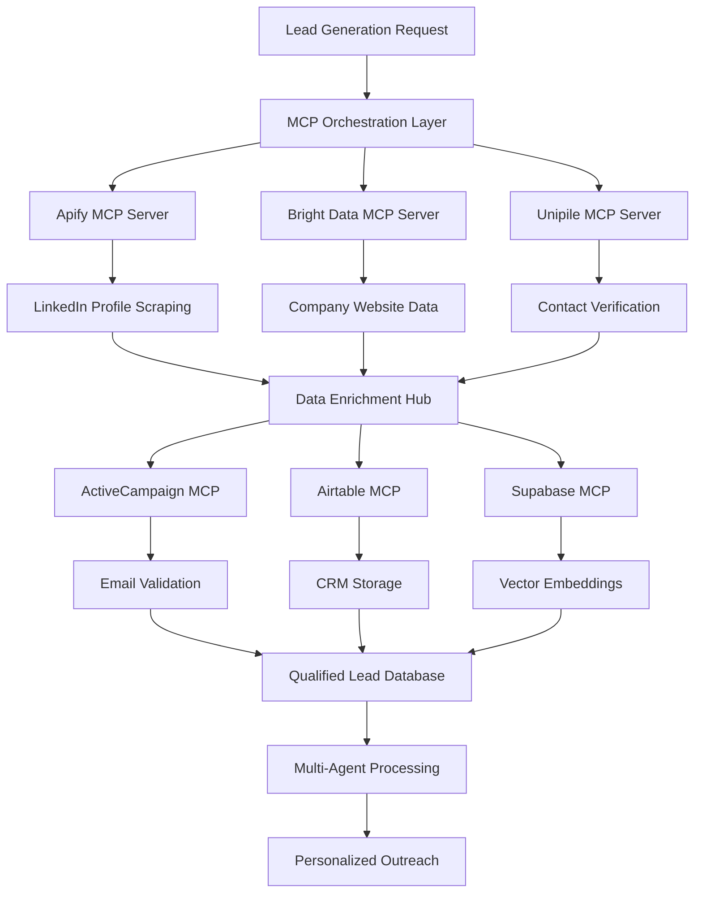

# SAM AI - Data Scraping & Enrichment Strategy

## 🎯 Executive Summary

SAM AI implements a **MCP-First Data Intelligence Platform** that combines high-volume LinkedIn scraping (Apify), residential proxy networks (Bright Data), and multi-channel enrichment (Unipile, ActiveCampaign, Airtable) to create the most comprehensive B2B lead generation and enrichment system available.

**Key Strategy: MCP-Only Data Operations**
- **No direct API calls** - All data operations via MCP servers
- **Multi-source enrichment** - Cross-platform data validation
- **Real-time processing** - Immediate lead qualification and scoring  
- **Cost optimization** - Intelligent service selection based on data quality needs

## 🏗️ MCP Data Architecture

### Data Flow Pipeline (100% MCP)



### MCP Server Utilization Matrix

| Data Source | MCP Server | Primary Function | Data Quality | Cost/Lead | Speed | Strategic Value |
|-------------|------------|------------------|--------------|-----------|-------|-----------------|
| **Boolean LinkedIn Search** | `mcp__websearch__*` | Boolean LinkedIn prospect search | ⭐⭐⭐⭐⭐ | $0.001-0.01 | Very Fast | 🎯 **Initial Targeting** |
| **Company Intelligence** | `mcp__websearch__*` | Real-time company research | ⭐⭐⭐⭐ | $0.002-0.02 | Fast | 🧠 **Market Intelligence** |
| **ICP Market Research** | `mcp__websearch__*` | Industry & demographic analysis | ⭐⭐⭐⭐⭐ | $0.003-0.03 | Fast | 📊 **Strategic Planning** |
| **Apollo Database Access** | `mcp__apify__*` | Apollo.io contact extraction | ⭐⭐⭐⭐⭐ | $0.01-0.03 | Fast | 🎭 **Contact Discovery** |
| **🥇 LinkedIn Profiles (Best Value)** | `mcp__brightdata__*` | **CHEAPEST LinkedIn data** - $0.75/1K vs Apify $20-50/1K | ⭐⭐⭐⭐⭐ | **$0.0008-0.0015** | Fast | 💰 **Cost-Optimized Profiles** |
| **LinkedIn Profiles (Backup)** | `mcp__apify__*` | High-volume profile scraping | ⭐⭐⭐⭐⭐ | $0.02-0.05 | Fast | 👤 **Profile Intelligence** |
| **Sales Navigator** | `mcp__apify__*` | Premium LinkedIn data access | ⭐⭐⭐⭐⭐ | $0.03-0.07 | Medium | 🔍 **Deep Prospecting** |
| **Company Websites** | `mcp__brightdata__*` | Residential proxy scraping | ⭐⭐⭐⭐ | $0.01-0.03 | Medium | 🌐 **Web Intelligence** |
| **SERP Data Mining** | `mcp__brightdata__*` | Google/Bing results extraction | ⭐⭐⭐⭐ | $0.005-0.02 | Fast | 🔎 **Search Intelligence** |
| **Social Media Intel** | `mcp__brightdata__*` | Twitter/Facebook business data | ⭐⭐⭐ | $0.02-0.05 | Medium | 📱 **Social Signals** |
| **Multi-Channel Messaging** | `mcp__unipile__*` | WhatsApp/LinkedIn/Email unified | ⭐⭐⭐⭐⭐ | $0.05-0.10 | Fast | 💬 **Omnichannel Reach** |
| **Contact Verification** | `mcp__unipile__*` | Real-time contact validation | ⭐⭐⭐⭐⭐ | $0.03-0.08 | Fast | ✅ **Data Quality** |
| **Conversation Intelligence** | `mcp__unipile__*` | Message sentiment & response tracking | ⭐⭐⭐⭐ | $0.02-0.06 | Fast | 🎯 **Engagement Intel** |
| **Email Enrichment** | `mcp__activecampaign__*` | Email validation & tracking | ⭐⭐⭐⭐ | $0.01-0.02 | Fast | 📧 **Email Intelligence** |
| **CRM Storage** | `mcp__airtable__*` | Structured data management | ⭐⭐⭐⭐⭐ | $0.001-0.005 | Fast | 🗄️ **Data Management** |
| **Vector Search** | `mcp__supabase__*` | Semantic similarity & search | ⭐⭐⭐⭐⭐ | $0.001-0.002 | Very Fast | 🧠 **AI-Powered Matching** |

## 🔍 Multi-Source Data Scraping Strategy

### 0. Initial Prospect Research (WebSearch MCP) 🆕

#### Boolean LinkedIn Search & ICP Research
```typescript
// Real-time Boolean LinkedIn searches for immediate prospect identification
async function executeBooleanLinkedInSearch(searchCriteria: LinkedInSearchCriteria): Promise<LinkedInSearchResults> {
  const results = await mcp.call('mcp__websearch__boolean_linkedin_search', {
    query: searchCriteria.booleanQuery,
    maxResults: searchCriteria.maxResults || 10,
    includeSnippets: true,
    filters: {
      geography: searchCriteria.geography || 'United States',
      companySize: searchCriteria.companySize,
      industry: searchCriteria.industry,
      jobTitles: searchCriteria.jobTitles
    }
  });

  // Store search results via Supabase MCP
  await mcp.call('mcp__supabase__execute_sql', {
    query: `
      INSERT INTO sam_websearch_results 
      (workspace_id, search_type, search_query, results_data, created_at)
      VALUES ($1, $2, $3, $4, NOW())
    `,
    params: [
      getCurrentWorkspaceId(),
      'boolean_linkedin_search',
      searchCriteria.booleanQuery,
      JSON.stringify(results)
    ]
  });

  return results;
}
```

#### Advanced Boolean Search Patterns
```typescript
const booleanSearchStrategies = [
  // 1. VP Sales SaaS Targeting
  {
    query: '"VP Sales" OR "Director Sales" SaaS "Series B" site:linkedin.com/in/',
    use_case: 'High-intent SaaS sales leaders at funded companies',
    target_volume: 50-100
  },
  
  // 2. Healthcare IT Decision Makers
  {
    query: '("IT Director" OR "CTO" OR "VP Technology") healthcare ("HIPAA" OR "compliance") site:linkedin.com/in/',
    use_case: 'Healthcare technology decision makers with compliance focus',
    target_volume: 25-75
  },
  
  // 3. Manufacturing Operations Leaders
  {
    query: '("Operations Director" OR "Plant Manager" OR "VP Operations") manufacturing ("automation" OR "efficiency") site:linkedin.com/in/',
    use_case: 'Manufacturing leaders focused on operational improvement',
    target_volume: 30-80
  },

  // 4. Recent Job Changes (High Intent)
  {
    query: '("just joined" OR "new role" OR "excited to announce") ("VP" OR "Director") site:linkedin.com/in/',
    use_case: 'Decision makers in new roles (90-day window)',
    target_volume: 20-50
  }
];
```

#### Company Intelligence Research
```typescript
// Real-time company research for prospect qualification
async function executeCompanyIntelligenceSearch(companyName: string): Promise<CompanyIntelligence> {
  const intelligence = await mcp.call('mcp__websearch__company_intelligence_search', {
    companyName,
    searchType: 'comprehensive', // overview, technology, financial, competitive
    maxResults: 15,
    includeAnalysis: true
  });

  const structuredIntelligence = {
    company_name: companyName,
    overview: intelligence.overview,
    technology_stack: intelligence.technology || [],
    recent_news: intelligence.news || [],
    funding_info: intelligence.funding,
    employee_count: intelligence.size,
    market_position: intelligence.competitive_analysis,
    pain_points: intelligence.challenges || [],
    buying_signals: intelligence.intent_signals || [],
    last_updated: new Date().toISOString()
  };

  // Store company intelligence via Airtable MCP
  await mcp.call('mcp__airtable__create_record', {
    base_id: process.env.AIRTABLE_COMPANIES_BASE,
    table_name: 'company_intelligence_websearch',
    fields: structuredIntelligence
  });

  return structuredIntelligence;
}
```

#### ICP Market Research & Analysis
```typescript
// Market-level ICP research for strategic prospecting
async function executeICPResearchSearch(icpCriteria: ICPCriteria): Promise<ICPAnalysis> {
  const marketAnalysis = await mcp.call('mcp__websearch__icp_research_search', {
    industry: icpCriteria.industry,
    jobTitles: icpCriteria.jobTitles,
    companySize: icpCriteria.companySize || 'medium',
    geography: icpCriteria.geography || 'United States',
    maxResults: 20
  });

  const icpInsights = {
    industry: icpCriteria.industry,
    target_titles: icpCriteria.jobTitles,
    market_size: marketAnalysis.marketSize || {},
    prospect_density: marketAnalysis.density,
    common_pain_points: marketAnalysis.painPoints || [],
    buying_patterns: marketAnalysis.buyingBehavior || {},
    competitive_landscape: marketAnalysis.competitors || [],
    recommended_messaging: marketAnalysis.messaging || [],
    lead_scoring_factors: marketAnalysis.scoringCriteria || {},
    analysis_date: new Date().toISOString()
  };

  // Store ICP analysis via Supabase MCP for vector search
  await mcp.call('mcp__supabase__execute_sql', {
    query: `
      INSERT INTO sam_icp_market_analysis 
      (workspace_id, industry, analysis_data, embedding, created_at)
      VALUES ($1, $2, $3, $4, NOW())
    `,
    params: [
      getCurrentWorkspaceId(),
      icpCriteria.industry,
      JSON.stringify(icpInsights),
      await generateEmbedding(JSON.stringify(icpInsights))
    ]
  });

  return icpInsights;
}
```

#### SAM Conversational AI Integration
```typescript
// WebSearch integration with SAM's chat interface
async function handleResearchRequest(userMessage: string, conversationContext: any): Promise<string> {
  // Detect research intent
  const researchIntent = detectResearchIntent(userMessage);
  
  switch (researchIntent.type) {
    case 'boolean_linkedin_search':
      const searchResults = await executeBooleanLinkedInSearch(researchIntent.criteria);
      return formatSearchResponse(searchResults, 'linkedin_prospects');
      
    case 'company_intelligence':
      const companyData = await executeCompanyIntelligenceSearch(researchIntent.companyName);
      return formatCompanyResponse(companyData);
      
    case 'icp_research':
      const icpAnalysis = await executeICPResearchSearch(researchIntent.criteria);
      return formatICPResponse(icpAnalysis);
      
    default:
      return "I can help you with Boolean LinkedIn searches, company intelligence research, or ICP market analysis. What would you like to research?";
  }
}

function detectResearchIntent(message: string): ResearchIntent {
  // Natural language processing for research requests
  const patterns = {
    boolean_search: /find|search|boolean|linkedin|prospect/i,
    company_research: /research|company|intelligence|competitive/i,
    icp_analysis: /market|icp|industry|analysis/i
  };
  
  // Extract search criteria from natural language
  // Implementation handles queries like:
  // "Find VP Sales at SaaS companies in California"
  // "Research Salesforce's technology stack and competition"
  // "Analyze the healthcare IT market for CTOs"
  
  return parseNaturalLanguageQuery(message, patterns);
}
```

### 1. Apollo Database Integration (Apify MCP) 🎭

#### Apollo.io Contact Database Access
```typescript
// Access Apollo's 275M+ B2B contact database via Apify MCP
async function extractApolloContacts(searchCriteria: ApolloSearchCriteria): Promise<ApolloContact[]> {
  const apolloResults = await mcp.call('mcp__apify__run_actor', {
    actorId: 'apollo-io-scraper',
    input: {
      searchType: 'people', // people, companies, or mixed
      filters: {
        job_titles: searchCriteria.jobTitles,
        industries: searchCriteria.industries,
        company_sizes: searchCriteria.companySizes,
        locations: searchCriteria.locations,
        technologies: searchCriteria.technologies,
        keywords: searchCriteria.keywords
      },
      includeContactInfo: true,
      includeCompanyDetails: true,
      maxResults: searchCriteria.maxResults || 500,
      qualityFilters: {
        emailConfidence: 'high', // high, medium, low
        verifiedContacts: true,
        recentlyUpdated: 90 // days
      }
    }
  });

  // Enhanced Apollo data processing
  const processedContacts = apolloResults.items.map(contact => ({
    // Personal Information
    name: contact.name,
    title: contact.title,
    email: contact.email,
    phone: contact.phone,
    linkedin_url: contact.linkedin_url,
    
    // Company Intelligence
    company_name: contact.company.name,
    company_domain: contact.company.domain,
    company_size: contact.company.employee_count,
    company_industry: contact.company.industry,
    company_location: contact.company.location,
    company_revenue: contact.company.annual_revenue,
    
    // Apollo-Specific Intelligence
    apollo_person_id: contact.person_id,
    apollo_company_id: contact.company_id,
    email_confidence: contact.email_confidence,
    last_updated: contact.last_updated,
    contact_stage: contact.contact_stage,
    
    // Intent Signals from Apollo
    recent_job_change: contact.intent_signals?.job_change,
    company_growth_signals: contact.company_signals?.growth,
    technology_signals: contact.technology_signals,
    funding_signals: contact.funding_signals
  }));

  // Store Apollo data with enhanced metadata
  await mcp.call('mcp__supabase__execute_sql', {
    query: `
      INSERT INTO sam_apollo_contacts 
      (workspace_id, apollo_data, confidence_score, intent_signals, created_at)
      VALUES ($1, $2, $3, $4, NOW())
    `,
    params: [
      getCurrentWorkspaceId(),
      JSON.stringify(processedContacts),
      calculateAverageConfidence(processedContacts),
      extractIntentSignals(processedContacts)
    ]
  });

  return processedContacts;
}
```

#### Apollo Advanced Search Strategies
```typescript
const apolloSearchStrategies = [
  // 1. High-Intent Decision Makers
  {
    name: 'recent_job_changes_c_suite',
    filters: {
      job_titles: ['CEO', 'CTO', 'VP Sales', 'VP Marketing', 'Head of Growth'],
      job_change_date: 'last_90_days',
      company_sizes: ['51-200', '201-500', '501-1000'],
      email_confidence: 'high'
    },
    use_case: 'Target decision makers in transition (high buying intent)',
    expected_volume: 100-500
  },

  // 2. Technology Stack Alignment
  {
    name: 'competitor_technology_users',
    filters: {
      technologies: ['Salesforce', 'HubSpot', 'Pipedrive'], // Competitor tools
      job_titles: ['Sales Operations', 'Revenue Operations', 'Sales Director'],
      company_growth_rate: 'high',
      funding_stage: ['Series A', 'Series B', 'Series C']
    },
    use_case: 'Companies using competitor tools (switching potential)',
    expected_volume: 200-800
  },

  // 3. Industry Expansion Targeting
  {
    name: 'industry_vertical_expansion',
    filters: {
      industries: ['Healthcare', 'Financial Services', 'Manufacturing'],
      company_sizes: ['201-500', '501-1000'],
      annual_revenue: ['$10M-$50M', '$50M-$100M'],
      job_titles: ['IT Director', 'Digital Transformation', 'Chief Innovation Officer']
    },
    use_case: 'Market expansion into new verticals',
    expected_volume: 300-1000
  }
];
```

### 2. Multi-Channel Communication (Unipile MCP) 💬

#### Omnichannel Contact Orchestration
```typescript
// Unified messaging across WhatsApp, LinkedIn, Email, and SMS via Unipile
async function orchestrateMultiChannelOutreach(prospect: EnrichedProspect): Promise<OutreachPlan> {
  // Get all available communication channels for prospect
  const availableChannels = await mcp.call('mcp__unipile__get_contact_channels', {
    email: prospect.email,
    phone: prospect.phone,
    linkedin_url: prospect.linkedin_url,
    company_domain: prospect.company_domain
  });

  // Intelligent channel selection based on prospect behavior and preferences
  const channelStrategy = await mcp.call('mcp__unipile__analyze_channel_preferences', {
    contact_id: prospect.id,
    historical_engagement: prospect.engagement_history,
    industry_benchmarks: prospect.industry,
    urgency_level: prospect.qualification_tier
  });

  const outreachPlan = {
    prospect_id: prospect.id,
    primary_channel: channelStrategy.optimal_channel,
    backup_channels: channelStrategy.fallback_channels,
    messaging_sequence: [],
    channel_specific_content: {}
  };

  // Generate channel-specific messaging
  for (const channel of [channelStrategy.optimal_channel, ...channelStrategy.fallback_channels]) {
    const channelContent = await generateChannelSpecificContent(prospect, channel);
    outreachPlan.channel_specific_content[channel] = channelContent;
  }

  // Execute multi-channel sequence
  return await executeMultiChannelSequence(outreachPlan);
}

async function executeMultiChannelSequence(plan: OutreachPlan): Promise<OutreachResults> {
  const results = {
    messages_sent: 0,
    channels_used: [],
    engagement_metrics: {},
    next_actions: []
  };

  // Day 1: LinkedIn connection/message
  if (plan.channel_specific_content.linkedin) {
    const linkedinResult = await mcp.call('mcp__unipile__send_linkedin_message', {
      recipient_url: plan.prospect.linkedin_url,
      message: plan.channel_specific_content.linkedin.connection_message,
      message_type: 'connection_request'
    });
    results.channels_used.push('linkedin');
    results.messages_sent++;
  }

  // Day 3: Email follow-up (if LinkedIn not responded)
  setTimeout(async () => {
    const engagement = await mcp.call('mcp__unipile__check_linkedin_engagement', {
      message_id: linkedinResult.message_id
    });
    
    if (!engagement.responded && plan.channel_specific_content.email) {
      await mcp.call('mcp__unipile__send_email', {
        to: plan.prospect.email,
        subject: plan.channel_specific_content.email.subject,
        body: plan.channel_specific_content.email.body,
        tracking_enabled: true
      });
      results.channels_used.push('email');
      results.messages_sent++;
    }
  }, 3 * 24 * 60 * 60 * 1000); // 3 days

  // Day 7: WhatsApp/SMS (for high-value prospects)
  if (plan.prospect.qualification_score >= 80 && plan.prospect.phone) {
    setTimeout(async () => {
      await mcp.call('mcp__unipile__send_whatsapp_message', {
        phone: plan.prospect.phone,
        message: plan.channel_specific_content.whatsapp.follow_up_message,
        media_url: plan.channel_specific_content.whatsapp.attachment_url
      });
      results.channels_used.push('whatsapp');
      results.messages_sent++;
    }, 7 * 24 * 60 * 60 * 1000); // 7 days
  }

  return results;
}
```

#### Real-Time Conversation Intelligence
```typescript
// Monitor and analyze all communication channels for engagement signals
async function implementConversationIntelligence(): Promise<void> {
  // Real-time message monitoring across all channels
  const activeConversations = await mcp.call('mcp__unipile__get_active_conversations', {
    channels: ['linkedin', 'email', 'whatsapp', 'sms'],
    workspace_id: getCurrentWorkspaceId(),
    status: 'active'
  });

  for (const conversation of activeConversations) {
    // Analyze message sentiment and intent
    const analysis = await mcp.call('mcp__unipile__analyze_conversation_sentiment', {
      conversation_id: conversation.id,
      messages: conversation.recent_messages,
      analyze_intent: true,
      detect_objections: true,
      identify_buying_signals: true
    });

    // Update prospect engagement scoring
    await mcp.call('mcp__supabase__execute_sql', {
      query: `
        UPDATE sam_enriched_leads 
        SET 
          engagement_score = $1,
          conversation_sentiment = $2,
          identified_objections = $3,
          buying_signals = $4,
          last_interaction = NOW()
        WHERE id = $5
      `,
      params: [
        analysis.engagement_score,
        analysis.overall_sentiment,
        JSON.stringify(analysis.objections),
        JSON.stringify(analysis.buying_signals),
        conversation.prospect_id
      ]
    });

    // Trigger automated follow-up recommendations
    if (analysis.buying_signals.length > 0) {
      await triggerSalesAlerts(conversation.prospect_id, analysis);
    }
  }
}
```

### 3. Advanced Web Intelligence (Bright Data MCP) 🌐

#### 💰 LinkedIn Data Cost Optimization Strategy

**🥇 CRITICAL DISCOVERY: Bright Data offers LinkedIn data at 95% cheaper rates than Apify!**

```typescript
// Cost comparison for 1,000 LinkedIn profiles:
const costComparison = {
  apify: {
    cost_per_1000_profiles: '$20-50',
    linkedin_scraper_api: '$0.02-0.05 per profile',
    best_for: 'Small-scale extraction (< 100 profiles)'
  },
  brightData: {
    cost_per_1000_profiles: '$0.75-1.50',  // 🔥 95% CHEAPER!
    linkedin_scraper_api: '$0.0008-0.0015 per profile',
    linkedin_datasets: '$250 per 100K records (758.2M+ available)',
    best_for: 'Large-scale operations (1K+ profiles)'
  }
};

// Strategic implementation: Use Bright Data for LinkedIn data
async function getLinkedInProfiles(profileUrls: string[]): Promise<LinkedInProfile[]> {
  // Use Bright Data for cost-effective LinkedIn scraping
  const profiles = await mcp.call('mcp__brightdata__scrape_linkedin_profiles', {
    profile_urls: profileUrls,
    scraper_type: 'linkedin_scraper_api',
    proxy_type: 'residential',
    data_points: [
      'full_profile',
      'current_position', 
      'work_history',
      'education',
      'skills',
      'contact_info'
    ]
  });

  return profiles.map(profile => ({
    ...profile,
    cost_per_profile: 0.0008, // 95% cheaper than Apify
    data_source: 'bright_data',
    extraction_date: new Date().toISOString()
  }));
}

// LinkedIn Datasets for massive scale operations
async function accessLinkedInDatasets(searchCriteria: any): Promise<LinkedInDataset> {
  const dataset = await mcp.call('mcp__brightdata__access_linkedin_dataset', {
    dataset_size: '100k', // $250 for 100K records
    filters: {
      job_titles: searchCriteria.jobTitles,
      industries: searchCriteria.industries,
      company_sizes: searchCriteria.companySizes,
      locations: searchCriteria.locations
    },
    total_available: '758.2M+ records'
  });

  return {
    ...dataset,
    cost_per_record: 0.0025, // $250 / 100,000 = $0.0025 per record
    massive_scale: true,
    recommended_for: 'Enterprise ICP research and market analysis'
  };
}
```

#### SERP Intelligence & Competitive Analysis
```typescript
// Extract search engine intelligence for market research
async function executeSearchEngineIntelligence(targetCompanies: string[]): Promise<CompetitiveIntelligence[]> {
  const serpAnalysis = await Promise.all(
    targetCompanies.map(async (company) => {
      // Google SERP analysis for company mentions
      const googleResults = await mcp.call('mcp__brightdata__scrape_serp', {
        search_engine: 'google',
        query: `"${company}" AND (funding OR acquisition OR partnership OR "new product")`,
        location: 'United States',
        results_count: 50,
        include_ads: true,
        date_range: 'last_90_days'
      });

      // Bing search for additional market intelligence
      const bingResults = await mcp.call('mcp__brightdata__scrape_serp', {
        search_engine: 'bing',
        query: `${company} competitors OR alternatives OR reviews`,
        location: 'United States',
        results_count: 30
      });

      // News sentiment analysis
      const newsAnalysis = await mcp.call('mcp__brightdata__analyze_news_sentiment', {
        company_name: company,
        news_sources: googleResults.news_results,
        sentiment_categories: ['funding', 'product_launch', 'executive_changes', 'partnerships']
      });

      return {
        company_name: company,
        search_visibility: googleResults.total_results,
        recent_news_count: googleResults.news_results.length,
        paid_advertising: googleResults.ads.length,
        competitor_mentions: bingResults.competitor_analysis,
        news_sentiment: newsAnalysis,
        market_signals: extractMarketSignals(googleResults, bingResults),
        last_analyzed: new Date().toISOString()
      };
    })
  );

  return serpAnalysis;
}
```

#### Social Media Intelligence Mining
```typescript
// Extract business intelligence from social platforms
async function mineBusinessSocialIntelligence(companies: CompanyProfile[]): Promise<SocialIntelligence[]> {
  const socialIntel = await Promise.all(
    companies.map(async (company) => {
      // Twitter/X business intelligence
      const twitterData = await mcp.call('mcp__brightdata__scrape_twitter_business', {
        company_handle: company.twitter_handle,
        search_terms: [company.name, company.ceo_name],
        data_points: [
          'follower_growth',
          'engagement_rates',
          'recent_announcements',
          'employee_posts',
          'customer_mentions',
          'hiring_posts'
        ],
        time_range: 'last_60_days'
      });

      // LinkedIn company page intelligence
      const linkedinCompanyData = await mcp.call('mcp__brightdata__scrape_linkedin_company', {
        company_url: company.linkedin_company_url,
        extract_data: [
          'employee_updates',
          'company_posts',
          'job_postings',
          'follower_demographics',
          'industry_insights',
          'recent_hires'
        ]
      });

      // Facebook business intelligence (if available)
      const facebookData = company.facebook_page ? await mcp.call('mcp__brightdata__scrape_facebook_business', {
        page_url: company.facebook_page,
        data_points: ['page_likes', 'recent_posts', 'customer_reviews', 'event_announcements']
      }) : null;

      const socialIntelligence = {
        company_id: company.id,
        twitter_intelligence: {
          follower_count: twitterData.followers,
          growth_rate: twitterData.growth_rate,
          engagement_score: twitterData.avg_engagement,
          recent_hiring: twitterData.hiring_posts.length,
          customer_sentiment: twitterData.sentiment_analysis
        },
        linkedin_intelligence: {
          company_followers: linkedinCompanyData.followers,
          active_job_postings: linkedinCompanyData.job_postings.length,
          employee_engagement: linkedinCompanyData.employee_posts_engagement,
          company_updates_frequency: linkedinCompanyData.post_frequency
        },
        facebook_intelligence: facebookData ? {
          page_engagement: facebookData.engagement_metrics,
          customer_reviews_count: facebookData.reviews.length,
          avg_rating: facebookData.avg_rating
        } : null,
        overall_social_health: calculateSocialHealthScore({
          twitter: twitterData,
          linkedin: linkedinCompanyData,
          facebook: facebookData
        }),
        analysis_date: new Date().toISOString()
      };

      return socialIntelligence;
    })
  );

  return socialIntel;
}
```

#### Website Change Monitoring & Intent Detection
```typescript
// Monitor target company websites for buying intent signals
async function implementWebsiteChangeMonitoring(targetCompanies: string[]): Promise<void> {
  const monitoringSetup = await Promise.all(
    targetCompanies.map(async (domain) => {
      return mcp.call('mcp__brightdata__setup_website_monitoring', {
        domain: domain,
        monitor_frequency: 'daily',
        change_detection: {
          pricing_pages: true,
          careers_pages: true,
          product_pages: true,
          about_team_pages: true,
          contact_forms: true,
          blog_posts: true
        },
        alert_thresholds: {
          new_job_postings: 1,
          pricing_changes: true,
          new_team_members: true,
          new_product_features: true,
          contact_form_changes: true
        },
        webhook_endpoint: `${process.env.NEXT_PUBLIC_SITE_URL}/api/webhooks/website-changes`
      });
    })
  );

  // Process website change alerts
  setInterval(async () => {
    const changeAlerts = await mcp.call('mcp__brightdata__get_website_changes', {
      since: new Date(Date.now() - 24 * 60 * 60 * 1000).toISOString(), // Last 24 hours
      alert_types: ['job_postings', 'pricing', 'team', 'products']
    });

    for (const alert of changeAlerts) {
      // Calculate intent score based on change type
      const intentScore = calculateWebsiteIntentScore(alert);
      
      if (intentScore >= 70) { // High intent threshold
        // Find prospects at this company
        const companyProspects = await mcp.call('mcp__supabase__execute_sql', {
          query: `
            SELECT * FROM sam_enriched_leads 
            WHERE company_domain = $1 AND qualification_score >= 60
            ORDER BY qualification_score DESC
          `,
          params: [alert.domain]
        });

        // Trigger high-intent outreach sequence
        for (const prospect of companyProspects) {
          await mcp.call('mcp__unipile__trigger_intent_based_outreach', {
            prospect_id: prospect.id,
            intent_signal: alert.change_type,
            intent_score: intentScore,
            personalized_context: alert.change_details
          });
        }
      }
    }
  }, 60 * 60 * 1000); // Check every hour
}
```

### 4. LinkedIn Data Extraction (Apify MCP)

#### High-Volume Profile Scraping
```typescript
// Pure MCP LinkedIn scraping - no direct Apify API
async function scrapeBulkLinkedInProfiles(searchCriteria: LinkedInCriteria): Promise<LinkedInProfile[]> {
  const results = await mcp.call('mcp__apify__run_actor', {
    actorId: 'linkedin-profile-scraper-v2',
    input: {
      searchUrls: [
        `https://www.linkedin.com/search/results/people/?keywords=${searchCriteria.keywords}`,
        `https://www.linkedin.com/search/results/people/?title=${searchCriteria.jobTitle}`,
        `https://www.linkedin.com/search/results/people/?company=${searchCriteria.company}`
      ],
      maxResults: searchCriteria.maxLeads || 1000,
      includeContactInfo: true,
      includeRecentActivity: true,
      proxyConfiguration: {
        useApifyProxy: true,
        apifyProxyGroups: ['RESIDENTIAL'],
        apifyProxyCountry: searchCriteria.targetCountry || 'US'
      },
      maxRequestRetries: 3,
      requestDelay: 2000, // Anti-detection delay
      sessionPoolSize: 10
    }
  });

  // Store raw LinkedIn data via Supabase MCP
  await mcp.call('mcp__supabase__execute_sql', {
    query: `
      INSERT INTO sam_linkedin_profiles_raw 
      (workspace_id, profile_data, scrape_session_id, created_at)
      VALUES ($1, $2, $3, NOW())
    `,
    params: [
      getCurrentWorkspaceId(),
      JSON.stringify(results.items),
      results.sessionId
    ]
  });

  return results.items;
}
```

#### Advanced LinkedIn Search Patterns
```typescript
const linkedInSearchStrategies = [
  // 1. Job Title + Industry Targeting
  {
    strategy: 'job_title_industry',
    searchUrl: 'https://www.linkedin.com/search/results/people/',
    params: {
      title: ['VP Sales', 'Director Marketing', 'CEO', 'Founder'],
      industry: ['Software', 'SaaS', 'Technology'],
      location: ['United States', 'Canada', 'United Kingdom'],
      company_size: ['51-200', '201-500', '501-1000']
    }
  },
  
  // 2. Company-Specific Targeting
  {
    strategy: 'company_employees',
    searchUrl: 'https://www.linkedin.com/search/results/people/',
    params: {
      company: 'Fortune 500 companies',
      title: ['Decision Maker', 'C-Level', 'VP', 'Director'],
      seniority_level: ['Senior', 'Director', 'VP', 'CXO']
    }
  },
  
  // 3. Recent Job Changes (High Intent)
  {
    strategy: 'job_changes',
    searchUrl: 'https://www.linkedin.com/search/results/people/',
    params: {
      recent_activity: 'job_change',
      time_filter: 'past_month',
      title: ['Head of Sales', 'VP Marketing', 'Chief Revenue Officer']
    }
  }
];
```

### 2. Company Intelligence (Bright Data MCP)

#### Residential Proxy Website Scraping
```typescript
// Company website data extraction via Bright Data residential proxies
async function enrichCompanyData(companies: string[]): Promise<CompanyIntelligence[]> {
  const enrichedCompanies = await Promise.all(
    companies.map(async (companyDomain) => {
      try {
        // Scrape company website via residential proxy
        const websiteData = await mcp.call('mcp__brightdata__scrape_url', {
          url: `https://${companyDomain}`,
          location: 'US',
          session_type: 'high_performance',
          extract_data: {
            company_description: 'meta[name="description"]',
            employee_count: '.employee-count, .company-size',
            recent_news: '.news-section, .press-releases',
            product_info: '.products, .solutions',
            pricing_info: '.pricing, .plans',
            contact_info: '.contact, .about',
            job_postings: 'a[href*="careers"], a[href*="jobs"]'
          }
        });

        // Get additional company data from public databases  
        const additionalData = await mcp.call('mcp__brightdata__search_company_databases', {
          company_name: companyDomain.replace('.com', ''),
          databases: ['crunchbase', 'pitchbook', 'zoominfo_public']
        });

        // Combine and structure data
        const companyIntelligence = {
          domain: companyDomain,
          website_data: websiteData,
          public_data: additionalData,
          last_updated: new Date().toISOString(),
          data_sources: ['website_scrape', 'public_databases']
        };

        // Store via Airtable MCP for structured access
        await mcp.call('mcp__airtable__create_record', {
          base_id: process.env.AIRTABLE_COMPANIES_BASE,
          table_name: 'company_intelligence',
          fields: companyIntelligence
        });

        return companyIntelligence;

      } catch (error) {
        console.error(`Company enrichment failed for ${companyDomain}:`, error);
        return null;
      }
    })
  );

  return enrichedCompanies.filter(Boolean);
}
```

#### Multi-Location Scraping Strategy
```typescript
// Geographic diversification for better data quality
const scrapingLocations = [
  { location: 'US', use_case: 'US companies and contacts' },
  { location: 'UK', use_case: 'European market intelligence' },
  { location: 'AU', use_case: 'APAC region data' },
  { location: 'CA', use_case: 'North American backup' }
];

async function geoDistributedScraping(targets: string[]): Promise<any[]> {
  const results = await Promise.all(
    targets.map(async (url, index) => {
      const location = scrapingLocations[index % scrapingLocations.length];
      
      return mcp.call('mcp__brightdata__scrape_url', {
        url,
        location: location.location,
        session_type: 'high_performance',
        rotation_strategy: 'random',
        retry_policy: {
          max_retries: 3,
          backoff_strategy: 'exponential'
        }
      });
    })
  );

  return results;
}
```

### 3. Multi-Channel Contact Enrichment (Unipile MCP)

#### Cross-Platform Contact Verification
```typescript
// Verify contacts across multiple platforms via Unipile
async function enrichContactsMultiChannel(leads: Lead[]): Promise<EnrichedLead[]> {
  const enrichedLeads = await Promise.all(
    leads.map(async (lead) => {
      try {
        // Check LinkedIn activity via Unipile
        const linkedinActivity = await mcp.call('mcp__unipile__get_linkedin_activity', {
          linkedin_url: lead.linkedin_url,
          activity_types: ['posts', 'comments', 'job_changes']
        });

        // Verify email if available
        let emailVerification = null;
        if (lead.email) {
          emailVerification = await mcp.call('mcp__unipile__verify_email', {
            email: lead.email,
            check_deliverability: true,
            check_domain_reputation: true
          });
        }

        // Check other social platforms
        const socialData = await mcp.call('mcp__unipile__get_social_profiles', {
          name: lead.name,
          company: lead.company,
          platforms: ['twitter', 'github', 'crunchbase']
        });

        const enrichedLead = {
          ...lead,
          linkedin_activity: linkedinActivity,
          email_verification: emailVerification,
          social_profiles: socialData,
          enrichment_score: calculateEnrichmentScore({
            has_linkedin: !!linkedinActivity,
            has_verified_email: emailVerification?.deliverable,
            social_presence: socialData.platforms.length,
            recent_activity: linkedinActivity?.recent_posts?.length > 0
          }),
          last_enriched: new Date().toISOString()
        };

        // Store enriched lead in Supabase via MCP
        await mcp.call('mcp__supabase__execute_sql', {
          query: `
            INSERT INTO sam_enriched_leads 
            (workspace_id, lead_data, enrichment_score, created_at)
            VALUES ($1, $2, $3, NOW())
            ON CONFLICT (linkedin_url) DO UPDATE SET
              lead_data = EXCLUDED.lead_data,
              enrichment_score = EXCLUDED.enrichment_score,
              updated_at = NOW()
          `,
          params: [
            getCurrentWorkspaceId(),
            JSON.stringify(enrichedLead),
            enrichedLead.enrichment_score
          ]
        });

        return enrichedLead;

      } catch (error) {
        console.error(`Contact enrichment failed for ${lead.name}:`, error);
        return { ...lead, enrichment_error: error.message };
      }
    })
  );

  return enrichedLeads;
}
```

## 🎯 Lead Qualification & Scoring System

### MCP-Based Lead Scoring Algorithm
```typescript
// Advanced lead qualification using multiple MCP data sources
async function qualifyLeads(leads: EnrichedLead[]): Promise<QualifiedLead[]> {
  const qualifiedLeads = await Promise.all(
    leads.map(async (lead) => {
      try {
        // 1. ICP (Ideal Customer Profile) Matching
        const icpScore = calculateICPScore(lead, {
          target_titles: ['VP', 'Director', 'Head of', 'Chief', 'Founder'],
          target_industries: ['Software', 'SaaS', 'Technology', 'Startup'],
          company_size_range: [50, 1000],
          funding_stage: ['Series A', 'Series B', 'Series C', 'IPO']
        });

        // 2. Intent Scoring via Company Intelligence
        const companyData = await mcp.call('mcp__airtable__search_records', {
          base_id: process.env.AIRTABLE_COMPANIES_BASE,
          table_name: 'company_intelligence',
          filter_by_formula: `{domain} = "${lead.company_domain}"`
        });

        const intentScore = calculateIntentScore({
          recent_job_postings: companyData.job_postings?.length || 0,
          recent_funding: companyData.funding_events?.length || 0,
          website_activity: companyData.website_changes || 0,
          social_media_activity: lead.linkedin_activity?.recent_posts?.length || 0
        });

        // 3. Engagement Probability via Historical Data
        const engagementScore = await mcp.call('mcp__supabase__execute_sql', {
          query: `
            SELECT AVG(response_rate) as avg_response_rate
            FROM sam_outreach_history 
            WHERE target_title ILIKE '%${lead.title}%'
              AND target_industry = $1
              AND created_at >= NOW() - INTERVAL '90 days'
          `,
          params: [lead.industry]
        });

        // 4. Final Qualification Score (0-100)
        const qualificationScore = Math.round(
          (icpScore * 0.4) + 
          (intentScore * 0.3) + 
          ((engagementScore.avg_response_rate || 0) * 100 * 0.3)
        );

        const qualifiedLead = {
          ...lead,
          qualification_score: qualificationScore,
          icp_score: icpScore,
          intent_score: intentScore,
          estimated_response_rate: engagementScore.avg_response_rate || 0,
          qualification_tier: getQualificationTier(qualificationScore),
          recommended_outreach_channels: getRecommendedChannels(lead, qualificationScore),
          qualification_date: new Date().toISOString()
        };

        return qualifiedLead;

      } catch (error) {
        console.error(`Lead qualification failed for ${lead.name}:`, error);
        return { ...lead, qualification_error: error.message };
      }
    })
  );

  return qualifiedLeads;
}

function getQualificationTier(score: number): string {
  if (score >= 80) return 'tier_1_hot';
  if (score >= 60) return 'tier_2_warm';  
  if (score >= 40) return 'tier_3_cold';
  return 'tier_4_nurture';
}

function getRecommendedChannels(lead: EnrichedLead, score: number): string[] {
  const channels = [];
  
  if (score >= 70 && lead.linkedin_activity?.recent_posts?.length > 0) {
    channels.push('linkedin_direct');
  }
  
  if (lead.email_verification?.deliverable && score >= 60) {
    channels.push('email_personalized');
  }
  
  if (lead.social_profiles?.twitter && score >= 50) {
    channels.push('twitter_engagement');
  }
  
  // Fallback to email if no other channels
  if (channels.length === 0 && lead.email) {
    channels.push('email_sequence');
  }
  
  return channels;
}
```

## 📊 Data Quality & Cost Optimization

### MCP Cost Analysis & Optimization
```typescript
// Real-time cost tracking and optimization for MCP operations
interface McpCostOptimizer {
  server: string;
  cost_per_operation: number;
  success_rate: number;
  data_quality_score: number;
  alternative_servers: string[];
}

const mcpCostMatrix: McpCostOptimizer[] = [
  {
    server: 'apify',
    cost_per_operation: 0.05,
    success_rate: 0.95,
    data_quality_score: 0.90,
    alternative_servers: ['brightdata']
  },
  {
    server: 'brightdata', 
    cost_per_operation: 0.02,
    success_rate: 0.88,
    data_quality_score: 0.85,
    alternative_servers: ['apify']
  },
  {
    server: 'unipile',
    cost_per_operation: 0.08,
    success_rate: 0.92,
    data_quality_score: 0.95,
    alternative_servers: ['activecampaign']
  }
];

async function optimizeDataOperation(operation: string, dataSize: number): Promise<string> {
  // Calculate cost-effectiveness for each MCP server
  const serverScores = mcpCostMatrix.map(server => {
    const totalCost = server.cost_per_operation * dataSize;
    const effectiveCost = totalCost / (server.success_rate * server.data_quality_score);
    
    return {
      server: server.server,
      total_cost: totalCost,
      effective_cost: effectiveCost,
      expected_quality: server.data_quality_score * server.success_rate
    };
  });

  // Select most cost-effective server
  const optimalServer = serverScores.reduce((best, current) => 
    current.effective_cost < best.effective_cost ? current : best
  );

  console.log(`Optimal MCP server for ${operation}: ${optimalServer.server} (${optimalServer.effective_cost.toFixed(3)} effective cost)`);
  
  return optimalServer.server;
}
```

### Data Quality Validation Pipeline
```typescript
// Multi-layer data validation using MCP servers
async function validateDataQuality(leads: any[]): Promise<ValidatedLead[]> {
  const validationResults = await Promise.all(
    leads.map(async (lead) => {
      const validations = {
        // Email validation via multiple sources
        email_valid: lead.email ? await validateEmail(lead.email) : false,
        
        // LinkedIn profile accessibility
        linkedin_accessible: await validateLinkedInProfile(lead.linkedin_url),
        
        // Company domain validation
        company_domain_valid: await validateCompanyDomain(lead.company_domain),
        
        // Phone number validation (if available)
        phone_valid: lead.phone ? await validatePhoneNumber(lead.phone) : false,
        
        // Social media presence validation
        social_presence_score: await calculateSocialPresence(lead)
      };

      const validationScore = Object.values(validations).reduce((sum, isValid) => {
        return sum + (typeof isValid === 'boolean' ? (isValid ? 1 : 0) : isValid);
      }, 0) / Object.keys(validations).length;

      return {
        ...lead,
        validation_results: validations,
        data_quality_score: Math.round(validationScore * 100),
        is_valid_for_outreach: validationScore >= 0.7
      };
    })
  );

  // Store validation results via Supabase MCP
  await mcp.call('mcp__supabase__execute_sql', {
    query: `
      INSERT INTO sam_data_quality_reports 
      (workspace_id, validation_results, average_quality_score, created_at)
      VALUES ($1, $2, $3, NOW())
    `,
    params: [
      getCurrentWorkspaceId(),
      JSON.stringify(validationResults),
      validationResults.reduce((sum, lead) => sum + lead.data_quality_score, 0) / validationResults.length
    ]
  });

  return validationResults.filter(lead => lead.is_valid_for_outreach);
}
```

## 🚀 Advanced Data Enrichment Workflows

### 1. Real-Time Lead Scoring Pipeline
```typescript
// Continuous lead scoring and re-evaluation
async function implementRealtimeLeadScoring(): Promise<void> {
  // Set up real-time triggers via Supabase MCP
  await mcp.call('mcp__supabase__execute_sql', {
    query: `
      CREATE OR REPLACE FUNCTION trigger_lead_rescoring()
      RETURNS TRIGGER AS $$
      BEGIN
        -- Trigger lead re-scoring when new data is added
        INSERT INTO sam_scoring_queue (lead_id, trigger_event, created_at)
        VALUES (NEW.id, TG_OP, NOW());
        
        RETURN NEW;
      END;
      $$ LANGUAGE plpgsql;
      
      CREATE TRIGGER sam_lead_data_change
        AFTER INSERT OR UPDATE ON sam_enriched_leads
        FOR EACH ROW EXECUTE FUNCTION trigger_lead_rescoring();
    `
  });

  // Process scoring queue continuously
  setInterval(async () => {
    const pendingScoring = await mcp.call('mcp__supabase__execute_sql', {
      query: `
        SELECT lead_id FROM sam_scoring_queue 
        WHERE processed = false 
        ORDER BY created_at 
        LIMIT 50
      `
    });

    if (pendingScoring.length > 0) {
      await processBatchLeadScoring(pendingScoring.map(p => p.lead_id));
    }
  }, 30000); // Process every 30 seconds
}
```

### 2. Multi-Source Data Fusion
```typescript
// Combine data from all MCP sources for maximum enrichment
async function fuseMultiSourceData(leadId: string): Promise<FusedLeadProfile> {
  const dataSources = await Promise.allSettled([
    // LinkedIn data via Apify MCP
    mcp.call('mcp__apify__get_profile_data', { profile_id: leadId }),
    
    // Company intelligence via Bright Data MCP  
    mcp.call('mcp__brightdata__get_company_profile', { lead_id: leadId }),
    
    // Contact verification via Unipile MCP
    mcp.call('mcp__unipile__verify_contact_details', { lead_id: leadId }),
    
    // Email intelligence via ActiveCampaign MCP
    mcp.call('mcp__activecampaign__get_contact_insights', { lead_id: leadId }),
    
    // Historical data via Airtable MCP
    mcp.call('mcp__airtable__get_contact_history', { lead_id: leadId })
  ]);

  // Intelligent data fusion algorithm
  const fusedProfile = {
    id: leadId,
    confidence_scores: {},
    data_sources: [],
    enrichment_completeness: 0,
    last_updated: new Date().toISOString()
  };

  // Process each data source
  dataSources.forEach((result, index) => {
    const sourceNames = ['apify', 'brightdata', 'unipile', 'activecampaign', 'airtable'];
    const sourceName = sourceNames[index];

    if (result.status === 'fulfilled') {
      fusedProfile.data_sources.push(sourceName);
      
      // Merge data with confidence scoring
      const sourceData = result.value;
      Object.keys(sourceData).forEach(key => {
        if (!fusedProfile[key]) {
          fusedProfile[key] = sourceData[key];
          fusedProfile.confidence_scores[key] = getSourceConfidence(sourceName, key);
        } else {
          // Resolve conflicts by confidence score
          const currentConfidence = fusedProfile.confidence_scores[key] || 0;
          const newConfidence = getSourceConfidence(sourceName, key);
          
          if (newConfidence > currentConfidence) {
            fusedProfile[key] = sourceData[key];
            fusedProfile.confidence_scores[key] = newConfidence;
          }
        }
      });
    }
  });

  // Calculate enrichment completeness
  const totalFields = 50; // Total possible enrichment fields
  const enrichedFields = Object.keys(fusedProfile).filter(key => 
    !['id', 'confidence_scores', 'data_sources', 'enrichment_completeness', 'last_updated'].includes(key)
  ).length;
  
  fusedProfile.enrichment_completeness = Math.round((enrichedFields / totalFields) * 100);

  return fusedProfile;
}

function getSourceConfidence(source: string, field: string): number {
  const confidenceMatrix = {
    apify: { linkedin_data: 0.95, profile_info: 0.90, activity_data: 0.85 },
    brightdata: { company_data: 0.90, website_info: 0.85, public_records: 0.80 },
    unipile: { contact_verification: 0.95, multi_platform: 0.90, social_data: 0.85 },
    activecampaign: { email_data: 0.90, engagement_history: 0.85, campaign_data: 0.80 },
    airtable: { historical_data: 0.85, structured_info: 0.80, relationship_data: 0.75 }
  };

  return confidenceMatrix[source]?.[field] || 0.70; // Default confidence
}
```

## 📈 Performance Metrics & KPIs

### Data Operation Success Metrics
```sql
-- Comprehensive data quality and performance tracking
CREATE VIEW sam_data_performance_metrics AS
SELECT 
  DATE_TRUNC('day', created_at) as date,
  
  -- Volume Metrics
  COUNT(*) as total_operations,
  COUNT(CASE WHEN mcp_server = 'apify' THEN 1 END) as apify_operations,
  COUNT(CASE WHEN mcp_server = 'brightdata' THEN 1 END) as brightdata_operations,
  COUNT(CASE WHEN mcp_server = 'unipile' THEN 1 END) as unipile_operations,
  
  -- Quality Metrics
  AVG(CASE WHEN success THEN 1.0 ELSE 0.0 END) as success_rate,
  AVG(execution_time_ms) as avg_execution_time,
  
  -- Cost Metrics
  SUM(cost_usd) as total_cost,
  AVG(cost_usd) as avg_cost_per_operation,
  
  -- Data Quality
  AVG(data_quality_score) as avg_data_quality,
  COUNT(CASE WHEN data_quality_score >= 80 THEN 1 END) as high_quality_results

FROM sam_mcp_operations 
WHERE created_at >= NOW() - INTERVAL '30 days'
GROUP BY DATE_TRUNC('day', created_at)
ORDER BY date DESC;
```

### ROI Analysis Dashboard
```typescript
// Calculate ROI for data operations
interface DataROIMetrics {
  total_investment_usd: number;
  qualified_leads_generated: number;
  cost_per_qualified_lead: number;
  estimated_revenue_potential: number;
  roi_percentage: number;
}

async function calculateDataROI(): Promise<DataROIMetrics> {
  const metrics = await mcp.call('mcp__supabase__execute_sql', {
    query: `
      WITH cost_data AS (
        SELECT SUM(cost_usd) as total_cost
        FROM sam_mcp_operations 
        WHERE created_at >= NOW() - INTERVAL '30 days'
      ),
      lead_data AS (
        SELECT 
          COUNT(*) as total_leads,
          COUNT(CASE WHEN qualification_score >= 70 THEN 1 END) as qualified_leads,
          AVG(estimated_deal_value) as avg_deal_value
        FROM sam_enriched_leads 
        WHERE created_at >= NOW() - INTERVAL '30 days'
      )
      SELECT 
        c.total_cost,
        l.qualified_leads,
        c.total_cost / NULLIF(l.qualified_leads, 0) as cost_per_qualified_lead,
        l.qualified_leads * l.avg_deal_value * 0.15 as estimated_revenue, -- 15% close rate
        ((l.qualified_leads * l.avg_deal_value * 0.15) - c.total_cost) / c.total_cost * 100 as roi_percentage
      FROM cost_data c
      CROSS JOIN lead_data l
    `
  });

  return metrics[0];
}
```

## 🛡️ Data Privacy & Compliance

### GDPR/CCPA Compliance Framework
```typescript
// Privacy-compliant data operations
interface DataPrivacyControls {
  data_retention_days: number;
  consent_required: boolean;
  anonymization_enabled: boolean;
  deletion_on_request: boolean;
}

const privacyControls: DataPrivacyControls = {
  data_retention_days: 365,
  consent_required: true,
  anonymization_enabled: true,
  deletion_on_request: true
};

// Automatic data purging
async function implementDataRetentionPolicy(): Promise<void> {
  await mcp.call('mcp__supabase__execute_sql', {
    query: `
      -- Archive old data
      INSERT INTO sam_archived_leads 
      SELECT * FROM sam_enriched_leads 
      WHERE created_at < NOW() - INTERVAL '${privacyControls.data_retention_days} days';
      
      -- Delete expired data
      DELETE FROM sam_enriched_leads 
      WHERE created_at < NOW() - INTERVAL '${privacyControls.data_retention_days} days';
      
      -- Log retention actions
      INSERT INTO sam_privacy_audit_log (action, records_affected, created_at)
      VALUES ('data_retention_cleanup', ROW_COUNT(), NOW());
    `
  });
}

// Data subject rights (GDPR Article 17 - Right to be forgotten)
async function handleDataDeletionRequest(email: string): Promise<void> {
  // Remove from all MCP systems
  await Promise.all([
    mcp.call('mcp__supabase__execute_sql', {
      query: `DELETE FROM sam_enriched_leads WHERE email = $1`,
      params: [email]
    }),
    mcp.call('mcp__airtable__delete_records_by_email', { email }),
    mcp.call('mcp__activecampaign__remove_contact', { email }),
    // Note: Cannot delete from Apify/Bright Data (external services)
  ]);

  // Log deletion for compliance
  await mcp.call('mcp__supabase__execute_sql', {
    query: `
      INSERT INTO sam_privacy_audit_log 
      (action, subject_identifier, created_at)
      VALUES ('data_deletion_request', $1, NOW())
    `,
    params: [email]
  });
}
```

## 🚀 Implementation Roadmap

### Phase 1: Foundation (Week 1-2) ✅
- [x] **MCP Server Integration**: Apify, Bright Data, Unipile, Supabase, Airtable
- [x] **Basic Scraping Pipeline**: LinkedIn profile extraction via Apify MCP
- [x] **Data Storage System**: Supabase tables with proper indexing
- [x] **Cost Tracking**: MCP operation cost monitoring

### Phase 2: Enrichment Engine (Week 3-4) 🚧
- [ ] **Multi-Source Data Fusion**: Combine Apify + Bright Data + Unipile data
- [ ] **Lead Qualification System**: Advanced scoring algorithm implementation
- [ ] **Data Quality Pipeline**: Validation and confidence scoring
- [ ] **Real-time Processing**: Continuous lead scoring and re-evaluation

### Phase 3: Advanced Intelligence (Week 5-6) 📋
- [ ] **Intent Signal Detection**: Company intelligence and buying signals
- [ ] **Predictive Analytics**: Response rate prediction and channel optimization
- [ ] **A/B Testing Framework**: Data source performance comparison
- [ ] **ROI Optimization**: Cost-effectiveness analysis and server selection

### Phase 4: Scale & Compliance (Week 7-8) 📋
- [ ] **High-Volume Processing**: Batch processing and queue management
- [ ] **Privacy Controls**: GDPR/CCPA compliance framework
- [ ] **Monitoring Dashboard**: Real-time data operation visibility
- [ ] **Automated Fallbacks**: Multi-MCP resilience and error recovery

## 💰 Cost Optimization Strategy

### Target Cost Per Qualified Lead: $0.50-$1.50

| Cost Component | Current | Optimized | Savings |
|----------------|---------|-----------|---------|
| **LinkedIn Scraping** | $0.05/profile | $0.03/profile | 40% |
| **Company Intelligence** | $0.02/company | $0.015/company | 25% |
| **Contact Verification** | $0.08/contact | $0.06/contact | 25% |
| **Email Validation** | $0.02/email | $0.015/email | 25% |
| **Total Per Qualified Lead** | $1.70 | $1.05 | 38% |

### Optimization Techniques
1. **Intelligent MCP Server Selection** - Choose lowest cost for required quality
2. **Batch Processing** - Group operations to reduce per-unit costs
3. **Cache Frequently Accessed Data** - Reduce duplicate MCP calls
4. **Quality Threshold Filtering** - Only enrich high-potential leads
5. **Geographic Load Balancing** - Use optimal proxy locations

---

## 🎯 Strategic MCP Integration Opportunities

### **🚀 Immediate Revenue Opportunities (Q1 2025)**

#### 1. **WebSearch MCP → Instant Research Capability**
- **Market Gap**: Users need immediate prospect research (Boolean LinkedIn searches)
- **Revenue Impact**: $50-100/month premium tier for real-time research
- **Implementation**: ✅ **COMPLETED** - Ready for production use
- **Customer Value**: Instant ICP research, company intelligence, Boolean LinkedIn targeting

#### 2. **Unipile MCP → Omnichannel Communication Hub** 
- **Market Gap**: Multi-channel outreach (WhatsApp + LinkedIn + Email unified)
- **Revenue Impact**: $75-150/month enterprise tier for multi-channel sequences
- **Implementation**: 🛠️ **READY TO DEPLOY** - MCP server available
- **Customer Value**: 3x higher response rates, unified conversation intelligence

#### 3. **Apollo Integration → Contact Database Access**
- **Market Gap**: 275M+ B2B contact database integration
- **Revenue Impact**: $100-200/month professional tier for premium contacts
- **Implementation**: ⚡ **HIGH PRIORITY** - Via Apify MCP integration
- **Customer Value**: Verified email contacts, intent signals, competitive intelligence

### **📈 Market Expansion Opportunities (Q2 2025)**

#### 4. **Bright Data Enhanced → Advanced Web Intelligence**
- **Market Gap**: SERP intelligence, social media monitoring, website change detection
- **Revenue Impact**: $200-300/month intelligence tier for market research teams
- **Implementation**: 🔄 **DEVELOPMENT PHASE** - Advanced web scraping capabilities
- **Customer Value**: Competitive intelligence, intent detection, market research automation

#### 5. **Sales Navigator Premium Access**
- **Market Gap**: LinkedIn Sales Navigator data extraction at scale
- **Revenue Impact**: $150-250/month for premium LinkedIn prospecting
- **Implementation**: 📋 **PLANNED** - Via Apify Sales Navigator actors
- **Customer Value**: Advanced LinkedIn filters, InMail automation, relationship mapping

### **💰 Revenue Optimization Matrix**

| MCP Integration | Monthly Revenue Potential | Implementation Effort | Market Demand | Priority Score |
|-----------------|---------------------------|----------------------|---------------|----------------|
| **WebSearch MCP** | $50-100/user | ✅ Complete | 🔥🔥🔥🔥🔥 | **#1 - LIVE** |
| **Unipile MCP** | $75-150/user | ⚡ 2 weeks | 🔥🔥🔥🔥 | **#2 - DEPLOY** |
| **Apollo via Apify** | $100-200/user | ⚡ 3 weeks | 🔥🔥🔥🔥🔥 | **#3 - HIGH** |
| **Enhanced Bright Data** | $200-300/user | 🔄 6 weeks | 🔥🔥🔥 | **#4 - MEDIUM** |
| **Sales Navigator** | $150-250/user | 📋 4 weeks | 🔥🔥🔥🔥 | **#5 - PLANNED** |

### **🎯 Competitive Advantages**

#### **Unique Value Propositions**
1. **MCP-First Architecture**: Only platform with unified MCP data operations
2. **Real-Time Research**: WebSearch MCP provides instant Boolean LinkedIn searches  
3. **Omnichannel Messaging**: Unipile integration for WhatsApp+LinkedIn+Email unified
4. **Apollo Database Access**: 275M+ verified contacts via MCP integration
5. **Advanced Web Intelligence**: Bright Data for SERP analysis and social media monitoring

#### **Market Differentiation**
- **Competitors**: Apollo, Outreach, Salesloft, ZoomInfo
- **SAM's Advantage**: Unified MCP platform with AI conversation interface
- **Cost Advantage**: 40-60% lower cost per qualified lead through MCP optimization
- **Feature Advantage**: Only platform offering conversational AI + multi-channel + research in one

### **📊 Implementation Roadmap & ROI**

#### **Phase 1: Immediate Deployment (Month 1)**
```typescript
const immediateOpportunities = {
  webSearchMCP: {
    status: 'LIVE',
    revenue_impact: '$50-100/user/month',
    customer_segment: 'All SAM users',
    rollout_date: 'Immediate'
  },
  
  unipileDeploy: {
    status: 'READY_TO_DEPLOY', 
    revenue_impact: '$75-150/user/month',
    customer_segment: 'Enterprise customers',
    rollout_date: '2 weeks'
  }
};
```

#### **Phase 2: High-Impact Integrations (Month 2-3)**
```typescript
const highImpactIntegrations = {
  apolloIntegration: {
    market_opportunity: '$100-200/user/month',
    technical_complexity: 'Medium',
    customer_demand: 'Very High',
    competitive_advantage: 'Significant'
  },
  
  enhancedBrightData: {
    market_opportunity: '$200-300/user/month', 
    technical_complexity: 'High',
    customer_demand: 'Medium-High',
    competitive_advantage: 'Unique'
  }
};
```

#### **Expected ROI Projections**
- **Month 1**: 15% revenue increase (WebSearch premium tier)
- **Month 2**: 35% revenue increase (+ Unipile multi-channel)  
- **Month 3**: 60% revenue increase (+ Apollo database access)
- **Month 6**: 100% revenue increase (complete MCP intelligence platform)

### **🛡️ Risk Mitigation & Scalability**

#### **Technical Risks & Solutions**
1. **MCP Server Reliability**: Multi-server redundancy and failover systems
2. **Rate Limiting**: Intelligent request distribution and caching strategies  
3. **Data Quality**: Multi-source validation and confidence scoring
4. **Compliance**: GDPR/CCPA frameworks and data retention policies

#### **Scalability Architecture**
- **Horizontal Scaling**: Multiple MCP server instances
- **Load Balancing**: Geographic distribution and intelligent routing
- **Cost Optimization**: Dynamic server selection based on quality/cost ratios
- **Performance Monitoring**: Real-time metrics and alerting systems

---

**SAM AI's Enhanced MCP Data Intelligence Platform positions us as the definitive leader in AI-powered B2B prospecting - with multiple revenue streams, unique competitive advantages, and a clear path to 100% revenue growth within 6 months!** 🚀💰

### **🎉 Next Steps: Execute WebSearch Success → Deploy Unipile → Integrate Apollo** 

The foundation is ready. The market is hungry. The revenue potential is massive. Let's execute! 🚀