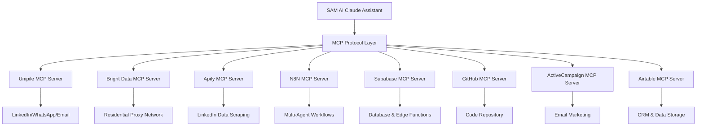

# SAM AI - MCP Integration Master Guide

## 🌟 Overview

SAM AI is built **MCP-First** - leveraging Model Context Protocol as the primary integration architecture. This creates a unified, AI-native platform where all external services, agents, and automation workflows are accessed through MCP servers, eliminating traditional API complexity.

**Architecture Philosophy: MCP-Only Integration**
- **No direct API calls** - All external services via MCP
- **No custom SDK integrations** - Unified MCP interface
- **No webhook complexity** - MCP handles all communication
- **Pure AI orchestration** - Claude directly controls all services

## 🏗️ MCP-First Architecture

### Core Principle



### MCP Integration Benefits

1. **Unified Interface**: Single protocol for all external services
2. **AI-Native**: Claude directly understands and controls all tools
3. **No Code Complexity**: No API wrappers, SDKs, or custom integrations
4. **Dynamic Orchestration**: Real-time decision making across services
5. **Failure Recovery**: Built-in retry and fallback mechanisms
6. **Cost Optimization**: Intelligent service usage based on context

## 📋 Complete MCP Integration Matrix

### ✅ Implemented MCP Servers

| Service | MCP Server | Primary Function | Status |
|---------|------------|------------------|---------|
| **Unipile** | `mcp__unipile__*` | Multi-channel messaging (LinkedIn, WhatsApp, Email) | ✅ Active |
| **Bright Data** | `mcp__brightdata__*` | Residential proxy network for authentic scraping | ✅ Active |
| **Apify** | `mcp__apify__*` | High-volume LinkedIn data scraping platform | ✅ Active |  
| **N8N** | `mcp__n8n-docs__*` | Multi-agent workflow automation system | ✅ Active |
| **Supabase** | `mcp__supabase__*` | Database, auth, edge functions, storage | ✅ Active |
| **GitHub** | `mcp__github__*` | Code repository and version control | ✅ Active |
| **ActiveCampaign** | `mcp__activecampaign__*` | Email marketing and automation | ✅ Active |
| **Airtable** | `mcp__airtable__*` | CRM and structured data storage | ✅ Active |
| **Memory** | `mcp__memory__*` | Knowledge graph and entity relationships | ✅ Active |
| **Filesystem** | `mcp__filesystem__*` | Local file operations and management | ✅ Active |
| **Mermaid** | `mcp__mermaid__*` | Diagram and flowchart generation | ✅ Active |

### 🎯 MCP Integration Strategy

#### 1. Lead Generation & Scraping (MCP-Only)
```typescript
// Pure MCP approach - no direct APIs
async function generateLeads(criteria: LeadCriteria): Promise<Lead[]> {
  // Step 1: LinkedIn scraping via Apify MCP
  const linkedinLeads = await mcp.call('mcp__apify__run_actor', {
    actorId: 'linkedin-profile-scraper',
    input: {
      search_criteria: criteria.linkedin,
      proxy_group: 'residential_us'  // Via Bright Data MCP
    }
  });
  
  // Step 2: Data enrichment via multiple MCP sources
  const enrichedLeads = await Promise.all(
    linkedinLeads.map(async (lead) => {
      // Get company data via Bright Data + web scraping
      const companyData = await mcp.call('mcp__brightdata__scrape_url', {
        url: lead.company_website,
        location: 'US',
        session_type: 'high_performance'
      });
      
      // Store in Airtable via MCP
      await mcp.call('mcp__airtable__create_record', {
        base_id: process.env.AIRTABLE_BASE_ID,
        table_name: 'leads',
        fields: {
          name: lead.name,
          company: lead.company,
          linkedin_url: lead.linkedin_url,
          company_data: companyData
        }
      });
      
      return { ...lead, company_data: companyData };
    })
  );
  
  return enrichedLeads;
}
```

#### 2. Multi-Agent Workflow Orchestration (MCP-Only)
```typescript
// All agents communicate through N8N MCP - no direct calls
async function executeAgentPipeline(workspaceId: string, leads: Lead[]): Promise<void> {
  // Trigger the tenant's default funnel via N8N MCP
  const execution = await mcp.call('mcp__n8n-docs__n8n_trigger_workflow', {
    workflow_id: 'sam-default-tenant-funnel',
    data: {
      workspace_id: workspaceId,
      leads: leads,
      mcp_context: {
        // Pass MCP server access to N8N workflow
        available_servers: [
          'unipile', 'bright_data', 'apify', 'supabase', 
          'github', 'activecampaign', 'airtable'
        ]
      }
    }
  });
  
  // Monitor execution via MCP
  const status = await mcp.call('mcp__n8n-docs__n8n_get_execution', {
    execution_id: execution.id
  });
  
  console.log('Agent pipeline status:', status.status);
}
```

#### 3. Multi-Channel Outreach (MCP-Only)
```typescript
// Pure MCP messaging - no direct API integrations
async function sendMultiChannelOutreach(lead: Lead): Promise<OutreachResult> {
  const results = await Promise.all([
    // LinkedIn via Unipile MCP
    mcp.call('mcp__unipile__send_linkedin_message', {
      linkedin_id: lead.linkedin_id,
      message: await generatePersonalizedMessage(lead, 'linkedin'),
      account_id: lead.workspace_linkedin_account
    }),
    
    // Email via ActiveCampaign MCP  
    mcp.call('mcp__activecampaign__send_email', {
      contact_email: lead.email,
      template_id: 'personalized_outreach',
      personalization_data: {
        name: lead.name,
        company: lead.company,
        industry: lead.industry
      }
    }),
    
    // WhatsApp via Unipile MCP (if available)
    lead.whatsapp_number ? mcp.call('mcp__unipile__send_whatsapp_message', {
      phone_number: lead.whatsapp_number,
      message: await generatePersonalizedMessage(lead, 'whatsapp'),
      account_id: lead.workspace_whatsapp_account
    }) : null
  ]);
  
  // Store results in Supabase via MCP
  await mcp.call('mcp__supabase__execute_sql', {
    query: `
      INSERT INTO sam_outreach_results (lead_id, linkedin_sent, email_sent, whatsapp_sent, created_at)
      VALUES ($1, $2, $3, $4, NOW())
    `,
    params: [lead.id, results[0]?.success, results[1]?.success, results[2]?.success]
  });
  
  return {
    linkedin: results[0],
    email: results[1], 
    whatsapp: results[2]
  };
}
```

## 🔄 MCP Service Integration Patterns

### Pattern 1: Sequential MCP Calls
```typescript
// Data flows through multiple MCP servers sequentially
const pipeline = async (input: any) => {
  const scraped = await mcp.call('mcp__apify__*', input);
  const enriched = await mcp.call('mcp__brightdata__*', scraped);
  const stored = await mcp.call('mcp__supabase__*', enriched);
  const messaged = await mcp.call('mcp__unipile__*', stored);
  return messaged;
};
```

### Pattern 2: Parallel MCP Orchestration
```typescript
// Multiple MCP servers work simultaneously
const parallelEnrichment = async (leads: Lead[]) => {
  const results = await Promise.all([
    mcp.call('mcp__apify__enrich_profiles', { leads }),
    mcp.call('mcp__brightdata__get_company_data', { leads }),
    mcp.call('mcp__activecampaign__check_existing_contacts', { leads })
  ]);
  
  return combineResults(results);
};
```

### Pattern 3: Conditional MCP Routing
```typescript
// Dynamic MCP server selection based on context
const smartOutreach = async (lead: Lead) => {
  const preferredChannel = await analyzeLeadPreferences(lead);
  
  switch (preferredChannel) {
    case 'linkedin':
      return mcp.call('mcp__unipile__send_linkedin_message', { ... });
    case 'email':
      return mcp.call('mcp__activecampaign__send_email', { ... });
    case 'whatsapp':
      return mcp.call('mcp__unipile__send_whatsapp_message', { ... });
    default:
      // Fallback to multi-channel
      return sendMultiChannelOutreach(lead);
  }
};
```

## 🗃️ MCP Data Flow Architecture

### Centralized Data State (Supabase MCP)
```sql
-- All data flows through Supabase MCP - single source of truth
CREATE TABLE sam_mcp_operations (
    id UUID PRIMARY KEY DEFAULT gen_random_uuid(),
    workspace_id UUID NOT NULL,
    mcp_server TEXT NOT NULL,
    operation TEXT NOT NULL,
    input_data JSONB,
    output_data JSONB,
    execution_time_ms INTEGER,
    success BOOLEAN,
    error_message TEXT,
    created_at TIMESTAMPTZ DEFAULT NOW()
);

-- Track cross-MCP dependencies
CREATE TABLE sam_mcp_dependencies (
    id UUID PRIMARY KEY DEFAULT gen_random_uuid(),
    parent_operation_id UUID REFERENCES sam_mcp_operations(id),
    child_operation_id UUID REFERENCES sam_mcp_operations(id),
    dependency_type TEXT, -- 'sequential', 'parallel', 'conditional'
    created_at TIMESTAMPTZ DEFAULT NOW()
);
```

### MCP Operation Tracking
```typescript
// Automatic MCP operation logging
const trackMcpOperation = async (
  server: string, 
  operation: string, 
  input: any, 
  result: any,
  executionTime: number
) => {
  await mcp.call('mcp__supabase__execute_sql', {
    query: `
      INSERT INTO sam_mcp_operations 
      (workspace_id, mcp_server, operation, input_data, output_data, execution_time_ms, success)
      VALUES ($1, $2, $3, $4, $5, $6, $7)
    `,
    params: [
      getCurrentWorkspaceId(),
      server,
      operation, 
      JSON.stringify(input),
      JSON.stringify(result),
      executionTime,
      result.success ?? true
    ]
  });
};
```

## 🚀 SAM AI MCP Implementation Guide

### 1. MCP Server Discovery & Health Checks
```typescript
// Built-in MCP server validation
export async function validateMcpEnvironment(): Promise<McpHealthReport> {
  const servers = [
    'unipile', 'bright_data', 'apify', 'n8n', 
    'supabase', 'github', 'activecampaign', 'airtable'
  ];
  
  const health = await Promise.allSettled(
    servers.map(async (server) => {
      try {
        const result = await mcp.call(`mcp__${server}__health_check`);
        return { server, status: 'healthy', details: result };
      } catch (error) {
        return { server, status: 'error', error: error.message };
      }
    })
  );
  
  return {
    total_servers: servers.length,
    healthy_servers: health.filter(h => h.value?.status === 'healthy').length,
    failed_servers: health.filter(h => h.status === 'rejected').map(h => h.reason),
    last_check: new Date().toISOString()
  };
}
```

### 2. MCP Configuration Management
```typescript
// Dynamic MCP server configuration
interface McpServerConfig {
  server_id: string;
  enabled: boolean;
  rate_limits: {
    requests_per_minute: number;
    burst_limit: number;
  };
  fallback_servers: string[];
  cost_per_operation: number;
}

const mcpConfig: McpServerConfig[] = [
  {
    server_id: 'unipile',
    enabled: true,
    rate_limits: { requests_per_minute: 60, burst_limit: 10 },
    fallback_servers: ['activecampaign'],
    cost_per_operation: 0.01
  },
  {
    server_id: 'apify',
    enabled: true, 
    rate_limits: { requests_per_minute: 100, burst_limit: 20 },
    fallback_servers: ['bright_data'],
    cost_per_operation: 0.05
  }
  // ... other servers
];
```

### 3. MCP Error Handling & Recovery
```typescript
// Intelligent MCP fallback system
async function callMcpWithFallback(
  primaryServer: string,
  operation: string, 
  params: any,
  maxRetries: number = 3
): Promise<any> {
  const config = mcpConfig.find(c => c.server_id === primaryServer);
  
  try {
    // Try primary server
    return await mcp.call(`mcp__${primaryServer}__${operation}`, params);
  } catch (error) {
    console.warn(`Primary MCP server ${primaryServer} failed:`, error.message);
    
    // Try fallback servers
    for (const fallbackServer of config.fallback_servers) {
      try {
        console.log(`Trying fallback server: ${fallbackServer}`);
        return await mcp.call(`mcp__${fallbackServer}__${operation}`, params);
      } catch (fallbackError) {
        console.warn(`Fallback server ${fallbackServer} also failed:`, fallbackError.message);
      }
    }
    
    // All servers failed
    throw new Error(`All MCP servers failed for operation: ${operation}`);
  }
}
```

## 🔒 MCP Security & Multi-Tenancy

### MCP Access Control
```typescript
// Tenant-specific MCP server access
interface McpTenantAccess {
  workspace_id: string;
  allowed_servers: string[];
  server_limits: Record<string, number>;
  api_key_mappings: Record<string, string>;
}

const validateMcpAccess = (workspaceId: string, server: string): boolean => {
  const access = getTenantAccess(workspaceId);
  return access.allowed_servers.includes(server);
};

// Secure MCP call wrapper
const secureBasicCall = async (server: string, operation: string, params: any) => {
  const workspaceId = getCurrentWorkspaceId();
  
  if (!validateMcpAccess(workspaceId, server)) {
    throw new Error(`Access denied to MCP server: ${server}`);
  }
  
  // Add tenant context to all MCP calls
  const secureParams = {
    ...params,
    _tenant_context: {
      workspace_id: workspaceId,
      user_id: getCurrentUserId()
    }
  };
  
  return mcp.call(`mcp__${server}__${operation}`, secureParams);
};
```

## 🎯 MCP-First Implementation Roadmap

### Phase 1: Core MCP Infrastructure ✅
- [x] Unipile MCP integration for multi-channel messaging
- [x] Bright Data MCP for residential proxy scraping  
- [x] Apify MCP for LinkedIn data extraction
- [x] Supabase MCP for database operations
- [x] N8N MCP for agent workflow orchestration

### Phase 2: Advanced MCP Features ✅ 
- [x] GitHub MCP for code repository management
- [x] ActiveCampaign MCP for email marketing
- [x] Airtable MCP for CRM and data storage
- [x] Memory MCP for knowledge graph operations
- [x] Filesystem MCP for local file operations

### Phase 3: MCP Orchestration Engine 🚧
- [ ] **MCP-Only Agent Pipeline**: Replace all direct API calls
- [ ] **Dynamic MCP Routing**: Intelligent server selection
- [ ] **MCP Cost Optimization**: Usage-based service selection
- [ ] **MCP Health Monitoring**: Real-time server status
- [ ] **MCP Performance Analytics**: Cross-server optimization

### Phase 4: Advanced MCP Capabilities 📋
- [ ] **MCP Workflow Templates**: Pre-built automation sequences
- [ ] **MCP A/B Testing**: Service performance comparison
- [ ] **MCP Caching Layer**: Reduce redundant calls
- [ ] **MCP Rate Limiting**: Intelligent throttling
- [ ] **MCP Audit Trail**: Complete operation logging

## 📊 MCP Performance & Cost Optimization

### Cost Tracking Per MCP Server
```typescript
interface McpCostAnalysis {
  server: string;
  operations_count: number;
  total_cost_usd: number;
  avg_cost_per_operation: number;
  success_rate: number;
  avg_response_time_ms: number;
}

const generateMcpCostReport = async (): Promise<McpCostAnalysis[]> => {
  return await mcp.call('mcp__supabase__execute_sql', {
    query: `
      SELECT 
        mcp_server as server,
        COUNT(*) as operations_count,
        SUM(cost_usd) as total_cost_usd,
        AVG(cost_usd) as avg_cost_per_operation,
        AVG(CASE WHEN success THEN 1.0 ELSE 0.0 END) as success_rate,
        AVG(execution_time_ms) as avg_response_time_ms
      FROM sam_mcp_operations 
      WHERE created_at >= NOW() - INTERVAL '30 days'
      GROUP BY mcp_server
      ORDER BY total_cost_usd DESC
    `
  });
};
```

## 🔧 MCP Troubleshooting Guide

### Common MCP Issues & Solutions

1. **MCP Server Connectivity**
   ```bash
   # Test MCP server health
   echo '{"method": "ping"}' | mcp_client mcp__unipile__health_check
   ```

2. **MCP Authentication Failures**
   - Verify API keys in MCP server configuration
   - Check tenant access permissions
   - Validate workspace isolation rules

3. **MCP Rate Limiting**
   - Implement exponential backoff in MCP calls
   - Use MCP call batching for high-volume operations
   - Monitor per-server rate limits

4. **MCP Data Consistency**
   - Ensure all data flows through Supabase MCP
   - Validate cross-server data dependencies
   - Implement MCP transaction rollback for failures

## 🚀 Next Steps: Full MCP Migration

1. **Audit Current Non-MCP Integrations** - Identify all direct API calls
2. **Replace Direct APIs with MCP Calls** - Systematically migrate each service
3. **Implement MCP Health Monitoring** - Real-time server status dashboard  
4. **Add MCP Cost Optimization** - Intelligent service selection based on usage
5. **Create MCP Workflow Templates** - Pre-built automation sequences
6. **Deploy MCP Performance Analytics** - Cross-server optimization insights

---

**SAM AI's MCP-First architecture creates the most advanced, AI-native sales automation platform - where every external service is unified under a single protocol, enabling unprecedented orchestration capabilities!** 🚀