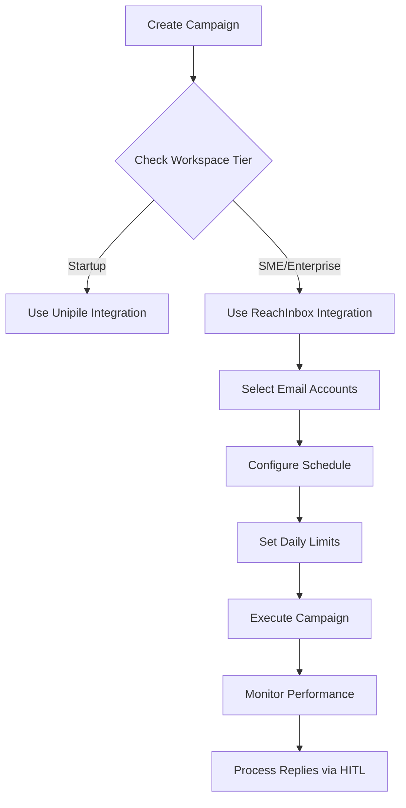

# ReachInbox Integration Guide for SAM AI
## SME & Enterprise Plans - Managed Email Infrastructure

---

## 🎯 **REACHINBOX TIER AVAILABILITY**

### **❌ NOT Available on Startup Plan ($99/month)**
- **Reason**: Requires extensive manual setup and domain configuration
- **Alternative**: **Unipile integration** (already implemented)
- **Startup Plan Users**: Use `/api/campaigns/email/execute` with Unipile

### **✅ Available on SME Plan ($399/month)**
- **Includes**: Complete email infrastructure setup by our team
- **Managed Service**: 6 email accounts, 2 custom domains, 30-day warmup
- **Volume**: 4,800 emails/month (6 accounts × 800 each)

### **✅ Available on Enterprise Plan ($899/month)**  
- **Includes**: Enterprise email infrastructure with dedicated IPs
- **Managed Service**: 20+ email accounts, 4+ domains, 45-day warmup
- **Volume**: 16,000+ emails/month (20 accounts × 800 each)

---

## 📋 **REACHINBOX SETUP REQUIREMENTS**

### **Pre-Setup Checklist (Managed by SAM AI Team)**

#### **1. Domain Requirements**
- **SME Plan**: 2 custom domains purchased and configured
- **Enterprise Plan**: 4+ custom domains with dedicated IPs
- **Domain Types**: `.com`, `.io`, `.net` (avoid new TLDs for deliverability)
- **Domain Age**: Minimum 30 days old for optimal reputation

#### **2. Email Account Structure**
```
SME Plan Example (6 accounts across 2 domains):
Domain 1: yourcompany.com
├── sales@yourcompany.com
├── team@yourcompany.com  
├── hello@yourcompany.com
├── connect@yourcompany.com
└── reach@yourcompany.com

Domain 2: yourcompany.sales
└── outreach@yourcompany.sales
```

#### **3. Technical Configuration (Handled by SAM AI Team)**
- **SPF Record**: `v=spf1 include:reachinbox.com ~all`
- **DKIM Configuration**: ReachInbox-specific DKIM keys
- **DMARC Policy**: `v=DMARC1; p=quarantine; rua=mailto:dmarc@yourcompany.com`
- **MX Records**: Point to ReachInbox servers
- **Warmup Process**: 30-45 day automated warmup

---

## 🔧 **REACHINBOX API INTEGRATION**

### **1. API Configuration**

```typescript
// ReachInbox API Configuration
const REACHINBOX_API_URL = 'https://api.reachinbox.ai/api/v1';
const REACHINBOX_API_KEY = process.env.REACHINBOX_API_KEY;

interface ReachInboxConfig {
  workspace_id: string;
  api_key: string;
  email_accounts: Array<{
    id: string;
    email: string;
    domain: string;
    status: 'active' | 'warming' | 'inactive';
    daily_limit: number;
    warmup_stage: number;
  }>;
}
```

### **2. Campaign Execution API**

```typescript
// app/api/campaigns/email/reachinbox/route.ts
import { NextRequest, NextResponse } from 'next/server';

interface ReachInboxCampaignRequest {
  campaign_id: string;
  email_accounts: string[]; // Array of account IDs to use
  prospects: Array<{
    email: string;
    first_name: string;
    last_name: string;
    company_name: string;
    personalized_subject: string;
    personalized_body: string;
  }>;
  schedule: {
    start_date: string;
    daily_limit_per_account: number;
    time_zone: string;
    sending_hours: {
      start: string;
      end: string;
    };
  };
}

export async function POST(req: NextRequest) {
  const supabase = createClient();
  
  // Get user and validate workspace tier
  const { data: { user } } = await supabase.auth.getUser();
  
  // Check workspace tier - ReachInbox only for SME/Enterprise
  const { data: workspaceTier } = await supabase
    .from('workspace_tiers')
    .select('tier')
    .eq('workspace_id', user.user_metadata.workspace_id)
    .single();

  if (!workspaceTier || workspaceTier.tier === 'startup') {
    return NextResponse.json({ 
      error: 'ReachInbox requires SME or Enterprise plan',
      current_tier: workspaceTier?.tier || 'startup',
      upgrade_info: {
        sme_plan: '$399/month - 6 email accounts, managed setup',
        enterprise_plan: '$899/month - 20+ accounts, dedicated IPs'
      }
    }, { status: 403 });
  }

  const request: ReachInboxCampaignRequest = await req.json();
  
  // Execute ReachInbox campaign
  const campaign = await executeReachInboxCampaign(request);
  
  return NextResponse.json(campaign);
}

async function executeReachInboxCampaign(request: ReachInboxCampaignRequest) {
  // ReachInbox API call implementation
  const response = await fetch(`${REACHINBOX_API_URL}/campaigns`, {
    method: 'POST',
    headers: {
      'Authorization': `Bearer ${REACHINBOX_API_KEY}`,
      'Content-Type': 'application/json'
    },
    body: JSON.stringify({
      name: `SAM AI Campaign ${request.campaign_id}`,
      prospects: request.prospects,
      email_accounts: request.email_accounts,
      schedule: request.schedule,
      tracking: {
        open_tracking: true,
        click_tracking: true,
        reply_tracking: true,
        unsubscribe_tracking: true
      }
    })
  });

  return await response.json();
}
```

### **3. Webhook Handler for ReachInbox Events**

```typescript
// app/api/campaigns/email/reachinbox/webhook/route.ts
export async function POST(req: NextRequest) {
  const webhook = await req.json();
  
  switch (webhook.event_type) {
    case 'email_sent':
      await handleEmailSent(webhook);
      break;
    case 'email_opened':
      await handleEmailOpened(webhook);
      break;
    case 'email_replied':
      await handleEmailReplied(webhook);
      break;
    case 'email_bounced':
      await handleEmailBounced(webhook);
      break;
    case 'email_clicked':
      await handleEmailClicked(webhook);
      break;
    case 'unsubscribed':
      await handleUnsubscribed(webhook);
      break;
  }

  return NextResponse.json({ status: 'processed' });
}

async function handleEmailReplied(webhook: any) {
  const supabase = createClient();
  
  // Find campaign message
  const { data: message } = await supabase
    .from('campaign_messages')
    .select('campaign_id, prospect_id')
    .eq('platform_message_id', webhook.message_id)
    .single();

  if (message) {
    // Update prospect status
    await supabase.rpc('update_campaign_prospect_status', {
      p_campaign_id: message.campaign_id,
      p_prospect_id: message.prospect_id,
      p_status: 'replied',
      p_reply_content: webhook.reply_content
    });

    // Create HITL approval session for SAM response
    await createHITLSession({
      workspace_id: webhook.workspace_id,
      campaign_id: message.campaign_id,
      prospect_id: message.prospect_id,
      original_message_content: webhook.reply_content,
      channel: 'email',
      prospect_email: webhook.from_email
    });
  }
}
```

---

## 🚀 **CAMPAIGN EXECUTION WORKFLOW**

### **1. Campaign Setup Process**



### **2. Account Selection Logic**

```typescript
function selectOptimalEmailAccounts(
  availableAccounts: EmailAccount[],
  prospectsCount: number,
  tier: 'sme' | 'enterprise'
): EmailAccount[] {
  // SME Plan: 6 accounts, 800 emails each = 4,800/month
  // Enterprise: 20+ accounts, 800 emails each = 16,000+/month
  
  const maxAccounts = tier === 'sme' ? 6 : 20;
  const dailyLimitPerAccount = 40; // 800/month ÷ 20 weekdays
  
  // Filter active, warmed accounts
  const readyAccounts = availableAccounts.filter(account => 
    account.status === 'active' && 
    account.warmup_stage >= 30
  );
  
  // Calculate required accounts
  const requiredAccounts = Math.ceil(prospectsCount / (dailyLimitPerAccount * 20));
  const accountsToUse = Math.min(requiredAccounts, maxAccounts, readyAccounts.length);
  
  // Select accounts with best sender reputation
  return readyAccounts
    .sort((a, b) => b.reputation_score - a.reputation_score)
    .slice(0, accountsToUse);
}
```

### **3. Volume Distribution Strategy**

```typescript
function distributeEmailVolume(
  prospects: Prospect[],
  selectedAccounts: EmailAccount[]
): CampaignDistribution {
  const distribution = selectedAccounts.map(account => ({
    account_id: account.id,
    email: account.email,
    prospects: [] as Prospect[],
    daily_limit: account.daily_limit
  }));
  
  // Round-robin distribution to balance load
  prospects.forEach((prospect, index) => {
    const accountIndex = index % selectedAccounts.length;
    distribution[accountIndex].prospects.push(prospect);
  });
  
  return {
    total_prospects: prospects.length,
    accounts_used: selectedAccounts.length,
    distribution: distribution,
    estimated_days: Math.ceil(
      Math.max(...distribution.map(d => d.prospects.length)) / 
      Math.min(...distribution.map(d => d.daily_limit))
    )
  };
}
```

---

## 📊 **MONITORING & ANALYTICS**

### **1. Real-time Campaign Monitoring**

```typescript
// app/api/campaigns/email/reachinbox/status/route.ts
export async function GET(req: NextRequest) {
  const { searchParams } = new URL(req.url);
  const campaignId = searchParams.get('campaign_id');
  
  // Get ReachInbox campaign status
  const reachInboxStats = await fetch(
    `${REACHINBOX_API_URL}/campaigns/${campaignId}/stats`,
    {
      headers: { 'Authorization': `Bearer ${REACHINBOX_API_KEY}` }
    }
  );
  
  const stats = await reachInboxStats.json();
  
  return NextResponse.json({
    campaign_id: campaignId,
    status: stats.status,
    metrics: {
      emails_sent: stats.sent_count,
      emails_delivered: stats.delivered_count,
      opens: stats.open_count,
      clicks: stats.click_count,
      replies: stats.reply_count,
      bounces: stats.bounce_count,
      unsubscribes: stats.unsubscribe_count
    },
    deliverability: {
      delivery_rate: (stats.delivered_count / stats.sent_count) * 100,
      open_rate: (stats.open_count / stats.delivered_count) * 100,
      click_rate: (stats.click_count / stats.delivered_count) * 100,
      reply_rate: (stats.reply_count / stats.delivered_count) * 100
    },
    account_performance: stats.account_stats
  });
}
```

### **2. Deliverability Monitoring**

```typescript
interface DeliverabilityMetrics {
  overall_reputation: number;
  domain_reputation: {
    domain: string;
    reputation: number;
    warming_progress: number;
  }[];
  account_health: {
    account: string;
    daily_volume: number;
    bounce_rate: number;
    spam_rate: number;
    engagement_rate: number;
  }[];
  recommendations: string[];
}

async function getDeliverabilityStatus(workspaceId: string): Promise<DeliverabilityMetrics> {
  // Fetch from ReachInbox deliverability API
  const response = await fetch(
    `${REACHINBOX_API_URL}/workspace/${workspaceId}/deliverability`,
    {
      headers: { 'Authorization': `Bearer ${REACHINBOX_API_KEY}` }
    }
  );
  
  return await response.json();
}
```

---

## 🔐 **SECURITY & COMPLIANCE**

### **1. Data Protection**
- **Encryption**: All email data encrypted in transit and at rest
- **GDPR Compliance**: Automatic data retention and deletion policies
- **Access Controls**: Role-based access to ReachInbox configuration

### **2. Spam Compliance**
- **CAN-SPAM Act**: Automatic compliance with US regulations
- **Unsubscribe Management**: One-click unsubscribe handling
- **Suppression Lists**: Automatic bounce and complaint handling

---

## 🧪 **TESTING REACHINBOX INTEGRATION**

### **1. Test Campaign Setup**

```bash
# Create test campaign with ReachInbox
curl -X POST "https://app.meet-sam.com/api/campaigns/email/reachinbox" \
  -H "Content-Type: application/json" \
  -d '{
    "campaign_id": "test-reachinbox-001",
    "email_accounts": ["account1", "account2"],
    "prospects": [
      {
        "email": "test@example.com",
        "first_name": "Test",
        "last_name": "User",
        "company_name": "Test Company",
        "personalized_subject": "Quick question about Test Company",
        "personalized_body": "Hi Test, I noticed Test Company..."
      }
    ],
    "schedule": {
      "start_date": "2025-09-25",
      "daily_limit_per_account": 10,
      "time_zone": "America/New_York",
      "sending_hours": {
        "start": "09:00",
        "end": "17:00"
      }
    }
  }'
```

### **2. Monitor Test Results**

```bash
# Check campaign status
curl "https://app.meet-sam.com/api/campaigns/email/reachinbox/status?campaign_id=test-reachinbox-001"

# Get deliverability metrics
curl "https://app.meet-sam.com/api/workspace/deliverability/reachinbox"
```

---

## 📞 **SUPPORT & ESCALATION**

### **SME Plan Support**
- **Onboarding**: 2-week white-glove setup
- **Support**: 4-hour response time
- **Account Manager**: Dedicated customer success manager

### **Enterprise Plan Support**
- **Onboarding**: Executive-level strategic alignment
- **Support**: Immediate response SLA
- **Dedicated Team**: 4-person pod for your account

### **Common Issues & Resolutions**
1. **Low Deliverability**: Account warming adjustments
2. **High Bounce Rates**: List hygiene and validation
3. **Spam Complaints**: Message optimization and targeting
4. **Volume Limits**: Account scaling and load balancing

---

## ✅ **NEXT STEPS**

1. **Upgrade to SME/Enterprise**: Enable ReachInbox integration
2. **Domain Setup**: Our team purchases and configures domains
3. **Account Creation**: 6-20 email accounts created and warmed
4. **Campaign Testing**: Test with small volume before scaling
5. **Full Deployment**: Scale to full campaign volume

**Ready to test ReachInbox? Contact our team to upgrade your plan and begin managed email infrastructure setup!**