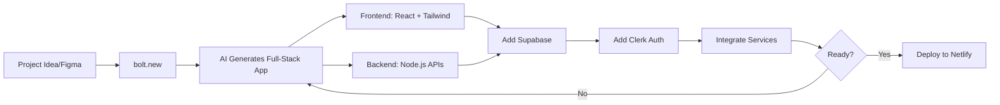
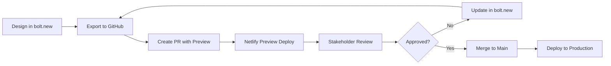
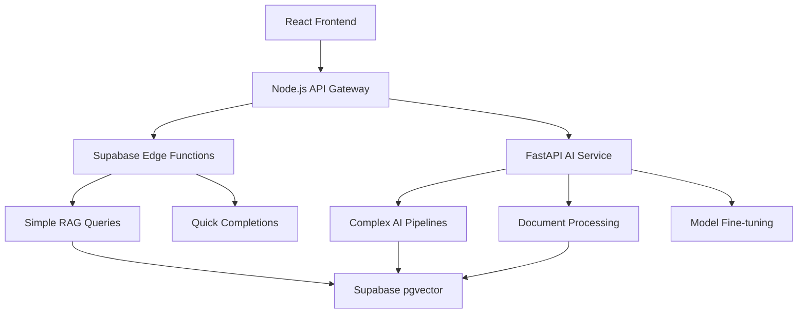
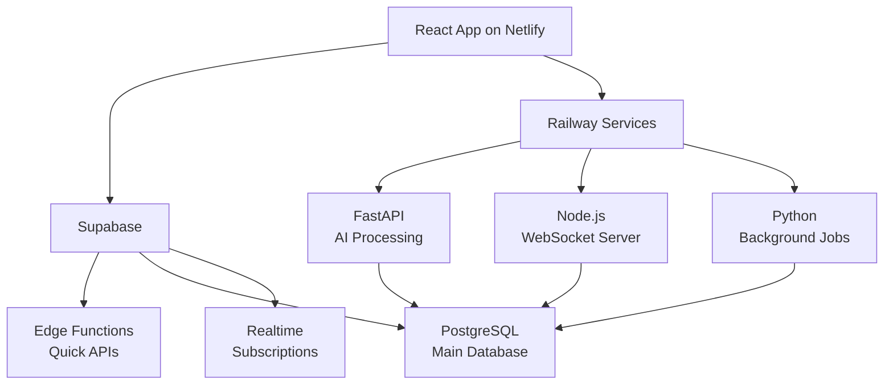

# Claude Guardrails Masterfile
**Comprehensive AI Safety, Quality, and Best Practices Guide**

**Created:** 2025-08-23  
**Purpose:** Unified reference for Claude AI interactions with anti-hallucination protocols, autosave system, and Anthropic best practices  
**Version:** 2.0 - Consolidated Edition

---

## 📋 Table of Contents
1. [🎯 Core Principles](#-core-principles)
2. [🚀 Project Setup Interview Process](#-project-setup-interview-process)
3. [🔌 MCP Integration & Availability](#-mcp-integration--availability)
4. [🚫 Anti-Hallucination Protocols](#-anti-hallucination-protocols)
5. [🔄 Automatic Progress Saving](#-automatic-progress-saving)
6. [🤝 Helpful AI Implementation](#-helpful-ai-implementation)
7. [🛡️ Harmless AI Implementation](#️-harmless-ai-implementation)
8. [✅ Honest AI Implementation](#-honest-ai-implementation)
9. [💻 Development Standards](#-development-standards)
10. [🎨 UI Implementation Guidelines](#-ui-implementation-guidelines)
11. [🔧 Implementation Architecture](#-implementation-architecture)
12. [📊 Quality Assurance & Monitoring](#-quality-assurance--monitoring)
13. [✅ Success Criteria & Metrics](#-success-criteria--metrics)

---

## 🎯 Core Principles

### **The Foundation: Anthropic's Three Pillars**
1. **HELPFUL** - Assist users effectively while respecting their autonomy
2. **HARMLESS** - Avoid actions that could cause harm to individuals or society  
3. **HONEST** - Provide accurate information and acknowledge limitations

### **Session Management & Context**
- Start each session with clear project context and current objectives
- **MANDATORY**: Check MCP (Model Context Protocol) server availability at session start
- Reference previous work and decisions explicitly
- Break large tasks into smaller, manageable chunks
- Maintain session continuity through handover documentation
- Use project-specific configuration files for consistent behavior
- Verify and document available MCP capabilities before proceeding with tasks

### **Communication Standards**
- **Be specific**: Provide exact file paths, line numbers, and concrete requirements
- **Include context**: Share relevant code snippets, error messages, and environment details
- **State constraints**: Mention dependencies, version requirements, and limitations
- **Request verification**: Ask for confirmation before making significant changes
- **Use structured requests**: Break complex requests into numbered steps

---

## 🚀 Project Setup Interview Process

### **NEW PROJECT INITIALIZATION PROTOCOL**

When starting a new project, agents MUST conduct a structured interview to gather project-specific information and create the required CLAUDE.md file.

#### **Project Setup Workflow**

```bash
# 1. Create project directory structure
mkdir -p project-name/{.agent-autosave,.agent-research,.agent-checkpoints,docs}

# 2. Initialize CLAUDE.md with interview results
touch project-name/CLAUDE.md

# 3. Add to .gitignore if needed
echo "CLAUDE.md" >> project-name/.gitignore
```

### **Organization Default Tech Stack**

#### **Standard Technology Choices**
```typescript
interface OrganizationDefaults {
  versionControl: {
    platform: 'GitHub';
    defaultBranch: 'main';
    protectedBranches: ['main', 'production'];
  };
  
  hosting: {
    frontend: 'Netlify';
    api: 'Netlify Functions' | 'Supabase Edge Functions' | 'Railway';
    database: 'Supabase' | 'Railway PostgreSQL';
    standalone: 'Railway'; // For services not needing Supabase
  };
  
  authentication: {
    provider: 'Clerk';
    methods: ['email', 'OAuth', 'magic link'];
  };
  
  frameworks: {
    frontend: 'React';
    backend: 'Node.js';
    css: 'Tailwind CSS';
    ui: 'shadcn/ui' | 'custom';
  };
  
  design: {
    prototyping: 'bolt.new';
    capabilities: 'Full-stack (React + Node.js)';
    workflow: 'bolt.new → Complete app → Deploy to Netlify';
    advantages: 'Supports entire stack, not just frontend';
  };
  
  automation: {
    workflows: 'n8n';
    serverless: 'Supabase Edge Functions';
    scheduled: 'n8n cron jobs';
  };
  
  communications: {
    transactional: 'Postmark';
    translations: 'Cal.com' | 'i18n';
    notifications: 'Postmark';
  };
  
  development: {
    packageManager: 'npm';
    nodeVersion: '>=18.0.0';
    typescript: true;
    linting: 'ESLint';
    formatting: 'Prettier';
  };
  
  aiDevelopment: {
    vectorDatabase: 'Supabase pgvector';
    ragFramework: 'LangChain' | 'Custom';
    edgeFunctions: 'Supabase Edge Functions';
    apiFramework: 'FastAPI (Python)' | 'Node.js';
    embeddingModels: 'OpenAI' | 'Cohere' | 'Custom';
    llmProviders: 'OpenRouter' | 'Anthropic' | 'OpenAI';
  };
}
```

#### **Simplified Project Setup for Standard Stack**

When using the organization's standard stack, the interview process is streamlined:

```markdown
## Quick Setup Questions (Standard Stack)
1. **Project Name**: [What should we call this project?]
2. **Project Type**: 
   - [ ] React Web App (Netlify hosted)
   - [ ] Node.js API (Supabase Edge Functions)
   - [ ] Full-Stack (React + Supabase)
3. **Special Features Needed**:
   - [ ] User authentication (Clerk)
   - [ ] Email notifications (Postmark)
   - [ ] Automated workflows (n8n)
   - [ ] Multi-language support (translations)
4. **Data Requirements**:
   - [ ] Database tables needed
   - [ ] File storage required
   - [ ] Real-time features
5. **Unique Requirements**: [Anything beyond standard stack?]
```

#### **Standard Project Structure**
```bash
# Frontend (React + Netlify)
project-name/
├── src/
│   ├── components/
│   ├── pages/
│   ├── hooks/
│   ├── lib/
│   │   ├── supabase.ts      # Supabase client
│   │   ├── clerk.ts         # Clerk configuration
│   │   └── api.ts           # API helpers
│   └── styles/
├── public/
├── netlify.toml             # Netlify configuration
├── .env.local               # Local environment variables
└── package.json

# Backend (Supabase + Edge Functions)
supabase/
├── functions/
│   ├── send-email/          # Postmark integration
│   ├── webhook-handler/     # n8n webhooks
│   └── api-endpoints/       # Business logic
├── migrations/
└── config.toml

# Automation (n8n workflows)
n8n/
├── workflows/
│   ├── user-onboarding.json
│   ├── daily-reports.json
│   └── data-sync.json
└── credentials/             # Encrypted credentials
```

#### **Environment Variables Template**
```bash
# Frontend (.env.local)
REACT_APP_SUPABASE_URL=your-project-url.supabase.co
REACT_APP_SUPABASE_ANON_KEY=your-anon-key
REACT_APP_CLERK_PUBLISHABLE_KEY=pk_test_...

# Backend (Supabase Edge Functions)
POSTMARK_SERVER_TOKEN=your-postmark-token
N8N_WEBHOOK_URL=https://your-n8n-instance.com/webhook/
CLERK_SECRET_KEY=sk_test_...

# n8n Environment
N8N_BASIC_AUTH_USER=admin
N8N_BASIC_AUTH_PASSWORD=secure-password
WEBHOOK_URL=https://your-app.netlify.app/api/webhook
```

#### **Full-Stack Development with bolt.new**

##### **Why bolt.new is Our Standard**

| Feature | bolt.new Capabilities |
|---------|----------------------|
| **Frontend Support** | ✅ React, Vue, Angular, Vanilla JS |
| **Backend Support** | ✅ Full Node.js support with API creation |
| **Figma Integration** | ✅ Import designs directly from Figma URLs |
| **In-Browser Development** | ✅ No local setup required |
| **Database Integration** | ✅ Can integrate with Supabase |
| **API Development** | ✅ Create REST/GraphQL APIs |
| **Mobile Development** | ✅ React Native with Expo |
| **Deployment** | ✅ Direct to Netlify |
| **Full Environment Control** | ✅ Filesystem, terminal, package manager |

##### **bolt.new Development Workflow**

1. **Project Initialization**
   - Describe your app in natural language
   - bolt.new creates complete project structure
   - Full environment setup (React, Node.js, dependencies)
   - Live preview immediately available

2. **Full-Stack Development**
   - **Frontend**: React components with TypeScript
   - **Backend**: Node.js APIs with Express/Fastify
   - **Database**: Supabase integration
   - **Auth**: Clerk authentication setup
   - **Services**: Postmark, n8n webhooks

3. **Figma to bolt.new Integration**
   - **Step 1**: Copy Figma design URL (frame or screen)
   - **Step 2**: Paste into bolt.new's Figma importer
   - **Step 3**: AI fetches design and assets
   - **Step 4**: Generates React + Tailwind CSS code
   - **Step 5**: Use element selector for refinements
   - **Step 6**: Chat with AI to modify functionality

4. **Development Features**
   - Full filesystem control
   - Integrated terminal
   - Package management (npm/yarn)
   - Browser console access
   - Hot reload and live preview

5. **Mobile Development**
   - React Native with Expo support
   - Cross-platform (iOS, Android, Web)
   - EAS build and deployment

6. **Deployment**
   - Direct deployment to Netlify
   - Export to GitHub for version control
   - Environment variable management

##### **Standard bolt.new Workflow**



##### **bolt.new Best Practices**

1. **Project Initialization**
   - Start with clear natural language description
   - Include tech stack preferences (React, Node.js, Supabase)
   - Specify authentication needs (Clerk)
   - Mention API requirements upfront

2. **Figma Integration (When Available)**
   - Prepare Figma designs with clear naming
   - Use frames for individual components
   - Copy specific frame URLs for targeted imports
   - Let AI generate initial code, then refine

3. **Full-Stack Development**
   - Leverage in-browser Node.js for API development
   - Use integrated terminal for package management
   - Test APIs directly in bolt.new environment
   - Connect to Supabase early for data persistence

4. **Service Integration**
   - Configure environment variables in bolt.new
   - Set up Clerk authentication flows
   - Add Postmark for transactional emails
   - Configure n8n webhook endpoints

5. **Mobile Development (If Needed)**
   - Use Expo integration for React Native
   - Test on multiple platforms
   - Leverage EAS for builds

##### **Design Approval Process for bolt.new**

###### **Option 1: GitHub Pull Request Reviews (Recommended)**

1. **Export & Create PR**
   ```bash
   # In bolt.new, export to GitHub
   # Create feature branch for design
   git checkout -b design/feature-name
   git push origin design/feature-name
   ```

2. **Deploy Preview**
   - Netlify automatically creates preview from PR
   - Share preview URL with stakeholders
   - Reviewers can interact with live app

3. **Visual Commenting**
   - Use GitHub PR comments on specific files
   - Reference line numbers in components
   - Attach screenshots with annotations
   - Use GitHub's "Files changed" view for visual diffs

4. **Approval Workflow**
   ```markdown
   ## Design Review Checklist
   - [ ] UI matches brand guidelines
   - [ ] Responsive on all breakpoints
   - [ ] Accessibility standards met
   - [ ] User flows are intuitive
   - [ ] Performance acceptable
   
   ## Stakeholder Sign-offs
   - [ ] @designer - Visual design approved
   - [ ] @product-manager - Functionality approved
   - [ ] @developer - Technical implementation approved
   ```

###### **Option 2: Screenshot-Based Reviews**

1. **Capture States in bolt.new**
   - Screenshot key screens/states
   - Document user flows
   - Create a visual sitemap

2. **Create Design Doc**
   ```markdown
   # Design Review: [Feature Name]
   ## Screenshots
   
   
   
   ## Interactive Preview
   [bolt.new Preview Link](https://bolt.new/...)
   
   ## Feedback Requested
   - Visual design feedback
   - UX flow improvements
   - Missing features
   ```

3. **Review Platforms**
   - **GitHub Issues**: Create design review issues
   - **Loom/CloudApp**: Record video walkthroughs
   - **Markup.io**: Overlay comments on screenshots

###### **Option 3: bolt.new Collaboration (Future)**

While bolt.new doesn't have native commenting yet, you can:
- Share bolt.new project links for live review
- Use browser extensions for visual feedback
- Conduct live review sessions via screen share

###### **Recommended Workflow**



###### **Design Review Templates**

**PR Description Template:**
```markdown
## Design Implementation: [Feature Name]

### 🎨 Design Decisions
- **Color Scheme**: [Rationale]
- **Layout**: [Approach]
- **Components**: [Reusability strategy]

### 🔗 Preview Links
- **Netlify Preview**: [URL]
- **bolt.new Project**: [URL]

### 📸 Key Screens
[Attach screenshots of main views]

### ✅ Review Checklist
- [ ] Desktop (1440px)
- [ ] Tablet (768px)
- [ ] Mobile (375px)
- [ ] Dark mode (if applicable)
- [ ] Loading states
- [ ] Error states
- [ ] Empty states

### 🎯 Specific Feedback Needed
1. [Specific question 1]
2. [Specific question 2]

/cc @designer @product-manager @stakeholder
```

###### **Quick Approval Tools**

**For Visual Annotations:**
- **GitHub + Screenshots**: Native, no extra tools
- **Jam.dev**: Browser extension for annotated screenshots
- **Markup Hero**: Screenshot annotation with sharing
- **CloudApp**: Screen recording + annotations

**For Live Reviews:**
- **Tuple/Screen**: Pair programming with drawing tools
- **Around**: Video calls with on-screen annotations
- **Miro/FigJam**: Import screenshots for collaborative review

###### **Automated Design Checks**

Add to your GitHub Actions:
```yaml
name: Design Review Automation
on:
  pull_request:
    types: [opened, synchronize]

jobs:
  design-checks:
    runs-on: ubuntu-latest
    steps:
      - name: Lighthouse CI
        uses: treosh/lighthouse-ci-action@v9
        with:
          urls: |
            ${{ env.DEPLOY_PREVIEW_URL }}
          uploadArtifacts: true
      
      - name: Accessibility Check
        run: |
          npm run test:a11y
      
      - name: Visual Regression
        run: |
          npm run test:visual
      
      - name: Comment Results
        uses: actions/github-script@v6
        with:
          script: |
            github.rest.issues.createComment({
              issue_number: context.issue.number,
              owner: context.repo.owner,
              repo: context.repo.repo,
              body: '## Automated Design Checks \n\n...results...'
            })
```

###### **Design Token Validation**

Ensure consistency by checking design tokens:
```javascript
// design-review.config.js
module.exports = {
  requiredChecks: [
    'colorContrast',     // WCAG AA compliance
    'fontSizes',         // Typography scale
    'spacing',           // Consistent spacing
    'breakpoints',       // Responsive behavior
    'animations',        // Performance impact
  ],
  
  brandGuidelines: {
    colors: ['--brand-primary', '--brand-secondary'],
    fonts: ['Inter', 'system-ui'],
    maxAnimationDuration: 300,
  }
};
```

##### **bolt.new Project Checklist**

**Initial Setup:**
- [ ] Describe project in natural language
- [ ] Import Figma designs (if available)
- [ ] Let AI scaffold full-stack structure
- [ ] Review and refine generated code

**Development:**
- [ ] Set up React frontend with TypeScript
- [ ] Create Node.js backend APIs
- [ ] Configure Supabase connection
- [ ] Implement Clerk authentication
- [ ] Add Postmark email service
- [ ] Set up n8n webhooks
- [ ] Test in live preview

**Deployment:**
- [ ] Configure environment variables
- [ ] Export to GitHub repository
- [ ] Deploy to Netlify
- [ ] Verify production functionality
- [ ] Monitor with error tracking

### **AI Application Development Stack**

#### **Current AI Infrastructure**
```typescript
interface AITechStack {
  rag: {
    vectorStore: 'Supabase pgvector';
    embeddingStorage: 'Supabase';
    chunkingStrategy: 'Semantic' | 'Fixed-size';
    retrievalMethod: 'Similarity search' | 'Hybrid';
  };
  
  compute: {
    current: 'Supabase Edge Functions';
    recommended: 'FastAPI for complex AI workloads';
    consideration: 'Modal.com for GPU tasks';
  };
  
  frameworks: {
    nodejs: {
      langchain: 'For RAG pipelines';
      llamaIndex: 'Alternative RAG framework';
      limitations: 'CPU-bound operations';
    };
    python: {
      fastapi: 'High-performance AI APIs';
      langchain: 'Better ecosystem than JS';
      benefits: 'Native ML library support';
    };
  };
}
```

#### **When to Use Python/FastAPI for AI**

| Use Case | Node.js + Edge Functions | Python/FastAPI |
|----------|-------------------------|----------------|
| **Simple RAG Queries** | ✅ Sufficient | ✅ Works but overkill |
| **Complex Embeddings** | ⚠️ Possible but limited | ✅ Better libraries |
| **Custom ML Models** | ❌ Very difficult | ✅ Native support |
| **Document Processing** | ⚠️ Basic only | ✅ Rich ecosystem |
| **Multi-step AI Pipelines** | ⚠️ Performance issues | ✅ Optimized |
| **Fine-tuning Models** | ❌ Not practical | ✅ Standard approach |

#### **Hybrid Architecture for AI Apps**



#### **FastAPI Integration Pattern**

```python
# FastAPI AI Service Structure
ai-service/
├── app/
│   ├── main.py              # FastAPI app
│   ├── routers/
│   │   ├── embeddings.py    # Embedding generation
│   │   ├── rag.py           # RAG endpoints
│   │   ├── processing.py    # Document processing
│   │   └── fine_tuning.py   # Model operations
│   ├── services/
│   │   ├── supabase.py      # Supabase client
│   │   ├── vector_store.py  # pgvector operations
│   │   ├── llm.py           # LLM integrations
│   │   └── embeddings.py    # Embedding models
│   └── utils/
├── requirements.txt
├── Dockerfile
└── deploy.yaml              # Deployment config
```

#### **When to Use Railway vs Supabase**

| Use Case | Supabase | Railway |
|----------|----------|----------|
| **Simple APIs** | ✅ Edge Functions | ⚠️ Overkill |
| **Database-heavy apps** | ✅ Built-in PostgreSQL | ✅ Can add PostgreSQL |
| **Long-running processes** | ❌ Not supported | ✅ Perfect |
| **WebSockets** | ⚠️ Limited | ✅ Full support |
| **Custom runtimes** | ❌ Deno only | ✅ Any language |
| **Background jobs** | ❌ Not ideal | ✅ Native support |
| **Cost for low traffic** | ✅ Free tier | ✅ $5/month |
| **Scaling** | ✅ Automatic | ✅ Automatic |

#### **Railway Deployment Scenarios**

##### **1. Python FastAPI Services**
```python
# railway.toml
[build]
builder = "NIXPACKS"

[deploy]
startCommand = "uvicorn app.main:app --host 0.0.0.0 --port $PORT"
healthcheckPath = "/health"
healthcheckTimeout = 100

[environment]
PORT = "8000"
ENVIRONMENT = "production"
```

##### **2. Standalone Node.js Services**
```javascript
// When you need features Supabase doesn't support:
// - WebSockets for real-time beyond Supabase Realtime
// - Long-running background jobs
// - Custom Node.js configurations
// - Direct MongoDB/Redis connections

// package.json
{
  "scripts": {
    "start": "node server.js",
    "dev": "nodemon server.js"
  },
  "engines": {
    "node": ">=18.0.0"
  }
}
```

##### **3. AI/ML Services**
```yaml
# For compute-intensive AI workloads
services:
  ai-service:
    build: .
    environment:
      - OPENAI_API_KEY
      - ANTHROPIC_API_KEY
      - DATABASE_URL # Can still connect to Supabase
    deploy:
      replicas: 2
      resources:
        limits:
          memory: 4Gi
          cpu: 2000m
```

##### **4. Background Job Processors**
```python
# Using Celery with Railway
from celery import Celery
import os

app = Celery('tasks')
app.config_from_object('celeryconfig')

# Railway provides Redis for job queues
REDIS_URL = os.getenv('REDIS_URL')

@app.task
def process_large_document(doc_id: str):
    # Long-running task that would timeout on Edge Functions
    document = fetch_document(doc_id)
    chunks = process_and_chunk(document)
    embeddings = generate_embeddings(chunks)
    store_in_supabase(embeddings)
```

#### **Railway + Supabase Hybrid Architecture**



#### **Railway Quick Start**

```bash
# Install Railway CLI
npm install -g @railway/cli

# Login to Railway
railway login

# Initialize new project
railway init

# Deploy
railway up

# Link to existing Supabase (optional)
railway variables set DATABASE_URL=$SUPABASE_DB_URL
```

#### **Decision Framework**

```typescript
interface DeploymentDecision {
  useSupabaseEdgeFunctions: {
    when: [
      'Response time < 10s',
      'Stateless operations',
      'Simple CRUD APIs',
      'Database-centric logic'
    ];
  };
  
  useRailway: {
    when: [
      'Need WebSockets',
      'Long-running processes',
      'Background jobs',
      'Python/AI workloads',
      'Custom runtime requirements',
      'Complex microservices'
    ];
  };
  
  hybrid: {
    example: 'Use Supabase for database + auth, Railway for compute-heavy services';
  };
}
```

#### **AI Development Workflow**

```bash
# 1. Start with Supabase Edge Functions for MVP
supabase functions new simple-rag

# 2. When you hit limitations, add FastAPI
python -m venv venv
pip install fastapi uvicorn langchain supabase pgvector

# 3. Develop locally with hot reload
uvicorn app.main:app --reload

# 4. Deploy to your chosen platform
# Railway example:
railway up
```

#### **Decision Matrix: Edge Functions vs FastAPI**

```typescript
function chooseAIBackend(requirements: AIRequirements): 'edge' | 'fastapi' {
  if (
    requirements.responseTime < 1000 && // Need sub-second responses
    requirements.complexity === 'simple' && // Basic RAG only
    !requirements.customModels && // No custom ML models
    !requirements.heavyProcessing // No document processing
  ) {
    return 'edge'; // Supabase Edge Functions
  }
  
  return 'fastapi'; // Python FastAPI service
}
```

#### **RAG Implementation Guidelines**

##### **Supabase pgvector Setup**
```sql
-- Enable pgvector extension
CREATE EXTENSION IF NOT EXISTS vector;

-- Create documents table with embeddings
CREATE TABLE documents (
  id UUID PRIMARY KEY DEFAULT gen_random_uuid(),
  content TEXT NOT NULL,
  metadata JSONB,
  embedding vector(1536), -- OpenAI embeddings dimension
  created_at TIMESTAMPTZ DEFAULT NOW()
);

-- Create index for similarity search
CREATE INDEX ON documents 
USING ivfflat (embedding vector_cosine_ops)
WITH (lists = 100);

-- Function for similarity search
CREATE FUNCTION match_documents (
  query_embedding vector(1536),
  match_count INT DEFAULT 5
) RETURNS TABLE (
  id UUID,
  content TEXT,
  metadata JSONB,
  similarity FLOAT
) AS $$
BEGIN
  RETURN QUERY
  SELECT
    documents.id,
    documents.content,
    documents.metadata,
    1 - (documents.embedding <=> query_embedding) AS similarity
  FROM documents
  ORDER BY documents.embedding <=> query_embedding
  LIMIT match_count;
END;
$$ LANGUAGE plpgsql;
```

##### **Edge Function RAG Example**
```typescript
// supabase/functions/rag-query/index.ts
import { serve } from 'https://deno.land/std@0.168.0/http/server.ts'
import { createClient } from 'https://esm.sh/@supabase/supabase-js@2'
import { Configuration, OpenAIApi } from 'https://esm.sh/openai@3'

serve(async (req) => {
  const { query } = await req.json()
  
  // Generate embedding for query
  const embedding = await generateEmbedding(query)
  
  // Search similar documents
  const { data: documents } = await supabase
    .rpc('match_documents', {
      query_embedding: embedding,
      match_count: 5
    })
  
  // Generate response with context
  const response = await generateResponse(query, documents)
  
  return new Response(JSON.stringify({ response }), {
    headers: { 'Content-Type': 'application/json' }
  })
})
```

##### **When to Migrate to FastAPI**

Consider FastAPI when you need:
- **Multi-stage pipelines**: Document processing → Chunking → Embedding → Storage
- **Custom embeddings**: Using Sentence Transformers or custom models
- **Hybrid search**: Combining vector search with keyword search
- **Re-ranking**: Using cross-encoders for better accuracy
- **Streaming responses**: For real-time AI responses
- **Background jobs**: For processing large documents

##### **FastAPI RAG Service Example**
```python
# app/routers/rag.py
from fastapi import APIRouter, HTTPException
from langchain.embeddings import OpenAIEmbeddings
from langchain.vectorstores import SupabaseVectorStore
from langchain.chains import ConversationalRetrievalChain
from ..services.supabase import get_supabase_client

router = APIRouter()

@router.post("/query")
async def rag_query(
    query: str,
    conversation_id: str = None
):
    # Initialize components
    embeddings = OpenAIEmbeddings()
    supabase = get_supabase_client()
    
    vectorstore = SupabaseVectorStore(
        client=supabase,
        embedding=embeddings,
        table_name="documents"
    )
    
    # Create retrieval chain with memory
    chain = ConversationalRetrievalChain.from_llm(
        llm=get_llm(),
        retriever=vectorstore.as_retriever(
            search_kwargs={"k": 5}
        ),
        return_source_documents=True
    )
    
    # Execute query
    result = await chain.ainvoke({
        "question": query,
        "chat_history": get_chat_history(conversation_id)
    })
    
    return {
        "answer": result["answer"],
        "sources": format_sources(result["source_documents"])
    }

@router.post("/ingest")
async def ingest_documents(
    documents: List[Document],
    process_type: str = "semantic"
):
    # This is where FastAPI shines over Edge Functions
    # Complex document processing pipeline
    processed_docs = await process_documents(
        documents,
        chunking_strategy=process_type
    )
    
    await vectorstore.add_documents(processed_docs)
    
    return {"processed": len(processed_docs)}
```

### **Project Interview Questions**

#### **1. Basic Project Information**
```markdown
## Project Setup Interview

### Basic Information
- **Project Name**: [What is the official name of this project?]
- **Project Type**: [Web app / API / Library / Mobile app / Other]
- **Primary Purpose**: [What problem does this project solve?]
- **Target Users**: [Who will use this application?]
- **Project Start Date**: [When did/will development begin?]
- **Expected Launch Date**: [When should this go live?]
```

#### **2. Technical Stack**
```markdown
### Technical Stack
- **Frontend Framework**: [React / Vue / Angular / Svelte / None]
- **Backend Framework**: [Node.js / Python / Ruby / Java / Go / None]
- **Database**: [PostgreSQL / MySQL / MongoDB / Supabase / None]
- **Hosting Platform**: [Netlify / Vercel / AWS / Heroku / Other]
- **Authentication**: [Auth0 / Supabase Auth / Firebase / Custom / None]
- **Package Manager**: [npm / yarn / pnpm / bun]
- **Version Control**: [GitHub / GitLab / Bitbucket / Other]
```

#### **3. Environment Configuration**
```markdown
### Environment Setup
- **Repository URL**: [GitHub/GitLab/Bitbucket URL]
- **Local Development Path**: [Where should this project live locally?]
- **Node Version Required**: [Specific version or range]
- **Environment Variables Needed**: 
  - [ ] Database connection string
  - [ ] API keys (list which ones)
  - [ ] Third-party service credentials
  - [ ] Feature flags
```

#### **4. Development Workflow**
```markdown
### Development Workflow
- **Branch Strategy**: [main/develop/feature branches?]
- **Deployment Pipeline**: [CI/CD setup or manual?]
- **Testing Requirements**: [Unit / Integration / E2E?]
- **Code Review Process**: [PR requirements?]
- **Staging Environment**: [URL if exists]
- **Production Environment**: [URL if exists]
```

#### **5. Project-Specific Requirements**
```markdown
### Special Requirements
- **Compliance Needs**: [GDPR / HIPAA / SOC2 / None]
- **Performance Targets**: [Specific metrics?]
- **Browser Support**: [Which browsers/versions?]
- **Mobile Support**: [Responsive / Native / PWA?]
- **Accessibility Level**: [WCAG 2.1 A / AA / AAA]
- **Internationalization**: [Multiple languages needed?]
```

#### **6. Integration Points**
```markdown
### External Integrations
- **APIs to Consume**: [List external APIs]
- **APIs to Provide**: [Will this expose APIs?]
- **Third-party Services**: 
  - [ ] Payment processing
  - [ ] Email service
  - [ ] Analytics
  - [ ] Error tracking
  - [ ] File storage
  - [ ] Search service
  - [ ] AI/ML services
```

#### **7. Data Architecture**
```markdown
### Data Management
- **Data Models**: [Main entities and relationships]
- **File Storage**: [Local / S3 / Cloudinary / Other]
- **Caching Strategy**: [Redis / In-memory / CDN / None]
- **Backup Requirements**: [Frequency and retention]
- **Data Sensitivity**: [Contains PII / Financial / Health data?]
```

#### **8. Team & Communication**
```markdown
### Team Information
- **Team Size**: [Number of developers]
- **Key Stakeholders**: [Product owner, designers, etc.]
- **Communication Channels**: [Slack / Discord / Email]
- **Documentation Location**: [Confluence / Notion / Wiki]
- **Design Resources**: [Figma / Sketch / Adobe XD links]
```

### **Automated CLAUDE.md Generation**

After collecting interview responses, generate the CLAUDE.md file:

```typescript
interface ProjectSetupInterview {
  generateClaude(responses: InterviewResponses): string {
    return `# ${responses.projectName}

## Project Setup
- **GitHub Repository**: ${responses.repoUrl}
- **Production URL**: ${responses.productionUrl || 'TBD'}
- **Staging URL**: ${responses.stagingUrl || 'TBD'}
- **Project Path**: ${responses.localPath}
- **Project Type**: ${responses.projectType}
- **Primary Purpose**: ${responses.purpose}

## Technical Stack
- **Frontend**: ${responses.frontend}
- **Backend**: ${responses.backend}
- **Database**: ${responses.database}
- **Hosting**: ${responses.hosting}
- **Package Manager**: ${responses.packageManager}

## Environment Configuration
${responses.envVars.map(v => `- **${v.name}**: ${v.description}`).join('\n')}

## Development Workflow
- **Branch Strategy**: ${responses.branchStrategy}
- **Testing**: ${responses.testingRequirements}
- **CI/CD**: ${responses.deploymentPipeline}

## Special Requirements
- **Compliance**: ${responses.compliance || 'None'}
- **Browser Support**: ${responses.browserSupport}
- **Accessibility**: ${responses.accessibilityLevel}
- **Performance**: ${responses.performanceTargets}

## Current Status
- **Project Phase**: Initial Setup
- **Last Updated**: ${new Date().toISOString()}
- **Setup Completed By**: AI Agent

## Next Steps
1. Verify all environment variables are configured
2. Install dependencies with ${responses.packageManager}
3. Set up development database
4. Configure CI/CD pipeline
5. Create initial project structure

## References
- **Guardrails**: See CLAUDE_GUARDRAILS_MASTERFILE.md
- **UI Guidelines**: See UI Implementation Guidelines section
- **Project Docs**: ${responses.documentationLocation || 'TBD'}
`;
  }
}
```

### **Project Type Templates**

#### **React SPA Template Questions**
- Router setup (React Router / TanStack Router)
- State management (Redux / Zustand / Context)
- UI library (MUI / Ant Design / Tailwind / Custom)
- Build tool (Vite / Create React App / Next.js)

#### **Node.js API Template Questions**
- Framework (Express / Fastify / NestJS / Koa)
- Database ORM (Prisma / TypeORM / Sequelize)
- Authentication strategy (JWT / Session / OAuth)
- API documentation (OpenAPI / GraphQL)

#### **Full-Stack Template Questions**
- Monorepo setup (Turborepo / Nx / Lerna)
- API communication (REST / GraphQL / tRPC)
- Shared code strategy
- Deployment coordination

### **Post-Interview Actions**

1. **Generate Project Structure**
   ```bash
   # Based on project type, create appropriate structure
   npx create-react-app . # or
   npm init -y # or
   npx create-next-app . # etc.
   ```

2. **Configure Git**
   ```bash
   git init
   git remote add origin [repo-url]
   ```

3. **Set Up Environment**
   ```bash
   cp .env.example .env.local
   # Prompt for each required env var
   ```

4. **Install Dependencies**
   ```bash
   [package-manager] install
   ```

5. **Create Initial Documentation**
   - Generate README.md
   - Create docs/ structure
   - Initialize component docs

### **Interview Execution Guidelines**

1. **Be Conversational**: Don't overwhelm with all questions at once
2. **Skip Irrelevant**: Based on project type, skip inapplicable questions
3. **Provide Examples**: Show examples of good answers
4. **Validate Inputs**: Ensure URLs, paths, and technical choices are valid
5. **Explain Implications**: Help user understand the impact of choices

### **Continuous Project Context Updates**

```markdown
## When to Update CLAUDE.md
- ✅ After each major milestone
- ✅ When adding new integrations
- ✅ When environment configuration changes
- ✅ After architectural decisions
- ✅ When team or workflow changes
- ✅ Before handing off to another developer/agent
```

---

## 🔌 MCP Integration & Availability

### **MANDATORY SESSION START PROTOCOL**

#### **MCP Availability Check (REQUIRED)**
At the beginning of EVERY Claude Code session, you MUST:

1. **Check MCP Server Status**: Verify which MCP servers are currently available
2. **Document Available Tools**: List the tools and capabilities accessible through MCP
3. **Report Limitations**: Clearly state if any expected MCP servers are unavailable
4. **Adapt Workflow**: Adjust approach based on available MCP capabilities

#### **MCP Server Categories**

##### **🎨 AI Content Generation**
- **fal.ai**: 100+ AI models (Stable Diffusion, FLUX, etc.)
- **ElevenLabs**: Text-to-speech and voice cloning
- **Gamma**: AI presentation generation
- **PiAPI**: Midjourney and AI model access

##### **💼 Productivity & Workflow**
- **n8n**: Workflow automation
- **Airtable**: Database management
- **Notion**: Workspace management
- **Linear**: Project management
- **Miro**: Visual collaboration

##### **🔍 Search & Research**
- **Perplexity**: AI-powered search with citations
- **Google**: Google services integration

##### **📱 Communication**
- **Unipile**: Multi-platform messaging (LinkedIn, WhatsApp, Instagram, etc.)

##### **🛠️ Development & Technical**
- **Python Runner**: Code execution in sandboxes
- **PDF Extraction**: Document processing
- **Filesystem**: File operations
- **Supabase**: Database operations

#### **MCP Status Reporting Format**
```markdown
## MCP Server Status Check
**Session Start**: [timestamp]

### Available MCP Servers:
✅ [Server Name] - [Capability description]
✅ [Server Name] - [Capability description]

### Unavailable MCP Servers:
❌ [Server Name] - [Reason if known]

### Impact on Current Session:
- Can proceed with: [list capabilities]
- Cannot proceed with: [list limitations]
- Alternative approaches: [if applicable]
```

#### **MCP Integration Best Practices**

##### **Before Using MCP Tools:**
1. **Verify Availability**: Don't assume any MCP server is available
2. **Check Capabilities**: Understand what each available server can do
3. **Plan Alternatives**: Have backup approaches if MCP tools are unavailable
4. **Document Usage**: Record which MCP tools were used for what purposes

##### **During MCP Usage:**
1. **Handle Errors Gracefully**: MCP servers may become unavailable during session
2. **Validate Results**: Verify outputs from MCP tools before proceeding
3. **Monitor Performance**: Track if MCP operations are completing successfully
4. **Provide Context**: Explain to user what MCP tools are being used and why

##### **MCP Error Handling:**
```typescript
interface MCPErrorHandling {
  onServerUnavailable: {
    reportToUser: boolean;
    findAlternatives: boolean;
    gracefulDegradation: boolean;
  };
  
  onOperationFailed: {
    retryLogic: boolean;
    fallbackApproach: boolean;
    errorLogging: boolean;
  };
  
  onUnexpectedResults: {
    validateOutputs: boolean;
    requestUserVerification: boolean;
    documentAnomalies: boolean;
  };
}
```

#### **Session Documentation Requirements**

Every session MUST document:
- Which MCP servers were available at session start
- Which MCP tools were used during the session
- Any MCP-related errors or limitations encountered
- How MCP availability affected task completion

#### **MCP-Enhanced Workflows**

When MCP servers are available, leverage them for:
- **Content Generation**: Use AI models for image, text, and media creation
- **Data Processing**: Automate data extraction, transformation, and analysis
- **Communication**: Access messaging platforms for outreach and monitoring
- **Workflow Automation**: Create and manage automated processes
- **Research**: Enhance research capabilities with AI-powered search

---

## 🚫 Anti-Hallucination Protocols

### ⚠️ CRITICAL: Prevent AI Code Hallucination

#### **Verification Requirements**
- **NEVER assume APIs, methods, or functions exist** without explicit verification
- **Always check documentation** before using any library or framework feature
- **Verify syntax** against official documentation for the language/framework
- **Test immediately** after writing any code block
- **No placeholder code** - write complete, working implementations only

#### **Code Accuracy Standards**
- **Real imports only** - verify all import statements exist and are correct
- **Actual function signatures** - check parameter names, types, and order
- **Valid configuration** - ensure all config options are real and properly formatted
- **Working examples only** - no "example" or "sample" code that doesn't actually work
- **Current versions** - use up-to-date syntax and methods for target versions

#### **Mandatory Verification Steps**
1. **Before writing code**: Check if the approach/library/method actually exists
2. **While coding**: Verify each function call, parameter, and syntax
3. **After coding**: Test the complete implementation
4. **Before committing**: Run tests and verify functionality

#### **Forbidden Practices**
- ❌ Making up API endpoints or methods
- ❌ Assuming parameter names without checking docs
- ❌ Using outdated or deprecated syntax
- ❌ Creating "example" code that doesn't work
- ❌ Guessing at configuration options
- ❌ Using placeholder values in production code

---

## 🔍 Technology Research & Documentation Validation Protocol

### **MANDATORY: Official Documentation Research**

#### **Pre-Implementation Research Requirements**
**Before implementing ANY new technology, library, or framework, you MUST:**

1. **Locate Official Documentation**: Find the authoritative source
2. **Verify Current Version**: Ensure you're using the latest stable release
3. **Read Installation Instructions**: Follow official setup procedures
4. **Review API Documentation**: Understand available methods and parameters
5. **Check Compatibility**: Verify compatibility with existing tech stack
6. **Examine Examples**: Study official code examples and patterns

#### **Research Documentation Template**
**Location**: `.agent-research/technology-[name]-[date].md`

```markdown
# Technology Research: [Technology Name]
**Date**: [ISO Date]
**Researcher**: [Agent/Human]
**Purpose**: [Why this technology is being considered]

## Official Documentation Sources
- **Primary Docs**: [Official documentation URL]
- **API Reference**: [API documentation URL]
- **GitHub Repository**: [Official repo URL]
- **NPM/PyPI Package**: [Package registry URL]
- **Version Researched**: [Specific version number]

## Technology Overview
- **Purpose**: What this technology does
- **Key Features**: Primary capabilities and benefits
- **License**: Open source license type
- **Maintenance Status**: Active development status
- **Community Support**: Size and activity of community

## Installation & Setup
```bash
# Official installation commands (copy exactly from docs)
[installation commands]
```

## Core API Methods
### Method: [method_name]
- **Purpose**: What this method does
- **Parameters**: 
  - param1 (type): Description
  - param2 (type, optional): Description
- **Returns**: Return type and description
- **Example**: 
```[language]
// Copy exact example from official docs
[code example]
```

## Configuration Options
- **Required Config**: Must-have configuration options
- **Optional Config**: Available customization options
- **Environment Variables**: Required env vars
- **Config File Format**: Structure and syntax

## Integration Patterns
- **With React**: How to integrate (if applicable)
- **With Node.js**: Server-side integration patterns
- **With Database**: Database integration approaches
- **With Authentication**: Auth integration methods

## Common Pitfalls & Solutions
- **Known Issues**: Documented problems and limitations
- **Troubleshooting**: Common error solutions
- **Performance Considerations**: Optimization recommendations
- **Security Considerations**: Security best practices

## Compatibility Matrix
| Dependency | Minimum Version | Tested Version | Compatible |
|------------|-----------------|----------------|------------|
| Node.js | x.x.x | x.x.x | ✅/❌ |
| React | x.x.x | x.x.x | ✅/❌ |
| [Other deps] | x.x.x | x.x.x | ✅/❌ |

## Implementation Plan
1. **Phase 1**: [Initial setup steps]
2. **Phase 2**: [Core integration]
3. **Phase 3**: [Advanced features]
4. **Testing**: [Testing approach]
5. **Rollback**: [How to remove if needed]

## Risk Assessment
- **High Risk**: [Significant concerns]
- **Medium Risk**: [Moderate concerns]
- **Low Risk**: [Minor concerns]
- **Mitigation**: [How to address risks]

## Decision Recommendation
- **Recommend**: ✅ Proceed / ❌ Do not implement / ⚠️ Proceed with caution
- **Justification**: [Reasoning for recommendation]
- **Alternatives Considered**: [Other options evaluated]

## Official Examples Verified
- [ ] Installation example tested
- [ ] Basic usage example tested
- [ ] Integration example tested
- [ ] Configuration example tested

## Research Validation
- **Documentation Date**: [When docs were last updated]
- **Version Stability**: [Stable/Beta/Alpha]
- **Breaking Changes**: [Recent breaking changes]
- **Deprecation Warnings**: [Any deprecated features]

## Next Steps
1. [Immediate next actions]
2. [Implementation timeline]
3. [Testing requirements]
4. [Documentation needs]
```

#### **Research Quality Standards**

**REQUIRED Research Depth:**
- ✅ **Official docs read completely**: Not just skimmed
- ✅ **Version compatibility verified**: Against current project versions
- ✅ **Installation tested**: In isolated environment first
- ✅ **Basic examples working**: Official examples confirmed functional
- ✅ **Integration patterns understood**: How it fits with existing code
- ✅ **Error handling documented**: Known failure modes and solutions

**FORBIDDEN Research Shortcuts:**
- ❌ Using blog posts as primary source
- ❌ Trusting Stack Overflow without verification
- ❌ Implementing based on memory or assumptions
- ❌ Skipping compatibility checks
- ❌ Using deprecated examples
- ❌ Ignoring breaking changes

### **Technology Validation Workflow**

#### **Phase 1: Discovery & Research (MANDATORY)**
```bash
# Create research directory
mkdir -p .agent-research

# Document research process
echo "# Technology Research: $TECH_NAME" > .agent-research/technology-$TECH_NAME-$(date +%Y%m%d).md

# Verify official documentation exists
curl -I "$OFFICIAL_DOCS_URL" || echo "⚠️ Official docs not accessible"
```

#### **Phase 2: Isolated Testing (REQUIRED)**
```bash
# Create isolated test environment
mkdir -p .agent-testing/$TECH_NAME-test
cd .agent-testing/$TECH_NAME-test

# Test installation exactly as documented
# [Follow official installation instructions]

# Test basic functionality
# [Run official examples]

# Document results
echo "✅ Installation successful: $(date)" >> ../test-results.md
echo "✅ Basic examples working: $(date)" >> ../test-results.md
```

#### **Phase 3: Integration Testing (REQUIRED)**
```bash
# Create integration test branch
git checkout -b integration-test/$TECH_NAME-$(date +%Y%m%d)

# Implement minimal integration
# [Add technology to actual project]

# Test with existing codebase
npm test # or appropriate test command
npm run build # verify build still works

# Document integration results
echo "Integration test results:" >> .agent-research/integration-results.md
```

### **Official Documentation Sources Priority**

#### **Primary Sources (Use ONLY these):**
1. **Official project documentation** (e.g., reactjs.org, nodejs.org)
2. **Official GitHub repositories** (README and docs folders)
3. **Official API references** (hosted by project maintainers)
4. **Official package registry pages** (npmjs.com, pypi.org with official badges)

#### **Secondary Sources (Verify against primary):**
1. **MDN Web Docs** (for web standards)
2. **Official vendor documentation** (AWS, Google Cloud, etc.)
3. **Official framework guides** (Next.js, Nuxt.js official docs)

#### **Prohibited Sources for Primary Research:**
- ❌ Personal blogs and tutorials
- ❌ Stack Overflow answers (use only for troubleshooting)
- ❌ Unofficial documentation sites
- ❌ Outdated or unmaintained resources
- ❌ AI-generated content without official verification

### **Version Management Protocol**

#### **Version Verification Checklist**
- [ ] **Latest Stable Version**: Confirmed current stable release
- [ ] **Breaking Changes**: Reviewed changelog for breaking changes
- [ ] **Deprecation Warnings**: Checked for deprecated features
- [ ] **Security Updates**: Verified no known security vulnerabilities
- [ ] **Compatibility Matrix**: Confirmed compatibility with project dependencies

```bash
# Example version verification commands
npm view [package-name] versions --json  # Check all available versions
npm view [package-name] time            # Check release dates
npm audit [package-name]                # Check for security issues
```

### **Implementation Validation Gates**

#### **Gate 1: Research Completion**
**Requirements before proceeding:**
- [ ] Official documentation thoroughly reviewed
- [ ] Technology research document completed
- [ ] Compatibility verified
- [ ] Installation tested in isolation

#### **Gate 2: Integration Testing**
**Requirements before production integration:**
- [ ] Isolated testing successful
- [ ] Integration test branch created
- [ ] Basic integration working
- [ ] No conflicts with existing code

#### **Gate 3: Production Readiness**
**Requirements before production deployment:**
- [ ] Full test suite passing
- [ ] Performance impact assessed
- [ ] Error handling implemented
- [ ] Documentation updated
- [ ] Rollback plan documented

### **Emergency Research Protocol**

#### **When Immediate Implementation Required:**
1. **Document the urgency**: Why normal research process is bypassed
2. **Implement minimal viable solution**: Use only well-documented, basic features
3. **Schedule full research**: Plan comprehensive research for next iteration
4. **Create technical debt ticket**: Track incomplete research as technical debt
5. **Set review reminder**: Schedule review of implementation after research

```markdown
## Emergency Implementation Notice
- **Date**: [date]
- **Technology**: [technology name]
- **Urgency Reason**: [why research was bypassed]
- **Scope Limited To**: [what features were implemented]
- **Research Scheduled**: [when full research will be completed]
- **Review Date**: [when implementation will be reviewed]
- **Risk Level**: [assessed risk of this approach]
```

---

## 🔄 Automatic Progress Saving

### **AUTOMATIC PROGRESS SAVING ENABLED**

#### **Autosave Triggers**
Agents should save progress when:
- ✅ Completing any task from todo list
- 🔧 Making significant code changes
- 🐛 Fixing bugs or resolving issues
- 📝 Updating documentation
- 🚀 Deploying changes
- ❌ Encountering errors or blockers
- 💡 Making important decisions

#### **What to Save**

##### 1. Progress Log (REQUIRED)
**Location:** `.agent-autosave/progress-[date].md`

**Format:**
```markdown
## Session: [timestamp]
### Task: [task description]
### Status: [completed/in-progress/blocked]
### Changes Made:
- [list of changes]
### Next Steps:
- [upcoming tasks]
### Issues/Blockers:
- [any problems encountered]
```

##### 2. Session Context
**Location:** `.agent-autosave/session-[id].json`
```json
{
  "session_id": "unique-id",
  "timestamp": "ISO-8601",
  "agent": "agent-name",
  "todos_completed": [],
  "files_modified": [],
  "decisions_made": [],
  "context_preserved": {}
}
```

#### **Autosave Commands**
```bash
# Quick save progress
echo "## Progress Update: $(date)" >> .agent-autosave/progress-$(date +%Y%m%d).md

# Save session state
echo '{"session":"'$(date +%s)'","task":"'$CURRENT_TASK'"}' > .agent-autosave/last-session.json
```

#### **Critical Autosave Rules**
1. **NEVER** skip autosaving after task completion
2. **ALWAYS** update deployment status for system changes
3. **PRESERVE** context between sessions
4. **DOCUMENT** all decisions and rationale
5. **TRACK** both successes and failures

#### **Recovery Instructions**
If an agent session is interrupted:
1. Check `.agent-autosave/last-session.json` for last state
2. Read latest progress log
3. Review deployment status for system state
4. Continue from last completed task

---

## 🤝 Helpful AI Implementation

### **User-Centric Design**

#### **Clear Communication Standards**
```typescript
interface HelpfulCommunication {
  clarity: {
    useSimpleLanguage: boolean;
    avoidJargon: boolean;
    provideContext: boolean;
    structureInformation: boolean;
  };
  
  actionability: {
    provideSpecificSteps: boolean;
    includeTimelines: boolean;
    offerAlternatives: boolean;
    enableDecisionMaking: boolean;
  };
  
  relevance: {
    focusOnUserGoals: boolean;
    filterIrrelevantInfo: boolean;
    prioritizeKeyInsights: boolean;
    adaptToUserLevel: boolean;
  };
}
```

#### **Proactive Assistance Patterns**
- **Anticipate Needs**: Predict next steps in the workflow
- **Provide Context**: Explain why certain actions are recommended
- **Offer Alternatives**: Present multiple options when appropriate
- **Enable Learning**: Help users understand processes and improve

#### **Capability Transparency**
- **What AI Can Do**: Specific automation capabilities
- **What AI Cannot Do**: Clear limitations and boundaries
- **When to Involve Humans**: Escalation scenarios and criteria
- **Quality Expectations**: Realistic outcome projections

#### **Adaptive Support Levels**
- **Beginner**: Detailed explanations and guided workflows
- **Intermediate**: Focused insights with optional deep-dives
- **Expert**: High-level summaries with raw data access

---

## 🛡️ Harmless AI Implementation

### **Compliance and Ethics Framework**

#### **Platform Compliance Standards**
```typescript
interface ComplianceFramework {
  platformPolicies: {
    respectRateLimits: boolean;
    maintainPersonalization: boolean;
    avoidSpamBehavior: boolean;
    followTermsOfService: boolean;
  };
  
  dataPrivacyLaws: {
    honorUnsubscribes: boolean;
    includeRequiredDisclosures: boolean;
    respectDataPrivacy: boolean;
    maintainConsentRecords: boolean;
  };
  
  industryRegulations: {
    dataProtection: boolean;
    professionalEthics: boolean;
    complianceRequirements: boolean;
  };
}
```

#### **Harm Prevention Measures**
1. **Anti-Spam Protocols**: Ensure all outreach is relevant and valuable
2. **Privacy Protection**: Safeguard all data
3. **Professional Standards**: Maintain appropriate communication
4. **Consent Management**: Respect opt-out requests and preferences

### **Data Privacy and Security**

#### **Data Handling Principles**
- **Minimal Collection**: Only gather necessary data
- **Secure Storage**: Encrypt sensitive information
- **Access Control**: Limit data access to authorized users
- **Retention Limits**: Delete data when no longer needed

#### **Privacy-First Design**
```typescript
interface PrivacyImplementation {
  dataMinimization: {
    collectOnlyRequired: boolean;
    regularDataAudits: boolean;
    automaticDeletion: boolean;
  };
  
  userConsent: {
    explicitOptIn: boolean;
    granularControls: boolean;
    easyOptOut: boolean;
    consentTracking: boolean;
  };
  
  dataTransparency: {
    clearDataUsage: boolean;
    accessToOwnData: boolean;
    deletionRights: boolean;
    portabilityOptions: boolean;
  };
}
```

### **Ethical Automation Boundaries**

#### **Human Oversight Requirements**
- **High-Value Decisions**: Human approval for significant actions
- **Sensitive Communications**: Human review of critical messages
- **Compliance Matters**: Human validation of regulatory adherence
- **Quality Thresholds**: Human escalation for subpar performance

#### **Automation Limits**
```typescript
interface AutomationBoundaries {
  prohibitedActions: [
    "Sending unsolicited bulk messages",
    "Misrepresenting individuals or organizations",
    "Accessing unauthorized data sources",
    "Violating platform terms of service"
  ];
  
  requireHumanApproval: [
    "Messages to executives",
    "Communications about sensitive topics",
    "Requests involving large commitments",
    "Responses to complaints or legal inquiries"
  ];
  
  qualityGates: {
    messagePersonalizationThreshold: 70;
    responseRelevanceThreshold: 80;
    complianceScoreThreshold: 95;
  };
}
```

---

## ✅ Honest AI Implementation

### **Information Accuracy Standards**

#### **Fact Verification Framework**
```typescript
interface AccuracyFramework {
  dataValidation: {
    sourceCredibilityCheck: boolean;
    crossReferenceVerification: boolean;
    recencyValidation: boolean;
    contextualAppropriateness: boolean;
  };
  
  metricReporting: {
    actualPerformanceData: boolean;
    confidenceIntervals: boolean;
    comparisonBenchmarks: boolean;
    trendAnalysis: boolean;
  };
  
  predictionHonesty: {
    probabilityRanges: boolean;
    assumptionDocumentation: boolean;
    uncertaintyDisclosure: boolean;
    scenarioPlanning: boolean;
  };
}
```

#### **Limitation Acknowledgment**
- **Uncertainty Indicators**: Clear communication of confidence levels
- **Data Freshness**: Timestamps and source reliability indicators
- **Scope Boundaries**: Explicit statement of what analysis covers
- **Assumption Documentation**: Clear listing of underlying assumptions

### **Capability Limitations Disclosure**

#### **AI Transparency Standards**
```typescript
interface AITransparency {
  capabilityLimitations: {
    noRealTimeWebAccess: boolean;
    noDirectSystemManipulation: boolean;
    noFinancialTransactions: boolean;
    contextWindowLimits: boolean;
  };
  
  dataLimitations: {
    trainingDataCutoff: string;
    geographicBiases: string[];
    industryKnowledgeGaps: string[];
    languageLimitations: string[];
  };
  
  processingLimitations: {
    complexityThresholds: Record<string, string>;
    accuracyBounds: Record<string, number>;
    recommendationScope: string[];
    decisionBoundaries: string[];
  };
}
```

#### **Error Acknowledgment Protocols**
When mistakes occur:
1. **Immediate Acknowledgment**: Recognize the error clearly
2. **Impact Assessment**: Explain consequences and affected areas
3. **Corrective Action**: Provide accurate information
4. **Prevention Measures**: Describe steps to prevent recurrence

### **Decision Support vs. Decision Making**

#### **Advisory Role Boundaries**
```typescript
interface AdvisoryBoundaries {
  provideRecommendations: boolean;
  explainReasoning: boolean;
  presentOptions: boolean;
  offerInsights: boolean;
  
  // Never do:
  makeDecisions: false;
  guaranteeOutcomes: false;
  replaceJudgment: false;
  assumeAuthority: false;
}
```

---

## 💻 Development Standards

### **Code Development Workflow**
1. **Planning Phase**: Outline approach, identify dependencies, and confirm understanding
2. **Implementation Phase**: Write clean, well-documented code with proper error handling
3. **Testing Phase**: Include relevant tests and verification steps
4. **Documentation Phase**: Update README, comments, and project documentation
5. **Review Phase**: Check for security issues, performance concerns, and best practices

### **Quality Assurance Standards**
- **Security First**: Never expose secrets, validate inputs, follow security best practices
- **Performance Aware**: Consider scalability, efficiency, and resource usage
- **Maintainable Code**: Use clear naming, consistent patterns, and proper documentation
- **Error Resilient**: Implement proper error handling and graceful degradation
- **Version Compatible**: Ensure compatibility with specified versions and dependencies

### **File Management & Organization**
- **Single Source of Truth**: Maintain authoritative project documentation
- **Version Control**: Use meaningful commit messages with verification status
- **File Structure**: Keep project files organized and well-documented
- **Backup Strategy**: Utilize autosave system and session backups
- **Templates**: Use consistent project templates and procedures

### **Testing & Validation**
- **Immediate Testing**: Test code immediately after writing each component
- **Integration Testing**: Verify components work together as expected
- **Edge Case Coverage**: Test boundary conditions and error scenarios
- **Performance Validation**: Consider performance implications of implementations
- **User Input Validation**: Always validate and sanitize user inputs

### **Deployment & Operations**
- **Staging First**: Always deploy to staging before production
- **Environment Consistency**: Use environment variables for configuration
- **Rollback Ready**: Maintain ability to quickly revert changes
- **Monitoring**: Include appropriate logging and monitoring
- **Documentation Updated**: Keep deployment procedures current

### **Environment-Specific Data Management Policy**

#### **MANDATORY: Data Usage by Environment**

**🔒 CRITICAL RULE: Environment Data Segregation**

```typescript
interface EnvironmentDataPolicy {
  LOCAL: {
    dataType: 'MOCK_DATA_ONLY';
    realData: false;
    testData: true;
    seedData: true;
    anonymizedData: false; // Not needed for local
  };
  
  STAGING: {
    dataType: 'LIVE_DATA_ONLY';
    realData: true;
    testData: false;
    mockData: false;
    purpose: 'Real-world testing and validation';
  };
  
  PRODUCTION: {
    dataType: 'LIVE_DATA_ONLY';
    realData: true;
    testData: false;
    mockData: false;
    purpose: 'Production operations';
  };
}
```

#### **Environment Data Rules**

##### **🏠 Local Development Environment**
- **✅ ALLOWED**: Mock data, seed data, synthetic test data
- **❌ FORBIDDEN**: Real customer data, live API data, production database connections
- **PURPOSE**: Safe development without exposure to sensitive information

```bash
# Local environment data setup examples
NODE_ENV=development
USE_MOCK_DATA=true
DATABASE_URL=sqlite://./dev.db  # Local test database
API_BASE_URL=http://localhost:3001/mock-api
```

##### **🧪 Staging Environment**
- **✅ REQUIRED**: Live data only
- **❌ FORBIDDEN**: Mock data, synthetic data, placeholder content
- **PURPOSE**: Real-world validation with actual data patterns and edge cases

```bash
# Staging environment configuration
NODE_ENV=staging
USE_MOCK_DATA=false
DATABASE_URL=${STAGING_DATABASE_URL}
API_BASE_URL=${STAGING_API_URL}
```

##### **🚀 Production Environment**
- **✅ REQUIRED**: Live data only
- **❌ FORBIDDEN**: Mock data, test data, development shortcuts
- **PURPOSE**: Live operations with real customer data

```bash
# Production environment configuration
NODE_ENV=production
USE_MOCK_DATA=false
DATABASE_URL=${PRODUCTION_DATABASE_URL}
API_BASE_URL=${PRODUCTION_API_URL}
```

#### **Data Management Implementation**

##### **Code Implementation Pattern**
```typescript
// Environment-aware data service
class DataService {
  private getDataSource() {
    switch (process.env.NODE_ENV) {
      case 'development':
        return new MockDataService();
      case 'staging':
      case 'production':
        return new LiveDataService();
      default:
        throw new Error('Invalid environment configuration');
    }
  }

  async getData() {
    const dataSource = this.getDataSource();
    return await dataSource.fetchData();
  }
}
```

##### **Environment Validation Checks**
```typescript
// Startup validation
function validateEnvironmentDataConfig() {
  const env = process.env.NODE_ENV;
  const useMockData = process.env.USE_MOCK_DATA === 'true';
  
  if (env === 'development' && !useMockData) {
    console.warn('⚠️ WARNING: Local environment should use mock data');
  }
  
  if ((env === 'staging' || env === 'production') && useMockData) {
    throw new Error('❌ CRITICAL: Staging/Production must use live data only');
  }
}
```

#### **Data Security & Compliance**

##### **Local Development Safety**
- **No PII**: Never store real personal information locally
- **Data Anonymization**: If using production-like data, fully anonymize
- **Secure Storage**: Even mock data should follow security practices
- **Regular Cleanup**: Periodically clean local development databases

##### **Staging/Production Data Handling**
- **Access Control**: Limit access to authorized personnel only
- **Encryption**: All data encrypted in transit and at rest
- **Audit Logging**: Log all data access and modifications
- **Compliance**: Follow GDPR, CCPA, and other applicable regulations

#### **Mock Data Generation Guidelines**

##### **Quality Mock Data Standards**
```javascript
// Example mock data structure
const mockUserData = {
  id: 'mock_user_001',
  email: 'test.user@example.com',
  name: 'Test User',
  created_at: '2025-01-01T00:00:00Z',
  // Realistic but clearly fake data
  phone: '+1-555-0123',
  address: '123 Test Street, Mock City, MC 12345'
};
```

##### **Mock Data Requirements**
- **Realistic Structure**: Match production data schema exactly
- **Edge Cases**: Include boundary conditions and error scenarios
- **Volume Testing**: Generate sufficient data for performance testing
- **Relationships**: Maintain referential integrity in mock relationships
- **Clearly Identifiable**: Mock data should be obviously non-real

#### **Environment Transition Protocol**

##### **Local → Staging Deployment**
```bash
# Pre-deployment checklist
echo "Verifying staging will use live data..."
if grep -q "USE_MOCK_DATA=true" .env.staging; then
  echo "❌ ERROR: Staging environment configured for mock data"
  exit 1
fi
echo "✅ Staging configured for live data"
```

##### **Staging → Production Deployment**
```bash
# Production deployment validation
echo "Final data configuration check..."
if [ "$NODE_ENV" = "production" ] && [ "$USE_MOCK_DATA" = "true" ]; then
  echo "❌ CRITICAL ERROR: Production cannot use mock data"
  exit 1
fi
echo "✅ Production data configuration validated"
```

#### **Monitoring & Alerts**

##### **Data Source Monitoring**
```javascript
// Runtime data source verification
function monitorDataSource() {
  const isProduction = process.env.NODE_ENV === 'production';
  const usingMockData = process.env.USE_MOCK_DATA === 'true';
  
  if (isProduction && usingMockData) {
    // Critical alert - production using mock data
    alerting.critical('Production environment using mock data!');
  }
}
```

#### **Documentation Requirements**

Every project **MUST** document:
- **Data Sources**: What data is used in each environment
- **Mock Data Schema**: Structure and generation of mock data
- **Environment Variables**: All data-related configuration
- **Migration Procedures**: How to promote code between environments
- **Data Refresh Process**: How staging data is updated from production

#### **Violation Response Protocol**

If environment data rules are violated:
1. **Immediate Stop**: Halt deployment/development immediately
2. **Impact Assessment**: Determine if real data was exposed inappropriately
3. **Remediation**: Fix configuration and validate correction
4. **Documentation**: Record incident and prevention measures
5. **Review**: Update procedures to prevent recurrence

---

## 🎨 UI Implementation Guidelines

### **Frontend Development Standards**

#### **Component Architecture Requirements**
```typescript
interface ComponentStandards {
  structure: {
    atomicDesign: boolean;          // Atoms, molecules, organisms pattern
    singleResponsibility: boolean;   // One component, one purpose
    propsValidation: boolean;        // TypeScript/PropTypes required
    testability: boolean;            // Components must be testable
  };
  
  naming: {
    componentNames: 'PascalCase';    // Component file naming
    cssClasses: 'kebab-case';        // CSS class naming
    jsVariables: 'camelCase';        // JavaScript variable naming
    constants: 'SCREAMING_SNAKE';    // Constant naming
  };
  
  fileOrganization: {
    componentFile: boolean;          // Main component logic
    styleFile: boolean;              // Component-specific styles
    testFile: boolean;               // Component tests
    storyFile: boolean;              // Storybook stories
    indexFile: boolean;              // Clean exports
  };
}
```

#### **State Management Principles**
- **Local State**: Use for UI-only state (modals, toggles, form inputs)
- **Global State**: Use for cross-component data (user auth, app settings)
- **Server State**: Use dedicated solutions (React Query, SWR) for API data
- **URL State**: Use for shareable application state (filters, pagination)

```typescript
// State Management Decision Tree
interface StateDecisionCriteria {
  isSharedAcrossComponents: boolean;  // → Global state
  isServerData: boolean;              // → Server state (React Query/SWR)
  isURLReflected: boolean;            // → URL state (query params)
  isComponentSpecific: boolean;       // → Local state (useState/useReducer)
}
```

### **Design System Implementation**

#### **Design Token Standards**
```css
/* Required Design Tokens Structure */
:root {
  /* Colors */
  --color-primary-50: #e3f2fd;
  --color-primary-100: #bbdefb;
  --color-primary-500: #2196f3;
  --color-primary-900: #0d47a1;
  
  /* Typography */
  --font-family-primary: -apple-system, BlinkMacSystemFont, 'Segoe UI', sans-serif;
  --font-size-xs: 0.75rem;    /* 12px */
  --font-size-sm: 0.875rem;   /* 14px */
  --font-size-base: 1rem;     /* 16px */
  --font-size-lg: 1.125rem;   /* 18px */
  --font-size-xl: 1.25rem;    /* 20px */
  
  /* Spacing */
  --spacing-xs: 0.25rem;      /* 4px */
  --spacing-sm: 0.5rem;       /* 8px */
  --spacing-md: 1rem;         /* 16px */
  --spacing-lg: 1.5rem;       /* 24px */
  --spacing-xl: 2rem;         /* 32px */
  
  /* Breakpoints */
  --breakpoint-sm: 640px;
  --breakpoint-md: 768px;
  --breakpoint-lg: 1024px;
  --breakpoint-xl: 1280px;
  
  /* Shadows */
  --shadow-sm: 0 1px 2px 0 rgba(0, 0, 0, 0.05);
  --shadow-md: 0 4px 6px -1px rgba(0, 0, 0, 0.1);
  --shadow-lg: 0 10px 15px -3px rgba(0, 0, 0, 0.1);
  
  /* Animation */
  --duration-fast: 150ms;
  --duration-normal: 300ms;
  --duration-slow: 500ms;
  --easing-default: cubic-bezier(0.4, 0, 0.2, 1);
}
```

#### **Component Library Structure**
```
src/components/
├── atoms/                    # Basic building blocks
│   ├── Button/
│   ├── Input/
│   ├── Icon/
│   └── Text/
├── molecules/               # Simple component combinations
│   ├── FormField/
│   ├── Card/
│   ├── Modal/
│   └── Dropdown/
├── organisms/              # Complex UI sections
│   ├── Header/
│   ├── Form/
│   ├── DataTable/
│   └── Navigation/
└── templates/             # Page-level layouts
    ├── DashboardLayout/
    ├── AuthLayout/
    └── PublicLayout/
```

### **Accessibility (a11y) Requirements**

#### **WCAG 2.1 AA Compliance**
```typescript
interface AccessibilityStandards {
  perceivable: {
    colorContrast: {
      normalText: 4.5;      // Minimum contrast ratio
      largeText: 3.0;       // Large text contrast ratio
      uiComponents: 3.0;    // Interactive elements
    };
    altText: boolean;       // All images must have alt text
    captions: boolean;      // Videos must have captions
    audioDescriptions: boolean; // Complex visuals need descriptions
  };
  
  operable: {
    keyboardNavigation: boolean;   // All interactive elements keyboard accessible
    focusIndicators: boolean;      // Visible focus states
    skipLinks: boolean;            // Skip to main content
    timeouts: boolean;             // User control over time limits
  };
  
  understandable: {
    errorIdentification: boolean;  // Clear error messages
    labelsAndInstructions: boolean; // Form labels required
    consistentNavigation: boolean; // Predictable UI patterns
    languageIdentification: boolean; // Page language declared
  };
  
  robust: {
    semanticHTML: boolean;         // Proper HTML semantics
    ariaUsage: boolean;           // Correct ARIA attributes
    validMarkup: boolean;         // W3C valid HTML
  };
}
```

#### **Required ARIA Implementation**
```html
<!-- Button with loading state -->
<button 
  aria-busy="true" 
  aria-label="Save changes"
  disabled
>
  <span aria-hidden="true">⌛</span>
  Saving...
</button>

<!-- Form with error -->
<div role="group" aria-labelledby="email-label">
  <label id="email-label" for="email">Email</label>
  <input 
    id="email" 
    type="email" 
    aria-invalid="true"
    aria-describedby="email-error"
  />
  <span id="email-error" role="alert">
    Please enter a valid email address
  </span>
</div>

<!-- Navigation landmark -->
<nav aria-label="Main navigation">
  <!-- navigation items -->
</nav>
```

### **User Interaction Patterns**

#### **Form Handling Standards**
```typescript
interface FormStandards {
  validation: {
    realTime: boolean;           // Validate as user types (with debounce)
    onBlur: boolean;             // Validate when field loses focus
    onSubmit: boolean;           // Final validation before submission
    clearErrorOnCorrection: boolean; // Remove errors when fixed
  };
  
  errorDisplay: {
    inlineErrors: boolean;       // Show errors next to fields
    summaryErrors: boolean;      // Show error summary at top
    focusFirstError: boolean;    // Auto-focus first error field
    ariaAnnouncements: boolean;  // Screen reader announcements
  };
  
  submission: {
    disableOnSubmit: boolean;    // Prevent double submission
    showProgress: boolean;       // Loading indicators
    preserveData: boolean;       // Keep form data on error
    successFeedback: boolean;    // Clear success messages
  };
}
```

#### **Loading States Requirements**
```typescript
// Loading State Hierarchy
enum LoadingPriority {
  SKELETON = 'Show skeleton screens for initial loads',
  SPINNER = 'Show spinner for actions < 1 second',
  PROGRESS = 'Show progress bar for actions > 1 second',
  OPTIMISTIC = 'Update UI optimistically when safe'
}

// Required Loading Implementations
interface LoadingStates {
  pageLoad: 'skeleton';          // Full page loads
  dataFetch: 'spinner';          // Data fetching
  formSubmit: 'button-spinner';  // Form submissions
  fileUpload: 'progress-bar';    // File uploads
  lazyLoad: 'placeholder';       // Image/component lazy loading
}
```

#### **Error Boundary Implementation**
```typescript
interface ErrorBoundaryRequirements {
  levels: {
    app: boolean;        // Catch app-wide errors
    route: boolean;      // Catch route-level errors
    component: boolean;  // Catch component errors
  };
  
  fallbacks: {
    fullPage: ReactNode;     // App crash fallback
    section: ReactNode;      // Section error fallback
    inline: ReactNode;       // Inline error message
  };
  
  reporting: {
    logToConsole: boolean;   // Development logging
    logToService: boolean;   // Production error tracking
    userFeedback: boolean;   // Allow user error reports
  };
}
```

### **Performance Standards**

#### **Core Web Vitals Targets**
```typescript
interface PerformanceTargets {
  LCP: {  // Largest Contentful Paint
    target: 2.5;  // seconds
    requirement: 'Page main content must load within 2.5s';
  };
  
  FID: {  // First Input Delay
    target: 100;  // milliseconds
    requirement: 'Page must be interactive within 100ms';
  };
  
  CLS: {  // Cumulative Layout Shift
    target: 0.1;  // score
    requirement: 'Visual stability with minimal layout shifts';
  };
  
  bundleSize: {
    initial: 200;     // KB - Initial bundle
    perRoute: 50;     // KB - Per route chunk
    images: 'WebP/AVIF with fallbacks';
  };
}
```

#### **Optimization Requirements**
```typescript
interface OptimizationStandards {
  codeOptimization: {
    treeshaking: boolean;         // Remove unused code
    codeSplitting: boolean;       // Split by route
    lazyLoading: boolean;         // Lazy load components
    memoization: boolean;         // Memoize expensive operations
  };
  
  assetOptimization: {
    imageCompression: boolean;    // Optimize all images
    responsiveImages: boolean;    // Multiple image sizes
    fontSubsetting: boolean;      // Only load used characters
    svgOptimization: boolean;     // Optimize SVG files
  };
  
  renderOptimization: {
    virtualScrolling: boolean;    // For long lists
    debouncing: boolean;          // For search/filter inputs
    throttling: boolean;          // For scroll/resize events
    requestIdleCallback: boolean; // For non-critical updates
  };
}
```

### **Testing Requirements**

#### **Frontend Testing Pyramid**
```typescript
interface TestingRequirements {
  unit: {
    coverage: 80;                // Minimum coverage percentage
    tools: ['Jest', 'React Testing Library'];
    scope: 'Logic, utilities, hooks';
  };
  
  integration: {
    coverage: 70;                // Minimum coverage percentage
    tools: ['React Testing Library', 'MSW'];
    scope: 'Component interactions, API calls';
  };
  
  e2e: {
    criticalPaths: 100;          // Coverage of critical user paths
    tools: ['Cypress', 'Playwright'];
    scope: 'User flows, cross-browser';
  };
  
  visual: {
    components: 100;             // All components in Storybook
    regression: boolean;         // Visual regression tests
    tools: ['Storybook', 'Chromatic'];
  };
  
  accessibility: {
    automated: 100;              // Automated a11y tests
    manual: 'Quarterly audits';  // Manual testing schedule
    tools: ['axe-core', 'WAVE', 'NVDA/JAWS'];
  };
}
```

#### **Test Implementation Examples**
```typescript
// Component Test Example
describe('Button Component', () => {
  it('should be keyboard accessible', () => {
    render(<Button>Click me</Button>);
    const button = screen.getByRole('button');
    
    button.focus();
    expect(button).toHaveFocus();
    
    fireEvent.keyDown(button, { key: 'Enter' });
    expect(mockOnClick).toHaveBeenCalled();
  });
  
  it('should announce state changes to screen readers', () => {
    render(<Button loading>Save</Button>);
    
    expect(screen.getByRole('button')).toHaveAttribute('aria-busy', 'true');
    expect(screen.getByText('Loading')).toBeInTheDocument();
  });
});
```

### **Responsive Design Standards**

#### **Mobile-First Development**
```css
/* REQUIRED: Start with mobile styles, enhance for larger screens */

/* Base (Mobile) Styles */
.component {
  padding: var(--spacing-sm);
  font-size: var(--font-size-base);
}

/* Tablet and up */
@media (min-width: 768px) {
  .component {
    padding: var(--spacing-md);
    font-size: var(--font-size-lg);
  }
}

/* Desktop and up */
@media (min-width: 1024px) {
  .component {
    padding: var(--spacing-lg);
    display: grid;
    grid-template-columns: 1fr 2fr;
  }
}
```

#### **Responsive Testing Checklist**
- [ ] **320px**: Minimum supported width
- [ ] **375px**: iPhone SE/Mini
- [ ] **768px**: iPad Portrait
- [ ] **1024px**: iPad Landscape / Small laptop
- [ ] **1440px**: Desktop
- [ ] **1920px**: Large desktop

### **Animation & Micro-interactions**

#### **Animation Standards**
```css
/* Respect user preferences */
@media (prefers-reduced-motion: reduce) {
  * {
    animation-duration: 0.01ms !important;
    animation-iteration-count: 1 !important;
    transition-duration: 0.01ms !important;
  }
}

/* Standard transitions */
.interactive-element {
  transition: 
    background-color var(--duration-fast) var(--easing-default),
    transform var(--duration-normal) var(--easing-default),
    box-shadow var(--duration-normal) var(--easing-default);
}

/* Loading animations */
@keyframes skeleton-pulse {
  0% { opacity: 1; }
  50% { opacity: 0.4; }
  100% { opacity: 1; }
}

.skeleton {
  animation: skeleton-pulse 2s ease-in-out infinite;
}
```

### **Documentation Requirements**

#### **Component Documentation**
```typescript
/**
 * Button Component
 * 
 * @description Primary interactive element for user actions
 * @example
 * ```tsx
 * <Button variant="primary" size="md" onClick={handleClick}>
 *   Submit Form
 * </Button>
 * ```
 * 
 * @accessibility
 * - Keyboard: Space/Enter to activate
 * - Screen Reader: Announces state changes
 * - Focus: Visible focus indicator
 * 
 * @performance
 * - Memoized to prevent unnecessary re-renders
 * - Lazy loads icon library
 */
interface ButtonProps {
  /** Visual style variant */
  variant?: 'primary' | 'secondary' | 'danger';
  /** Size of the button */
  size?: 'sm' | 'md' | 'lg';
  /** Loading state */
  loading?: boolean;
  /** Disabled state */
  disabled?: boolean;
  /** Click handler */
  onClick?: (event: MouseEvent<HTMLButtonElement>) => void;
  /** Button content */
  children: ReactNode;
}
```

### **UI Implementation Checklist**

#### **Before Starting UI Development**
- [ ] Design system tokens defined
- [ ] Component library structure planned
- [ ] Accessibility requirements understood
- [ ] Performance budgets established
- [ ] Testing strategy documented

#### **During Development**
- [ ] Mobile-first approach followed
- [ ] Semantic HTML used
- [ ] ARIA labels added where needed
- [ ] Keyboard navigation tested
- [ ] Loading states implemented
- [ ] Error states handled
- [ ] Component documented

#### **Before Code Review**
- [ ] Responsive design tested on all breakpoints
- [ ] Accessibility audit passed (automated)
- [ ] Performance metrics within budget
- [ ] Unit tests written and passing
- [ ] Visual regression tests updated
- [ ] Cross-browser testing completed
- [ ] Component added to Storybook

---

## 🔧 Implementation Architecture

### **Ethical AI Middleware**

#### **Pre-Processing Checks**
```typescript
class EthicalAIMiddleware {
  async validateRequest(request: UserRequest): Promise<ValidationResult> {
    const checks = await Promise.all([
      this.checkComplianceBoundaries(request),
      this.validateDataPrivacy(request),
      this.assessHarmPotential(request),
      this.verifyUserAuthorization(request)
    ]);
    
    return this.aggregateValidationResults(checks);
  }
  
  async enhanceResponse(response: AIResponse): Promise<EnhancedResponse> {
    return {
      ...response,
      confidenceMetrics: await this.calculateConfidence(response),
      limitations: await this.identifyLimitations(response),
      sources: await this.documentSources(response),
      alternatives: await this.suggestAlternatives(response)
    };
  }
}
```

#### **Post-Processing Validation**
- **Accuracy Verification**: Cross-check facts and figures
- **Bias Detection**: Identify potential unfair biases
- **Harm Assessment**: Evaluate potential negative consequences
- **Compliance Review**: Ensure regulatory adherence

### **Continuous Improvement Framework**

#### **Feedback Integration**
```typescript
interface FeedbackSystem {
  userFeedback: {
    helpfulnessRatings: boolean;
    accuracyReports: boolean;
    improvementSuggestions: boolean;
    errorReporting: boolean;
  };
  
  performanceMonitoring: {
    outcomeTracking: boolean;
    qualityMetrics: boolean;
    complianceAudits: boolean;
    ethicsReviews: boolean;
  };
  
  systemOptimization: {
    modelUpdates: boolean;
    processRefinements: boolean;
    policyAdjustments: boolean;
    trainingEnhancements: boolean;
  };
}
```

---

## 📊 Quality Assurance & Monitoring

### **Multi-Layer Validation**
1. **Technical Validation**: Data accuracy and system performance
2. **Ethical Review**: Compliance with principles and regulations
3. **User Experience**: Helpfulness and usability assessment
4. **Business Impact**: Effectiveness and value creation

### **Continuous Monitoring Dashboard**
```typescript
interface QualityDashboard {
  helpfulnessMetrics: {
    userSatisfactionScore: number;
    taskCompletionRate: number;
    timeToResolution: number;
    recommendationAccuracy: number;
  };
  
  harmlessMetrics: {
    complianceViolations: number;
    privacyIncidents: number;
    ethicalConcerns: number;
    userComplaints: number;
  };
  
  honestyMetrics: {
    predictionAccuracy: number;
    factualCorrectness: number;
    uncertaintyCalibration: number;
    transparencyScore: number;
  };
}
```

### **Implementation Checklist**

#### **Phase 1: Foundation**
- [ ] Ethical framework documentation
- [ ] Compliance boundary definitions
- [ ] Privacy protection protocols
- [ ] Accuracy verification systems

#### **Phase 2: Integration**
- [ ] Middleware implementation
- [ ] Validation pipeline setup
- [ ] Feedback system deployment
- [ ] Monitoring dashboard creation

#### **Phase 3: Optimization**
- [ ] Performance baseline establishment
- [ ] Continuous improvement processes
- [ ] User training and education
- [ ] Regular ethics reviews

#### **Phase 4: Maintenance**
- [ ] Ongoing compliance monitoring
- [ ] Regular accuracy assessments
- [ ] User satisfaction tracking
- [ ] System optimization updates

---

## ✅ Success Criteria & Metrics

### **Helpful Metrics**
- User task completion rate: >85%
- Time to valuable insight: <2 minutes
- Recommendation adoption rate: >70%
- User satisfaction score: >4.5/5

### **Harmless Metrics**
- Compliance violations: 0 per month
- Privacy incidents: 0 per quarter
- User complaints: <1% of interactions
- Platform policy adherence: 100%

### **Honest Metrics**
- Fact accuracy rate: >95%
- Prediction calibration: Within 10% of actual
- Uncertainty acknowledgment: 100% when applicable
- Transparency score: >90%

### **Overall Success Criteria**
Every task should meet these standards:
1. **Verified Implementation**: All code tested and confirmed working
2. **Documentation Updated**: Relevant docs updated with changes
3. **Security Checked**: No secrets exposed, inputs validated
4. **Performance Considered**: Scalability and efficiency evaluated
5. **Progress Documented**: Autosave completed, handover ready

---

## 📂 Project Documentation Structure

### **Required File Architecture**

Every project must maintain the following structured documentation:

```
Project Directory/
├── CLAUDE.md                           # Project-specific information
├── .agent-autosave/                    # Autosave system directory
│   ├── progress-[date].md              # Daily progress logs
│   ├── session-state.json              # Current session state
│   └── last-session.json               # Previous session reference
├── docs/                               # Project documentation
│   ├── DEPLOYMENT_STATUS.md            # Current deployment state
│   ├── SCHEMA_MAP.md                   # Database schema documentation
│   └── API_DOCUMENTATION.md            # API endpoint documentation
└── .claude-reference/                  # Claude reference materials
    └── GUARDRAILS_REFERENCE.md         # Link to this masterfile
```

### **CLAUDE.md Requirements**

Every project **MUST** have a `CLAUDE.md` file in its root directory with the following information:

```markdown
# [Project Name]

## Project Setup
- **GitHub Repository**: https://github.com/username/repo-name
- **Production URL**: https://app.example.com
- **Staging URL**: https://staging--example.netlify.app  
- **Project Path**: `/Users/tvonlinz/Dev_Master/project-name`
- **Netlify Site**: site-name.netlify.app (if applicable)

## Environment Configuration
- **Database**: Connection strings and credentials
- **API Keys**: Project-specific keys and endpoints (local storage only)
- **Deployment**: Platform settings and deployment keys
- **Credentials**: Service account details and authentication tokens

## Security Notes for Local Credentials
- ✅ **Local Development**: Storing credentials in CLAUDE.md for local development convenience
- ⚠️ **Git Safety**: Ensure CLAUDE.md is in .gitignore if repo is public
- 🔒 **File Permissions**: Set restrictive permissions (chmod 600) on CLAUDE.md
- 🚫 **Never Share**: Never share or copy CLAUDE.md outside secure environment
- 📋 **Regular Rotation**: Rotate credentials regularly as security practice

## Current Status
- **Last Updated**: Date and time
- **Current Branch**: main/staging/feature-branch
- **Priority Tasks**: What needs to be done next
- **Recent Task Updates**: 
  - [Date] Task description - Status (completed/in-progress/blocked)
  - [Date] Task description - Status

## Critical Restrictions
- Document any project-specific restrictions or requirements

## Component Documentation Status
- **App Interface**: docs/APP_INTERFACE.md - Last updated: [date]
- **Database Schema**: docs/DATABASE_SCHEMA.md - Last updated: [date]
- **Automation Process**: docs/AUTOMATION_PROCESS.md - Last updated: [date]
- **LLM Prompts**: docs/LLM_PROMPTS.md - Last updated: [date]
- **Netlify Setup**: docs/NETLIFY_SETUP.md - Last updated: [date]
- **UX Design**: docs/UX_DESIGN.md - Last updated: [date]

## References
- **Guardrails**: See CLAUDE_GUARDRAILS_MASTERFILE.md for behavior guidelines
- **Project Docs**: Links to project-specific documentation
```

### **Documentation Responsibilities**

| File | Purpose | Required Contents | Update Frequency |
|------|---------|-------------------|------------------|
| **CLAUDE.md** | Project context | Setup, environment, status, restrictions | Every session |
| **progress-[date].md** | Daily logs | Tasks, changes, blockers | After each task |
| **DEPLOYMENT_STATUS.md** | System state | Environment status, deployment history | After deployment |
| **SCHEMA_MAP.md** | Database reference | Tables, fields, relationships, constraints | After schema changes |
| **API_DOCUMENTATION.md** | API reference | Endpoints, parameters, responses, authentication | After API changes |

### **Documentation Standards**

1. **Accuracy**: All documentation must reflect the current state of the project
2. **Completeness**: All required sections must be filled out
3. **Clarity**: Information must be organized and easily understandable
4. **Consistency**: Use consistent formatting and terminology
5. **Currency**: Update documentation immediately when changes occur

### **Component Documentation Requirements**

Every project **MUST** maintain the following component documentation files in the `docs/` directory:

#### **1. APP_INTERFACE.md**
**Purpose**: Document the complete application interface structure
**Update Triggers**: UI changes, new components, routing updates, state management changes

```markdown
# App Interface Documentation

## Component Architecture
- **Main Components**: List of primary React components
- **Routing Structure**: All routes and their purposes
- **State Management**: Redux/Context patterns and data flow
- **UI Framework**: Design system and component library used

## User Flows
- **Primary Workflows**: Step-by-step user interactions
- **Authentication**: Login/logout processes
- **Error Handling**: Error states and user feedback

## API Integration Points
- **Frontend Services**: API calls and data fetching
- **Real-time Features**: WebSocket connections, subscriptions
- **Caching Strategy**: Client-side data management

## Last Updated: [Date] - [Description of changes]
```

#### **2. DATABASE_SCHEMA.md**
**Purpose**: Comprehensive database structure and relationships
**Update Triggers**: Schema changes, new tables, index updates, constraint modifications

```markdown
# Database Schema Documentation

[Database schema documentation template - to be populated with project-specific schema]
```

#### **3. AUTOMATION_PROCESS.md**
**Purpose**: Document all automated workflows and processes
**Update Triggers**: N8N workflow changes, automation logic updates, new integrations

```markdown
# Automation Process Documentation

## Workflow Overview
- **Primary Automations**: Core business process automations
- **Triggers**: What initiates each automation
- **Dependencies**: External services and requirements

## N8N Workflows
### Workflow: [workflow_name]
- **Purpose**: What this workflow accomplishes
- **Trigger**: How the workflow starts
- **Steps**: Detailed step-by-step process
- **Error Handling**: Failure scenarios and recovery
- **Monitoring**: How to track workflow health

## Integration Points
- **External APIs**: Third-party service integrations
- **Database Operations**: Automated data processing
- **Notification Systems**: Alert and communication automation

## Last Updated: [Date] - [Description of changes]
```

#### **4. LLM_PROMPTS.md**
**Purpose**: Document all AI prompts and LLM integrations
**Update Triggers**: Prompt modifications, new AI features, model updates

```markdown
# LLM Prompts Documentation

## Prompt Templates
### Prompt: [prompt_name]
- **Purpose**: What this prompt accomplishes
- **Input Variables**: Required parameters and format
- **Expected Output**: Response format and structure
- **Model Used**: Specific LLM model and version
- **Performance**: Success rate and quality metrics

```
[Actual prompt template with variables marked]
```

## AI Integration Points
- **OpenRouter Configuration**: Model selection and routing
- **Anthropic Integration**: Claude-specific implementations
- **Fallback Strategies**: What happens when AI services fail

## Quality Assurance
- **Testing Procedures**: How prompts are validated
- **Performance Monitoring**: Metrics and alerts
- **Version Control**: Prompt versioning and rollback

## Last Updated: [Date] - [Description of changes]
```

#### **5. NETLIFY_SETUP.md**
**Purpose**: Complete deployment and hosting configuration
**Update Triggers**: Deployment changes, environment updates, domain changes

```markdown
# Netlify Setup Documentation

## Site Configuration
- **Site ID**: Netlify site identifier
- **Custom Domain**: Production and staging domains
- **SSL Configuration**: Certificate management
- **Branch Deployments**: Staging and preview setup

## Build Settings
- **Build Command**: npm run build
- **Publish Directory**: dist/ or build/
- **Node Version**: Specific version requirements
- **Environment Variables**: All required env vars

## Deployment Pipeline
- **Automatic Deploys**: Branch-based deployment rules
- **Build Hooks**: Webhook URLs for external triggers
- **Post-processing**: Optimization and plugin configuration

## Monitoring & Performance
- **Analytics**: Traffic and performance monitoring
- **Function Logs**: Serverless function monitoring
- **Error Tracking**: Error reporting and alerting

## Last Updated: [Date] - [Description of changes]
```

#### **6. UX_DESIGN.md**
**Purpose**: User experience design patterns and guidelines
**Update Triggers**: Design system updates, accessibility improvements, user feedback

```markdown
# UX Design Documentation

## Design System
- **Color Palette**: Brand colors and usage guidelines
- **Typography**: Font families, sizes, and hierarchy
- **Component Library**: Reusable UI components
- **Icons & Assets**: Icon sets and graphic resources

## User Experience Patterns
- **Navigation**: Site navigation structure and logic
- **Forms**: Form design patterns and validation
- **Data Display**: Tables, cards, and information architecture
- **Responsive Design**: Mobile and desktop breakpoints

## Accessibility Standards
- **WCAG Compliance**: Accessibility level and requirements
- **Keyboard Navigation**: Tab order and shortcuts
- **Screen Readers**: ARIA labels and semantic markup
- **Color Contrast**: Minimum contrast ratios

## User Testing
- **Usability Studies**: Recent testing results
- **User Feedback**: Common issues and improvements
- **Performance Metrics**: Load times and user satisfaction

## Last Updated: [Date] - [Description of changes]
```

### **Documentation Update Protocol**

**MANDATORY**: When completing any milestone or significant task, agents MUST:

1. **Update Relevant Component Docs**: Modify the appropriate documentation files
2. **Update CLAUDE.md**: Record the task completion and documentation updates
3. **Document Decision Rationale**: Explain why specific approaches were chosen
4. **Update Cross-References**: Ensure all documents link correctly to each other

**Update Format for CLAUDE.md Task Tracking:**
```markdown
## Recent Task Updates
- **2025-08-23**: Updated database schema for new submission fields - Completed
  - Updated: docs/DATABASE_SCHEMA.md with new fields
  - Updated: docs/APP_INTERFACE.md with form changes
- **2025-08-23**: Fixed N8N workflow timeout issues - Completed
  - Updated: docs/AUTOMATION_PROCESS.md with new error handling
```

### **Cross-Project References**

Projects should reference this guardrails masterfile as follows:

```markdown
## AI Behavior Guidelines
This project follows the comprehensive AI behavior guidelines defined in:
`/Users/tvonlinz/mcp-servers/CLAUDE_GUARDRAILS_MASTERFILE.md`
```

## 📈 Change Tracking & Restoration Protocol

### **Mandatory Change Management System**

#### **1. Incremental Change Tracking**
**Purpose**: Prevent unrecoverable rabbit holes and maintain audit trail
**Location**: `.agent-changes/changes-[date].json`

```typescript
interface ChangeRecord {
  timestamp: string;          // ISO timestamp
  operation: 'create' | 'modify' | 'delete';
  file_path: string;         // Absolute path to modified file
  change_description: string; // Human-readable description
  change_reason: string;     // Rationale for change
  change_hash: string;       // Hash of change content
  reversion_command?: string; // Command to revert this change (if applicable)
  dependencies: string[];    // Files that depend on this change
  affects_modules: string[]; // Systems affected by this change
  checkpoint_id?: string;    // Reference to checkpoint if this is a major change
  is_safe_point: boolean;    // Whether system is in stable state after this change
}
```

#### **2. System Checkpoints**
**Purpose**: Create stable recovery points at key milestones
**Location**: `.agent-checkpoints/`

**REQUIRED**: Create checkpoints before and after:
- Major architectural changes
- Database schema modifications
- API contract changes
- Dependency version updates
- Security-critical modifications

```bash
# Create a checkpoint (example implementation)
mkdir -p .agent-checkpoints/$(date +%Y%m%d-%H%M%S)
cp -r [critical_files] .agent-checkpoints/$(date +%Y%m%d-%H%M%S)/
echo '{"checkpoint_id":"'$(date +%Y%m%d-%H%M%S)'","description":"Pre-[task] stable state","is_verified":true}' > .agent-checkpoints/$(date +%Y%m%d-%H%M%S)/metadata.json
```

#### **3. Git Integration (When Available)**
**Purpose**: Leverage Git for more robust change tracking

```bash
# Before significant changes (creates a branch for the task)
git checkout -b task/[task-description]-$(date +%Y%m%d)

# After each logical unit of work
git add [changed files]
git commit -m "[Change description]: [Rationale]"

# Create a tag at safe points
git tag -a "safe-point-$(date +%Y%m%d-%H%M%S)" -m "Verified stable state: [description]"
```

#### **4. Validation Before Persistence**
**Purpose**: Ensure system stability before considering changes permanent

**REQUIRED CHECKS**:
- ✅ Unit tests pass
- ✅ Integration tests pass
- ✅ Application builds successfully
- ✅ Database migrations apply/revert cleanly
- ✅ No security vulnerabilities introduced
- ✅ Documentation updated to reflect changes

```bash
# Example validation script
echo "Running validation suite..."
if npm test && npm run build && npx prisma migrate dev --dry-run; then
  echo "✅ Validation PASSED - Changes are safe"
  # Update checkpoint as verified
  echo '{"verified_at":"'$(date -Iseconds)'"}' >> .agent-checkpoints/latest/validation.json
else
  echo "❌ Validation FAILED - Changes need review"
  # Log failure details
  echo '{"failed_at":"'$(date -Iseconds)'","errors":true}' >> .agent-checkpoints/latest/validation.json
fi
```

### **Rabbit Hole Prevention Protocol**

#### **1. Task Timebox Enforcement**
- **Maximum time per subtask**: 30 minutes
- **Evaluation point**: Every 30 minutes of work
- **Decision required**: Continue, pivot, or rollback

```markdown
## Timebox Evaluation
- **Time spent**: [minutes]
- **Progress made**: [description]
- **Current blocker**: [if any]
- **Options**:
  - ✅ Continue: [justification]
  - 🔄 Pivot to: [alternative approach]
  - ⏪ Rollback to: [safe point]
```

#### **2. Progress Metrics**
**REQUIRED**: Track objective measures of forward progress

```typescript
interface ProgressMetrics {
  time_invested: number;       // Minutes spent
  completion_percentage: number; // Estimated % complete
  known_issues: string[];     // Identified problems
  blocked_by: string[];       // Current blockers
  tangible_outputs: string[]; // Concrete deliverables
  tests_passing: number;      // Number of passing tests
  tests_failing: number;      // Number of failing tests
}
```

#### **3. Escape Hatch Procedure**
**Purpose**: Clear protocol for abandoning a problematic approach

```markdown
## Escape Hatch Triggered
- **Reason**: [justification for abandoning approach]
- **Current state**: [description of problematic state]
- **Rollback point**: [checkpoint_id or commit hash]
- **Rollback command**: [specific command to execute]
- **Alternative approach**: [new direction to pursue]
- **Lessons learned**: [what to avoid in the future]
```

### **Restoration Quick Reference**

```bash
# Restore from latest checkpoint
cp -r .agent-checkpoints/latest/* ./

# List all checkpoints
ls -la .agent-checkpoints/

# Restore from specific checkpoint
cp -r .agent-checkpoints/[checkpoint_id]/* ./

# Git-based restoration
git checkout safe-point-[timestamp]

# View change history
cat .agent-changes/changes-$(date +%Y%m%d).json

# Execute specific reversion
[reversion_command from change record]
```

## 🚀 Quick Reference

### **Essential Commands**
```bash
# Manual progress save
echo "## Progress Update: $(date)" >> .agent-autosave/progress-$(date +%Y%m%d).md

# Create checkpoint
mkdir -p .agent-checkpoints/$(date +%Y%m%d-%H%M%S)
cp -r [critical_files] .agent-checkpoints/$(date +%Y%m%d-%H%M%S)/

# Record change
echo '{"timestamp":"'$(date -Iseconds)'","operation":"modify","file_path":"'$FILE_PATH'","change_description":"'$DESCRIPTION'"}' >> .agent-changes/changes-$(date +%Y%m%d).json

# Session recovery
cat .agent-autosave/last-session.json

# Verification check
echo "✅ Code verified against documentation: [YES/NO]"
echo "✅ Tests passed: [YES/NO]"
echo "✅ Security reviewed: [YES/NO]"
```

### **Critical Reminders**
- ⚠️ **NEVER** assume APIs exist without verification
- 💾 **ALWAYS** autosave after task completion
- 🔍 **VERIFY** every function and parameter before use
- 🛡️ **CHECK** for security and privacy compliance
- 📊 **DOCUMENT** decisions and limitations clearly

---

**This masterfile ensures AI operates according to the highest ethical and technical standards while maintaining effectiveness and reliability in all interactions.**

*Version 2.0 - Consolidated from multiple source documents for comprehensive coverage of Claude AI best practices, safety protocols, and quality assurance.*
