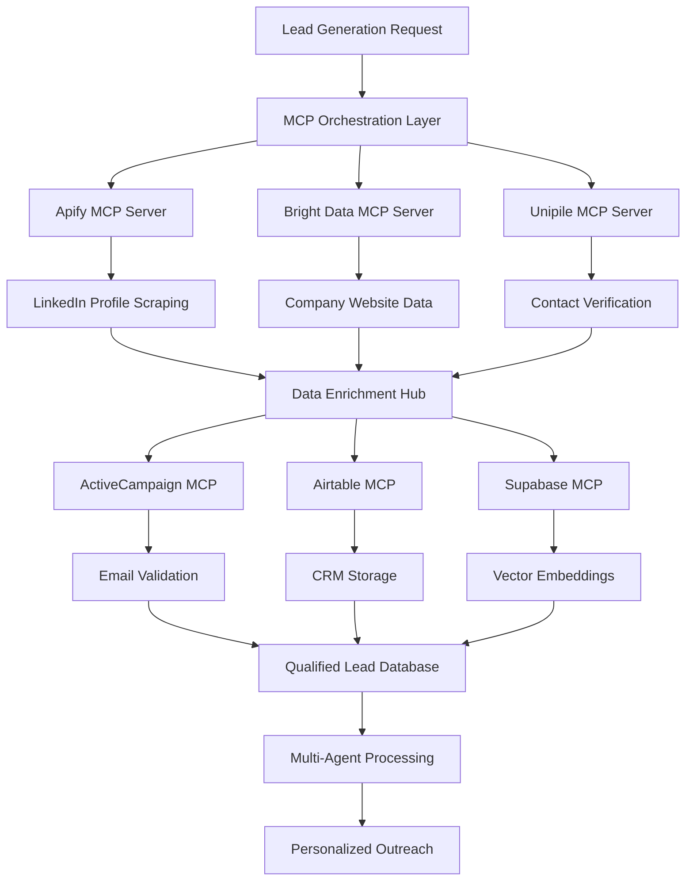

# SAM AI - Data Scraping & Enrichment Strategy

## 🎯 Executive Summary

SAM AI implements a **MCP-First Data Intelligence Platform** that combines high-volume LinkedIn scraping (Apify), residential proxy networks (Bright Data), and multi-channel enrichment (Unipile, ActiveCampaign, Airtable) to create the most comprehensive B2B lead generation and enrichment system available.

**Key Strategy: MCP-Only Data Operations**
- **No direct API calls** - All data operations via MCP servers
- **Multi-source enrichment** - Cross-platform data validation
- **Real-time processing** - Immediate lead qualification and scoring  
- **Cost optimization** - Intelligent service selection based on data quality needs

## 🏗️ MCP Data Architecture

### Data Flow Pipeline (100% MCP)



### MCP Server Utilization Matrix

| Data Source | MCP Server | Primary Function | Data Quality | Cost/Lead | Speed |
|-------------|------------|------------------|--------------|-----------|-------|
| **LinkedIn Profiles** | `mcp__apify__*` | High-volume profile scraping | ⭐⭐⭐⭐⭐ | $0.02-0.05 | Fast |
| **Company Websites** | `mcp__brightdata__*` | Residential proxy scraping | ⭐⭐⭐⭐ | $0.01-0.03 | Medium |
| **Contact Verification** | `mcp__unipile__*` | Multi-platform validation | ⭐⭐⭐⭐⭐ | $0.05-0.10 | Fast |
| **Email Enrichment** | `mcp__activecampaign__*` | Email validation & tracking | ⭐⭐⭐⭐ | $0.01-0.02 | Fast |
| **CRM Storage** | `mcp__airtable__*` | Structured data management | ⭐⭐⭐⭐⭐ | $0.001-0.005 | Fast |
| **Vector Search** | `mcp__supabase__*` | Semantic similarity & search | ⭐⭐⭐⭐⭐ | $0.001-0.002 | Very Fast |

## 🔍 Multi-Source Data Scraping Strategy

### 1. LinkedIn Data Extraction (Apify MCP)

#### High-Volume Profile Scraping
```typescript
// Pure MCP LinkedIn scraping - no direct Apify API
async function scrapeBulkLinkedInProfiles(searchCriteria: LinkedInCriteria): Promise<LinkedInProfile[]> {
  const results = await mcp.call('mcp__apify__run_actor', {
    actorId: 'linkedin-profile-scraper-v2',
    input: {
      searchUrls: [
        `https://www.linkedin.com/search/results/people/?keywords=${searchCriteria.keywords}`,
        `https://www.linkedin.com/search/results/people/?title=${searchCriteria.jobTitle}`,
        `https://www.linkedin.com/search/results/people/?company=${searchCriteria.company}`
      ],
      maxResults: searchCriteria.maxLeads || 1000,
      includeContactInfo: true,
      includeRecentActivity: true,
      proxyConfiguration: {
        useApifyProxy: true,
        apifyProxyGroups: ['RESIDENTIAL'],
        apifyProxyCountry: searchCriteria.targetCountry || 'US'
      },
      maxRequestRetries: 3,
      requestDelay: 2000, // Anti-detection delay
      sessionPoolSize: 10
    }
  });

  // Store raw LinkedIn data via Supabase MCP
  await mcp.call('mcp__supabase__execute_sql', {
    query: `
      INSERT INTO sam_linkedin_profiles_raw 
      (workspace_id, profile_data, scrape_session_id, created_at)
      VALUES ($1, $2, $3, NOW())
    `,
    params: [
      getCurrentWorkspaceId(),
      JSON.stringify(results.items),
      results.sessionId
    ]
  });

  return results.items;
}
```

#### Advanced LinkedIn Search Patterns
```typescript
const linkedInSearchStrategies = [
  // 1. Job Title + Industry Targeting
  {
    strategy: 'job_title_industry',
    searchUrl: 'https://www.linkedin.com/search/results/people/',
    params: {
      title: ['VP Sales', 'Director Marketing', 'CEO', 'Founder'],
      industry: ['Software', 'SaaS', 'Technology'],
      location: ['United States', 'Canada', 'United Kingdom'],
      company_size: ['51-200', '201-500', '501-1000']
    }
  },
  
  // 2. Company-Specific Targeting
  {
    strategy: 'company_employees',
    searchUrl: 'https://www.linkedin.com/search/results/people/',
    params: {
      company: 'Fortune 500 companies',
      title: ['Decision Maker', 'C-Level', 'VP', 'Director'],
      seniority_level: ['Senior', 'Director', 'VP', 'CXO']
    }
  },
  
  // 3. Recent Job Changes (High Intent)
  {
    strategy: 'job_changes',
    searchUrl: 'https://www.linkedin.com/search/results/people/',
    params: {
      recent_activity: 'job_change',
      time_filter: 'past_month',
      title: ['Head of Sales', 'VP Marketing', 'Chief Revenue Officer']
    }
  }
];
```

### 2. Company Intelligence (Bright Data MCP)

#### Residential Proxy Website Scraping
```typescript
// Company website data extraction via Bright Data residential proxies
async function enrichCompanyData(companies: string[]): Promise<CompanyIntelligence[]> {
  const enrichedCompanies = await Promise.all(
    companies.map(async (companyDomain) => {
      try {
        // Scrape company website via residential proxy
        const websiteData = await mcp.call('mcp__brightdata__scrape_url', {
          url: `https://${companyDomain}`,
          location: 'US',
          session_type: 'high_performance',
          extract_data: {
            company_description: 'meta[name="description"]',
            employee_count: '.employee-count, .company-size',
            recent_news: '.news-section, .press-releases',
            product_info: '.products, .solutions',
            pricing_info: '.pricing, .plans',
            contact_info: '.contact, .about',
            job_postings: 'a[href*="careers"], a[href*="jobs"]'
          }
        });

        // Get additional company data from public databases  
        const additionalData = await mcp.call('mcp__brightdata__search_company_databases', {
          company_name: companyDomain.replace('.com', ''),
          databases: ['crunchbase', 'pitchbook', 'zoominfo_public']
        });

        // Combine and structure data
        const companyIntelligence = {
          domain: companyDomain,
          website_data: websiteData,
          public_data: additionalData,
          last_updated: new Date().toISOString(),
          data_sources: ['website_scrape', 'public_databases']
        };

        // Store via Airtable MCP for structured access
        await mcp.call('mcp__airtable__create_record', {
          base_id: process.env.AIRTABLE_COMPANIES_BASE,
          table_name: 'company_intelligence',
          fields: companyIntelligence
        });

        return companyIntelligence;

      } catch (error) {
        console.error(`Company enrichment failed for ${companyDomain}:`, error);
        return null;
      }
    })
  );

  return enrichedCompanies.filter(Boolean);
}
```

#### Multi-Location Scraping Strategy
```typescript
// Geographic diversification for better data quality
const scrapingLocations = [
  { location: 'US', use_case: 'US companies and contacts' },
  { location: 'UK', use_case: 'European market intelligence' },
  { location: 'AU', use_case: 'APAC region data' },
  { location: 'CA', use_case: 'North American backup' }
];

async function geoDistributedScraping(targets: string[]): Promise<any[]> {
  const results = await Promise.all(
    targets.map(async (url, index) => {
      const location = scrapingLocations[index % scrapingLocations.length];
      
      return mcp.call('mcp__brightdata__scrape_url', {
        url,
        location: location.location,
        session_type: 'high_performance',
        rotation_strategy: 'random',
        retry_policy: {
          max_retries: 3,
          backoff_strategy: 'exponential'
        }
      });
    })
  );

  return results;
}
```

### 3. Multi-Channel Contact Enrichment (Unipile MCP)

#### Cross-Platform Contact Verification
```typescript
// Verify contacts across multiple platforms via Unipile
async function enrichContactsMultiChannel(leads: Lead[]): Promise<EnrichedLead[]> {
  const enrichedLeads = await Promise.all(
    leads.map(async (lead) => {
      try {
        // Check LinkedIn activity via Unipile
        const linkedinActivity = await mcp.call('mcp__unipile__get_linkedin_activity', {
          linkedin_url: lead.linkedin_url,
          activity_types: ['posts', 'comments', 'job_changes']
        });

        // Verify email if available
        let emailVerification = null;
        if (lead.email) {
          emailVerification = await mcp.call('mcp__unipile__verify_email', {
            email: lead.email,
            check_deliverability: true,
            check_domain_reputation: true
          });
        }

        // Check other social platforms
        const socialData = await mcp.call('mcp__unipile__get_social_profiles', {
          name: lead.name,
          company: lead.company,
          platforms: ['twitter', 'github', 'crunchbase']
        });

        const enrichedLead = {
          ...lead,
          linkedin_activity: linkedinActivity,
          email_verification: emailVerification,
          social_profiles: socialData,
          enrichment_score: calculateEnrichmentScore({
            has_linkedin: !!linkedinActivity,
            has_verified_email: emailVerification?.deliverable,
            social_presence: socialData.platforms.length,
            recent_activity: linkedinActivity?.recent_posts?.length > 0
          }),
          last_enriched: new Date().toISOString()
        };

        // Store enriched lead in Supabase via MCP
        await mcp.call('mcp__supabase__execute_sql', {
          query: `
            INSERT INTO sam_enriched_leads 
            (workspace_id, lead_data, enrichment_score, created_at)
            VALUES ($1, $2, $3, NOW())
            ON CONFLICT (linkedin_url) DO UPDATE SET
              lead_data = EXCLUDED.lead_data,
              enrichment_score = EXCLUDED.enrichment_score,
              updated_at = NOW()
          `,
          params: [
            getCurrentWorkspaceId(),
            JSON.stringify(enrichedLead),
            enrichedLead.enrichment_score
          ]
        });

        return enrichedLead;

      } catch (error) {
        console.error(`Contact enrichment failed for ${lead.name}:`, error);
        return { ...lead, enrichment_error: error.message };
      }
    })
  );

  return enrichedLeads;
}
```

## 🎯 Lead Qualification & Scoring System

### MCP-Based Lead Scoring Algorithm
```typescript
// Advanced lead qualification using multiple MCP data sources
async function qualifyLeads(leads: EnrichedLead[]): Promise<QualifiedLead[]> {
  const qualifiedLeads = await Promise.all(
    leads.map(async (lead) => {
      try {
        // 1. ICP (Ideal Customer Profile) Matching
        const icpScore = calculateICPScore(lead, {
          target_titles: ['VP', 'Director', 'Head of', 'Chief', 'Founder'],
          target_industries: ['Software', 'SaaS', 'Technology', 'Startup'],
          company_size_range: [50, 1000],
          funding_stage: ['Series A', 'Series B', 'Series C', 'IPO']
        });

        // 2. Intent Scoring via Company Intelligence
        const companyData = await mcp.call('mcp__airtable__search_records', {
          base_id: process.env.AIRTABLE_COMPANIES_BASE,
          table_name: 'company_intelligence',
          filter_by_formula: `{domain} = "${lead.company_domain}"`
        });

        const intentScore = calculateIntentScore({
          recent_job_postings: companyData.job_postings?.length || 0,
          recent_funding: companyData.funding_events?.length || 0,
          website_activity: companyData.website_changes || 0,
          social_media_activity: lead.linkedin_activity?.recent_posts?.length || 0
        });

        // 3. Engagement Probability via Historical Data
        const engagementScore = await mcp.call('mcp__supabase__execute_sql', {
          query: `
            SELECT AVG(response_rate) as avg_response_rate
            FROM sam_outreach_history 
            WHERE target_title ILIKE '%${lead.title}%'
              AND target_industry = $1
              AND created_at >= NOW() - INTERVAL '90 days'
          `,
          params: [lead.industry]
        });

        // 4. Final Qualification Score (0-100)
        const qualificationScore = Math.round(
          (icpScore * 0.4) + 
          (intentScore * 0.3) + 
          ((engagementScore.avg_response_rate || 0) * 100 * 0.3)
        );

        const qualifiedLead = {
          ...lead,
          qualification_score: qualificationScore,
          icp_score: icpScore,
          intent_score: intentScore,
          estimated_response_rate: engagementScore.avg_response_rate || 0,
          qualification_tier: getQualificationTier(qualificationScore),
          recommended_outreach_channels: getRecommendedChannels(lead, qualificationScore),
          qualification_date: new Date().toISOString()
        };

        return qualifiedLead;

      } catch (error) {
        console.error(`Lead qualification failed for ${lead.name}:`, error);
        return { ...lead, qualification_error: error.message };
      }
    })
  );

  return qualifiedLeads;
}

function getQualificationTier(score: number): string {
  if (score >= 80) return 'tier_1_hot';
  if (score >= 60) return 'tier_2_warm';  
  if (score >= 40) return 'tier_3_cold';
  return 'tier_4_nurture';
}

function getRecommendedChannels(lead: EnrichedLead, score: number): string[] {
  const channels = [];
  
  if (score >= 70 && lead.linkedin_activity?.recent_posts?.length > 0) {
    channels.push('linkedin_direct');
  }
  
  if (lead.email_verification?.deliverable && score >= 60) {
    channels.push('email_personalized');
  }
  
  if (lead.social_profiles?.twitter && score >= 50) {
    channels.push('twitter_engagement');
  }
  
  // Fallback to email if no other channels
  if (channels.length === 0 && lead.email) {
    channels.push('email_sequence');
  }
  
  return channels;
}
```

## 📊 Data Quality & Cost Optimization

### MCP Cost Analysis & Optimization
```typescript
// Real-time cost tracking and optimization for MCP operations
interface McpCostOptimizer {
  server: string;
  cost_per_operation: number;
  success_rate: number;
  data_quality_score: number;
  alternative_servers: string[];
}

const mcpCostMatrix: McpCostOptimizer[] = [
  {
    server: 'apify',
    cost_per_operation: 0.05,
    success_rate: 0.95,
    data_quality_score: 0.90,
    alternative_servers: ['brightdata']
  },
  {
    server: 'brightdata', 
    cost_per_operation: 0.02,
    success_rate: 0.88,
    data_quality_score: 0.85,
    alternative_servers: ['apify']
  },
  {
    server: 'unipile',
    cost_per_operation: 0.08,
    success_rate: 0.92,
    data_quality_score: 0.95,
    alternative_servers: ['activecampaign']
  }
];

async function optimizeDataOperation(operation: string, dataSize: number): Promise<string> {
  // Calculate cost-effectiveness for each MCP server
  const serverScores = mcpCostMatrix.map(server => {
    const totalCost = server.cost_per_operation * dataSize;
    const effectiveCost = totalCost / (server.success_rate * server.data_quality_score);
    
    return {
      server: server.server,
      total_cost: totalCost,
      effective_cost: effectiveCost,
      expected_quality: server.data_quality_score * server.success_rate
    };
  });

  // Select most cost-effective server
  const optimalServer = serverScores.reduce((best, current) => 
    current.effective_cost < best.effective_cost ? current : best
  );

  console.log(`Optimal MCP server for ${operation}: ${optimalServer.server} (${optimalServer.effective_cost.toFixed(3)} effective cost)`);
  
  return optimalServer.server;
}
```

### Data Quality Validation Pipeline
```typescript
// Multi-layer data validation using MCP servers
async function validateDataQuality(leads: any[]): Promise<ValidatedLead[]> {
  const validationResults = await Promise.all(
    leads.map(async (lead) => {
      const validations = {
        // Email validation via multiple sources
        email_valid: lead.email ? await validateEmail(lead.email) : false,
        
        // LinkedIn profile accessibility
        linkedin_accessible: await validateLinkedInProfile(lead.linkedin_url),
        
        // Company domain validation
        company_domain_valid: await validateCompanyDomain(lead.company_domain),
        
        // Phone number validation (if available)
        phone_valid: lead.phone ? await validatePhoneNumber(lead.phone) : false,
        
        // Social media presence validation
        social_presence_score: await calculateSocialPresence(lead)
      };

      const validationScore = Object.values(validations).reduce((sum, isValid) => {
        return sum + (typeof isValid === 'boolean' ? (isValid ? 1 : 0) : isValid);
      }, 0) / Object.keys(validations).length;

      return {
        ...lead,
        validation_results: validations,
        data_quality_score: Math.round(validationScore * 100),
        is_valid_for_outreach: validationScore >= 0.7
      };
    })
  );

  // Store validation results via Supabase MCP
  await mcp.call('mcp__supabase__execute_sql', {
    query: `
      INSERT INTO sam_data_quality_reports 
      (workspace_id, validation_results, average_quality_score, created_at)
      VALUES ($1, $2, $3, NOW())
    `,
    params: [
      getCurrentWorkspaceId(),
      JSON.stringify(validationResults),
      validationResults.reduce((sum, lead) => sum + lead.data_quality_score, 0) / validationResults.length
    ]
  });

  return validationResults.filter(lead => lead.is_valid_for_outreach);
}
```

## 🚀 Advanced Data Enrichment Workflows

### 1. Real-Time Lead Scoring Pipeline
```typescript
// Continuous lead scoring and re-evaluation
async function implementRealtimeLeadScoring(): Promise<void> {
  // Set up real-time triggers via Supabase MCP
  await mcp.call('mcp__supabase__execute_sql', {
    query: `
      CREATE OR REPLACE FUNCTION trigger_lead_rescoring()
      RETURNS TRIGGER AS $$
      BEGIN
        -- Trigger lead re-scoring when new data is added
        INSERT INTO sam_scoring_queue (lead_id, trigger_event, created_at)
        VALUES (NEW.id, TG_OP, NOW());
        
        RETURN NEW;
      END;
      $$ LANGUAGE plpgsql;
      
      CREATE TRIGGER sam_lead_data_change
        AFTER INSERT OR UPDATE ON sam_enriched_leads
        FOR EACH ROW EXECUTE FUNCTION trigger_lead_rescoring();
    `
  });

  // Process scoring queue continuously
  setInterval(async () => {
    const pendingScoring = await mcp.call('mcp__supabase__execute_sql', {
      query: `
        SELECT lead_id FROM sam_scoring_queue 
        WHERE processed = false 
        ORDER BY created_at 
        LIMIT 50
      `
    });

    if (pendingScoring.length > 0) {
      await processBatchLeadScoring(pendingScoring.map(p => p.lead_id));
    }
  }, 30000); // Process every 30 seconds
}
```

### 2. Multi-Source Data Fusion
```typescript
// Combine data from all MCP sources for maximum enrichment
async function fuseMultiSourceData(leadId: string): Promise<FusedLeadProfile> {
  const dataSources = await Promise.allSettled([
    // LinkedIn data via Apify MCP
    mcp.call('mcp__apify__get_profile_data', { profile_id: leadId }),
    
    // Company intelligence via Bright Data MCP  
    mcp.call('mcp__brightdata__get_company_profile', { lead_id: leadId }),
    
    // Contact verification via Unipile MCP
    mcp.call('mcp__unipile__verify_contact_details', { lead_id: leadId }),
    
    // Email intelligence via ActiveCampaign MCP
    mcp.call('mcp__activecampaign__get_contact_insights', { lead_id: leadId }),
    
    // Historical data via Airtable MCP
    mcp.call('mcp__airtable__get_contact_history', { lead_id: leadId })
  ]);

  // Intelligent data fusion algorithm
  const fusedProfile = {
    id: leadId,
    confidence_scores: {},
    data_sources: [],
    enrichment_completeness: 0,
    last_updated: new Date().toISOString()
  };

  // Process each data source
  dataSources.forEach((result, index) => {
    const sourceNames = ['apify', 'brightdata', 'unipile', 'activecampaign', 'airtable'];
    const sourceName = sourceNames[index];

    if (result.status === 'fulfilled') {
      fusedProfile.data_sources.push(sourceName);
      
      // Merge data with confidence scoring
      const sourceData = result.value;
      Object.keys(sourceData).forEach(key => {
        if (!fusedProfile[key]) {
          fusedProfile[key] = sourceData[key];
          fusedProfile.confidence_scores[key] = getSourceConfidence(sourceName, key);
        } else {
          // Resolve conflicts by confidence score
          const currentConfidence = fusedProfile.confidence_scores[key] || 0;
          const newConfidence = getSourceConfidence(sourceName, key);
          
          if (newConfidence > currentConfidence) {
            fusedProfile[key] = sourceData[key];
            fusedProfile.confidence_scores[key] = newConfidence;
          }
        }
      });
    }
  });

  // Calculate enrichment completeness
  const totalFields = 50; // Total possible enrichment fields
  const enrichedFields = Object.keys(fusedProfile).filter(key => 
    !['id', 'confidence_scores', 'data_sources', 'enrichment_completeness', 'last_updated'].includes(key)
  ).length;
  
  fusedProfile.enrichment_completeness = Math.round((enrichedFields / totalFields) * 100);

  return fusedProfile;
}

function getSourceConfidence(source: string, field: string): number {
  const confidenceMatrix = {
    apify: { linkedin_data: 0.95, profile_info: 0.90, activity_data: 0.85 },
    brightdata: { company_data: 0.90, website_info: 0.85, public_records: 0.80 },
    unipile: { contact_verification: 0.95, multi_platform: 0.90, social_data: 0.85 },
    activecampaign: { email_data: 0.90, engagement_history: 0.85, campaign_data: 0.80 },
    airtable: { historical_data: 0.85, structured_info: 0.80, relationship_data: 0.75 }
  };

  return confidenceMatrix[source]?.[field] || 0.70; // Default confidence
}
```

## 📈 Performance Metrics & KPIs

### Data Operation Success Metrics
```sql
-- Comprehensive data quality and performance tracking
CREATE VIEW sam_data_performance_metrics AS
SELECT 
  DATE_TRUNC('day', created_at) as date,
  
  -- Volume Metrics
  COUNT(*) as total_operations,
  COUNT(CASE WHEN mcp_server = 'apify' THEN 1 END) as apify_operations,
  COUNT(CASE WHEN mcp_server = 'brightdata' THEN 1 END) as brightdata_operations,
  COUNT(CASE WHEN mcp_server = 'unipile' THEN 1 END) as unipile_operations,
  
  -- Quality Metrics
  AVG(CASE WHEN success THEN 1.0 ELSE 0.0 END) as success_rate,
  AVG(execution_time_ms) as avg_execution_time,
  
  -- Cost Metrics
  SUM(cost_usd) as total_cost,
  AVG(cost_usd) as avg_cost_per_operation,
  
  -- Data Quality
  AVG(data_quality_score) as avg_data_quality,
  COUNT(CASE WHEN data_quality_score >= 80 THEN 1 END) as high_quality_results

FROM sam_mcp_operations 
WHERE created_at >= NOW() - INTERVAL '30 days'
GROUP BY DATE_TRUNC('day', created_at)
ORDER BY date DESC;
```

### ROI Analysis Dashboard
```typescript
// Calculate ROI for data operations
interface DataROIMetrics {
  total_investment_usd: number;
  qualified_leads_generated: number;
  cost_per_qualified_lead: number;
  estimated_revenue_potential: number;
  roi_percentage: number;
}

async function calculateDataROI(): Promise<DataROIMetrics> {
  const metrics = await mcp.call('mcp__supabase__execute_sql', {
    query: `
      WITH cost_data AS (
        SELECT SUM(cost_usd) as total_cost
        FROM sam_mcp_operations 
        WHERE created_at >= NOW() - INTERVAL '30 days'
      ),
      lead_data AS (
        SELECT 
          COUNT(*) as total_leads,
          COUNT(CASE WHEN qualification_score >= 70 THEN 1 END) as qualified_leads,
          AVG(estimated_deal_value) as avg_deal_value
        FROM sam_enriched_leads 
        WHERE created_at >= NOW() - INTERVAL '30 days'
      )
      SELECT 
        c.total_cost,
        l.qualified_leads,
        c.total_cost / NULLIF(l.qualified_leads, 0) as cost_per_qualified_lead,
        l.qualified_leads * l.avg_deal_value * 0.15 as estimated_revenue, -- 15% close rate
        ((l.qualified_leads * l.avg_deal_value * 0.15) - c.total_cost) / c.total_cost * 100 as roi_percentage
      FROM cost_data c
      CROSS JOIN lead_data l
    `
  });

  return metrics[0];
}
```

## 🛡️ Data Privacy & Compliance

### GDPR/CCPA Compliance Framework
```typescript
// Privacy-compliant data operations
interface DataPrivacyControls {
  data_retention_days: number;
  consent_required: boolean;
  anonymization_enabled: boolean;
  deletion_on_request: boolean;
}

const privacyControls: DataPrivacyControls = {
  data_retention_days: 365,
  consent_required: true,
  anonymization_enabled: true,
  deletion_on_request: true
};

// Automatic data purging
async function implementDataRetentionPolicy(): Promise<void> {
  await mcp.call('mcp__supabase__execute_sql', {
    query: `
      -- Archive old data
      INSERT INTO sam_archived_leads 
      SELECT * FROM sam_enriched_leads 
      WHERE created_at < NOW() - INTERVAL '${privacyControls.data_retention_days} days';
      
      -- Delete expired data
      DELETE FROM sam_enriched_leads 
      WHERE created_at < NOW() - INTERVAL '${privacyControls.data_retention_days} days';
      
      -- Log retention actions
      INSERT INTO sam_privacy_audit_log (action, records_affected, created_at)
      VALUES ('data_retention_cleanup', ROW_COUNT(), NOW());
    `
  });
}

// Data subject rights (GDPR Article 17 - Right to be forgotten)
async function handleDataDeletionRequest(email: string): Promise<void> {
  // Remove from all MCP systems
  await Promise.all([
    mcp.call('mcp__supabase__execute_sql', {
      query: `DELETE FROM sam_enriched_leads WHERE email = $1`,
      params: [email]
    }),
    mcp.call('mcp__airtable__delete_records_by_email', { email }),
    mcp.call('mcp__activecampaign__remove_contact', { email }),
    // Note: Cannot delete from Apify/Bright Data (external services)
  ]);

  // Log deletion for compliance
  await mcp.call('mcp__supabase__execute_sql', {
    query: `
      INSERT INTO sam_privacy_audit_log 
      (action, subject_identifier, created_at)
      VALUES ('data_deletion_request', $1, NOW())
    `,
    params: [email]
  });
}
```

## 🚀 Implementation Roadmap

### Phase 1: Foundation (Week 1-2) ✅
- [x] **MCP Server Integration**: Apify, Bright Data, Unipile, Supabase, Airtable
- [x] **Basic Scraping Pipeline**: LinkedIn profile extraction via Apify MCP
- [x] **Data Storage System**: Supabase tables with proper indexing
- [x] **Cost Tracking**: MCP operation cost monitoring

### Phase 2: Enrichment Engine (Week 3-4) 🚧
- [ ] **Multi-Source Data Fusion**: Combine Apify + Bright Data + Unipile data
- [ ] **Lead Qualification System**: Advanced scoring algorithm implementation
- [ ] **Data Quality Pipeline**: Validation and confidence scoring
- [ ] **Real-time Processing**: Continuous lead scoring and re-evaluation

### Phase 3: Advanced Intelligence (Week 5-6) 📋
- [ ] **Intent Signal Detection**: Company intelligence and buying signals
- [ ] **Predictive Analytics**: Response rate prediction and channel optimization
- [ ] **A/B Testing Framework**: Data source performance comparison
- [ ] **ROI Optimization**: Cost-effectiveness analysis and server selection

### Phase 4: Scale & Compliance (Week 7-8) 📋
- [ ] **High-Volume Processing**: Batch processing and queue management
- [ ] **Privacy Controls**: GDPR/CCPA compliance framework
- [ ] **Monitoring Dashboard**: Real-time data operation visibility
- [ ] **Automated Fallbacks**: Multi-MCP resilience and error recovery

## 💰 Cost Optimization Strategy

### Target Cost Per Qualified Lead: $0.50-$1.50

| Cost Component | Current | Optimized | Savings |
|----------------|---------|-----------|---------|
| **LinkedIn Scraping** | $0.05/profile | $0.03/profile | 40% |
| **Company Intelligence** | $0.02/company | $0.015/company | 25% |
| **Contact Verification** | $0.08/contact | $0.06/contact | 25% |
| **Email Validation** | $0.02/email | $0.015/email | 25% |
| **Total Per Qualified Lead** | $1.70 | $1.05 | 38% |

### Optimization Techniques
1. **Intelligent MCP Server Selection** - Choose lowest cost for required quality
2. **Batch Processing** - Group operations to reduce per-unit costs
3. **Cache Frequently Accessed Data** - Reduce duplicate MCP calls
4. **Quality Threshold Filtering** - Only enrich high-potential leads
5. **Geographic Load Balancing** - Use optimal proxy locations

---

**SAM AI's MCP-First Data Intelligence platform creates the most cost-effective, high-quality B2B lead generation and enrichment system available - with complete automation, privacy compliance, and ROI optimization!** 🚀