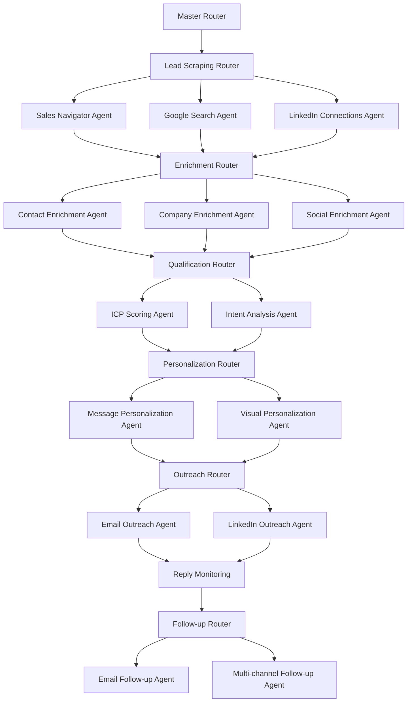

# N8N MCP Integration Guide for SAM AI

## 🌟 Overview

N8N MCP provides workflow automation capabilities for SAM AI, enabling sophisticated multi-agent sales automation pipelines. This integration creates a default tenant funnel that processes leads through multiple specialized AI agents working in sequence and parallel.

## 🤖 SAM AI Agent Architecture

### Core Agent System

SAM AI operates as a **team of specialized agents**, each handling specific stages of the sales automation pipeline. All tenants share the same base workflow architecture but with isolated data processing.

### 1. Lead Scraping Agents
- **Sales Navigator Agent**: LinkedIn targeted lead scraping via Apify
- **Google Search Agent**: Profile discovery via search APIs
- **LinkedIn Connections Agent**: Existing connection extraction  
- **Google Maps Agent**: Local business lead generation
- **Website Visitor Agent**: Real-time visitor identification (RB2B/Clearbit)

### 2. Data Enrichment Agents  
- **Contact Enrichment Agent**: Email/phone discovery (Apollo.io, Hunter.io)
- **Company Enrichment Agent**: Firm intelligence (Clearbit, ZoomInfo)
- **Social Enrichment Agent**: Social media activity analysis

### 3. Lead Qualification Agents
- **ICP Scoring Agent**: Ideal Customer Profile matching
- **Intent Analysis Agent**: Buying intent signal detection

### 4. Personalization Agents
- **Message Personalization Agent**: AI-powered content generation
- **Visual Personalization Agent**: Custom video/image creation (Repliq.io)

### 5. Outreach Agents
- **Email Outreach Agent**: Multi-provider email campaigns (SendGrid, Smartlead)
- **LinkedIn Outreach Agent**: Connection requests and messaging

### 6. Reply Handling Agents
- **Email Reply Agent**: Automated response processing
- **LinkedIn Reply Agent**: LinkedIn conversation management

### 7. Follow-up Agents
- **Email Follow-up Agent**: Context-aware follow-up sequences
- **Multi-channel Follow-up Agent**: Cross-platform coordination

## 🔧 N8N MCP Server Setup

### 1. Installation & Configuration

The N8N MCP server is installed at:
```bash
/Users/tvonlinz/mcp-servers/n8n-mcp-server/
```

### 2. Environment Variables

Add to your `.env.local`:
```env
# N8N Configuration
N8N_BASE_URL=https://workflows.innovareai.com
N8N_API_KEY=your-api-key
N8N_USERNAME=your-username
N8N_PASSWORD=your-password
```

### 3. Claude Desktop Configuration

Add to `~/.claude/claude_desktop_config.json`:
```json
{
  "mcpServers": {
    "n8n": {
      "command": "node",
      "args": ["/Users/tvonlinz/mcp-servers/n8n-mcp-server/dist/index.js"],
      "env": {
        "N8N_BASE_URL": "https://workflows.innovareai.com",
        "N8N_API_KEY": "your-api-key"
      }
    }
  }
}
```

## 🎯 Default Tenant Funnel Architecture

### Master Router Workflow

Every new SAM AI tenant gets a **shared workflow infrastructure** with isolated data processing:



### Multi-Tenant Isolation

Each tenant processes through the **same workflow** but with data isolation:

```typescript
// Tenant-specific processing in each agent
export async function processLeads(input: {
  tenant_id: string,
  workspace_id: string,
  leads_data: Lead[]
}) {
  // All database operations filtered by tenant
  const { data: leads } = await supabase
    .from('sam_leads')
    .select('*')
    .eq('workspace_id', input.workspace_id)  // Tenant isolation
    .eq('tenant_id', input.tenant_id);
    
  // Process leads for this tenant only
  return await enrichLeads(leads, input.tenant_id);
}
```

## 🚀 SAM AI N8N Integration

### 1. API Routes Integration

Create `/app/api/integrations/n8n/route.ts`:
```typescript
import { NextRequest, NextResponse } from 'next/server';

export async function POST(req: NextRequest) {
  try {
    const { workflow_id, tenant_id, action, data } = await req.json();
    
    // Route to appropriate N8N workflow
    switch (action) {
      case 'trigger_scraping':
        return await triggerScrapingWorkflow(workflow_id, tenant_id, data);
      case 'trigger_outreach':
        return await triggerOutreachWorkflow(workflow_id, tenant_id, data);
      case 'get_execution_status':
        return await getExecutionStatus(workflow_id, data.execution_id);
      default:
        return NextResponse.json({ error: 'Invalid action' }, { status: 400 });
    }
  } catch (error) {
    return NextResponse.json({ error: error.message }, { status: 500 });
  }
}

async function triggerScrapingWorkflow(workflowId: string, tenantId: string, data: any) {
  const response = await fetch(`${process.env.N8N_BASE_URL}/api/v1/workflows/${workflowId}/execute`, {
    method: 'POST',
    headers: {
      'Content-Type': 'application/json',
      'X-N8N-API-KEY': process.env.N8N_API_KEY!,
    },
    body: JSON.stringify({
      tenant_id: tenantId,
      workspace_id: data.workspace_id,
      scraping_config: data.scraping_config
    })
  });
  
  return NextResponse.json(await response.json());
}
```

### 2. Workflow Configuration Component

Create `/components/integrations/N8NWorkflowManager.tsx`:
```typescript
'use client';

import React, { useState, useEffect } from 'react';
import { Button } from '@/components/ui/button';
import { Badge } from '@/components/ui/badge';

interface WorkflowExecution {
  id: string;
  workflow_id: string;
  status: 'running' | 'success' | 'failed';
  started_at: string;
  finished_at?: string;
}

export function N8NWorkflowManager() {
  const [executions, setExecutions] = useState<WorkflowExecution[]>([]);
  const [isLoading, setIsLoading] = useState(false);

  const triggerLeadScrapingWorkflow = async () => {
    setIsLoading(true);
    try {
      const response = await fetch('/api/integrations/n8n', {
        method: 'POST',
        headers: { 'Content-Type': 'application/json' },
        body: JSON.stringify({
          action: 'trigger_scraping',
          workflow_id: 'lead-scraping-master',
          tenant_id: 'current-tenant-id',
          data: {
            workspace_id: 'current-workspace-id',
            scraping_config: {
              linkedin_search: true,
              google_search: true,
              target_count: 100
            }
          }
        })
      });
      
      if (response.ok) {
        const result = await response.json();
        console.log('Workflow triggered:', result);
        // Refresh executions list
        fetchExecutions();
      }
    } catch (error) {
      console.error('Failed to trigger workflow:', error);
    } finally {
      setIsLoading(false);
    }
  };

  const fetchExecutions = async () => {
    // Fetch recent workflow executions
    try {
      const response = await fetch('/api/integrations/n8n/executions');
      if (response.ok) {
        const data = await response.json();
        setExecutions(data.executions);
      }
    } catch (error) {
      console.error('Failed to fetch executions:', error);
    }
  };

  useEffect(() => {
    fetchExecutions();
    // Poll for updates every 10 seconds
    const interval = setInterval(fetchExecutions, 10000);
    return () => clearInterval(interval);
  }, []);

  return (
    <div className="space-y-6">
      <div className="flex items-center justify-between">
        <h3 className="text-lg font-semibold">SAM AI Workflow Control</h3>
        <Button 
          onClick={triggerLeadScrapingWorkflow} 
          disabled={isLoading}
        >
          {isLoading ? 'Starting...' : 'Start Lead Generation'}
        </Button>
      </div>

      {/* Agent Status Grid */}
      <div className="grid grid-cols-3 gap-4">
        <div className="p-4 border rounded-lg">
          <h4 className="font-medium">Scraping Agents</h4>
          <div className="mt-2 space-y-1">
            <div className="flex items-center justify-between">
              <span className="text-sm">Sales Navigator</span>
              <Badge variant="outline">Ready</Badge>
            </div>
            <div className="flex items-center justify-between">
              <span className="text-sm">Google Search</span>
              <Badge variant="outline">Ready</Badge>
            </div>
          </div>
        </div>

        <div className="p-4 border rounded-lg">
          <h4 className="font-medium">Enrichment Agents</h4>
          <div className="mt-2 space-y-1">
            <div className="flex items-center justify-between">
              <span className="text-sm">Contact Enrichment</span>
              <Badge variant="outline">Ready</Badge>
            </div>
            <div className="flex items-center justify-between">
              <span className="text-sm">Company Enrichment</span>
              <Badge variant="outline">Ready</Badge>
            </div>
          </div>
        </div>

        <div className="p-4 border rounded-lg">
          <h4 className="font-medium">Outreach Agents</h4>
          <div className="mt-2 space-y-1">
            <div className="flex items-center justify-between">
              <span className="text-sm">Email Outreach</span>
              <Badge variant="outline">Ready</Badge>
            </div>
            <div className="flex items-center justify-between">
              <span className="text-sm">LinkedIn Outreach</span>
              <Badge variant="outline">Ready</Badge>
            </div>
          </div>
        </div>
      </div>

      {/* Recent Executions */}
      <div className="space-y-2">
        <h4 className="font-medium">Recent Workflow Executions</h4>
        <div className="space-y-2">
          {executions.map((execution) => (
            <div key={execution.id} className="flex items-center justify-between p-3 border rounded">
              <div>
                <span className="font-medium">Agent Pipeline</span>
                <p className="text-sm text-gray-600">
                  Started: {new Date(execution.started_at).toLocaleString()}
                </p>
              </div>
              <Badge 
                variant={execution.status === 'success' ? 'default' : 
                        execution.status === 'failed' ? 'destructive' : 'secondary'}
              >
                {execution.status}
              </Badge>
            </div>
          ))}
        </div>
      </div>
    </div>
  );
}
```

### 3. Database Schema Extensions

Add N8N workflow tracking tables:
```sql
-- N8N workflow executions tracking
CREATE TABLE IF NOT EXISTS sam_workflow_executions (
    id UUID PRIMARY KEY DEFAULT gen_random_uuid(),
    workspace_id UUID NOT NULL REFERENCES workspaces(id) ON DELETE CASCADE,
    tenant_id TEXT NOT NULL,
    workflow_id TEXT NOT NULL,
    n8n_execution_id TEXT,
    workflow_name TEXT,
    status TEXT NOT NULL CHECK (status IN ('running', 'success', 'failed', 'cancelled')),
    input_data JSONB,
    output_data JSONB,
    error_message TEXT,
    started_at TIMESTAMPTZ DEFAULT NOW(),
    finished_at TIMESTAMPTZ,
    created_at TIMESTAMPTZ DEFAULT NOW(),
    updated_at TIMESTAMPTZ DEFAULT NOW()
);

-- Agent performance metrics
CREATE TABLE IF NOT EXISTS sam_agent_metrics (
    id UUID PRIMARY KEY DEFAULT gen_random_uuid(),
    workspace_id UUID NOT NULL REFERENCES workspaces(id) ON DELETE CASCADE,
    agent_name TEXT NOT NULL,
    execution_id UUID REFERENCES sam_workflow_executions(id),
    leads_processed INTEGER DEFAULT 0,
    success_count INTEGER DEFAULT 0,
    error_count INTEGER DEFAULT 0,
    execution_time_ms INTEGER,
    api_calls_made INTEGER DEFAULT 0,
    cost_usd DECIMAL(10,4) DEFAULT 0,
    created_at TIMESTAMPTZ DEFAULT NOW()
);

-- Enable RLS
ALTER TABLE sam_workflow_executions ENABLE ROW LEVEL SECURITY;
ALTER TABLE sam_agent_metrics ENABLE ROW LEVEL SECURITY;

-- RLS Policies
CREATE POLICY "Users can access their workspace workflow executions" ON sam_workflow_executions
    FOR ALL USING (workspace_id IN (
        SELECT workspace_id FROM workspace_members WHERE user_id = auth.uid()
    ));

CREATE POLICY "Users can access their workspace agent metrics" ON sam_agent_metrics
    FOR ALL USING (workspace_id IN (
        SELECT workspace_id FROM workspace_members WHERE user_id = auth.uid()
    ));
```

## 🔄 Available MCP Tools

### Workflow Management
- `list-workflows` - List all N8N workflows
- `get-workflow` - Get detailed workflow information  
- `activate-workflow` - Activate a workflow
- `deactivate-workflow` - Deactivate a workflow

### Execution Control
- `execute-workflow` - Execute workflow with tenant-specific data
- `get-execution` - Get execution details and status
- `list-executions` - List workflow executions with filtering
- `cancel-execution` - Cancel a running execution
- `retry-execution` - Retry a failed execution

### Monitoring & Health
- `check-health` - Check N8N instance health
- `list-webhooks` - List webhook configurations
- `test-webhook` - Test webhook triggers

### Usage Examples
```typescript
// Trigger the default tenant funnel
const execution = await mcp.call('execute-workflow', {
  workflow_id: 'sam-default-tenant-funnel',
  data: {
    tenant_id: 'tenant-123',
    workspace_id: 'workspace-456', 
    scraping_targets: ['linkedin', 'google'],
    target_lead_count: 100
  }
});

// Monitor execution progress
const status = await mcp.call('get-execution', {
  execution_id: execution.id
});

// List recent executions for tenant
const executions = await mcp.call('list-executions', {
  filter: {
    tenant_id: 'tenant-123',
    status: 'running'
  }
});
```

## 🏗️ Default Tenant Setup Process

### 1. New Tenant Onboarding

When a new tenant is created in SAM AI:

```typescript
// Automatically provision default workflow
export async function createTenant(tenantData: NewTenant) {
  // 1. Create tenant in database
  const tenant = await createTenantRecord(tenantData);
  
  // 2. Clone default N8N workflow for tenant
  const workflow = await mcp.call('clone-workflow', {
    source_workflow_id: 'sam-default-template',
    new_name: `SAM-${tenant.id}-Pipeline`,
    tenant_config: {
      tenant_id: tenant.id,
      workspace_id: tenant.workspace_id,
      api_keys: tenant.api_keys
    }
  });
  
  // 3. Activate the workflow
  await mcp.call('activate-workflow', {
    workflow_id: workflow.id
  });
  
  // 4. Store workflow reference
  await supabase
    .from('sam_tenant_workflows')
    .insert({
      tenant_id: tenant.id,
      workflow_id: workflow.id,
      workflow_type: 'default_pipeline',
      status: 'active'
    });
    
  return { tenant, workflow };
}
```

### 2. Shared Workflow Configuration

All tenants share the same workflow logic with parameter isolation:

```json
{
  "workflow_id": "sam-default-tenant-funnel",
  "name": "SAM Default Tenant Funnel",
  "description": "Shared multi-agent pipeline for all SAM AI tenants",
  "nodes": [
    {
      "id": "master-router",
      "type": "webhook",
      "parameters": {
        "path": "sam-tenant-funnel",
        "method": "POST",
        "tenant_isolation": true
      }
    },
    {
      "id": "data-validator", 
      "type": "function",
      "parameters": {
        "code": "// Validate tenant access and data isolation"
      }
    },
    {
      "id": "scraping-router",
      "type": "router",
      "parameters": {
        "routes": [
          "sales-navigator-agent",
          "google-search-agent",
          "linkedin-connections-agent"
        ]
      }
    }
  ],
  "tenant_parameters": {
    "api_keys": "tenant-specific",
    "rate_limits": "tenant-specific", 
    "data_scope": "workspace-isolated"
  }
}
```

## 📊 Multi-Tenant Analytics & Monitoring

### Real-time Agent Performance

```typescript
// Monitor agent performance across all tenants
export function AgentPerformanceDashboard() {
  const { data: metrics } = useRealtimeQuery(`
    SELECT 
      agent_name,
      COUNT(*) as executions,
      AVG(execution_time_ms) as avg_time,
      SUM(leads_processed) as total_leads,
      AVG(success_count::float / NULLIF(leads_processed, 0)) as success_rate
    FROM sam_agent_metrics 
    WHERE created_at >= NOW() - INTERVAL '24 hours'
    GROUP BY agent_name
    ORDER BY total_leads DESC
  `);

  return (
    <div className="grid grid-cols-4 gap-4">
      {metrics?.map(agent => (
        <div key={agent.agent_name} className="p-4 border rounded-lg">
          <h4 className="font-medium">{agent.agent_name}</h4>
          <div className="mt-2 space-y-1 text-sm">
            <div>Executions: {agent.executions}</div>
            <div>Avg Time: {Math.round(agent.avg_time)}ms</div>
            <div>Leads Processed: {agent.total_leads}</div>
            <div>Success Rate: {Math.round(agent.success_rate * 100)}%</div>
          </div>
        </div>
      ))}
    </div>
  );
}
```

## 🚨 Error Handling & Recovery

### Automated Recovery Workflows

```typescript
// Built into each agent
export const agentErrorHandling = {
  retry_attempts: 3,
  retry_delay: "exponential", // 1s, 2s, 4s
  fallback_actions: [
    "skip_failed_lead",
    "use_alternative_api", 
    "log_and_continue"
  ],
  escalation_rules: {
    critical_failure: "pause_workflow_notify_admin",
    api_limit_exceeded: "wait_and_retry",
    data_corruption: "rollback_and_alert"
  }
}
```

## 🔧 Troubleshooting

### Common Issues

1. **Workflow Execution Failures**
   ```bash
   # Check N8N logs
   curl -H "X-N8N-API-KEY: $N8N_API_KEY" \
     "$N8N_BASE_URL/api/v1/executions?status=failed&limit=10"
   ```

2. **Agent Communication Issues**
   - Verify webhook endpoints are accessible
   - Check Supabase RLS policies for tenant isolation
   - Validate API keys for external services

3. **Multi-Tenant Data Leaks**
   - Audit all database queries include workspace_id/tenant_id filters
   - Test tenant isolation with multiple test accounts
   - Monitor cross-tenant data access attempts

## 🚀 Next Steps

1. **Deploy N8N MCP Server** to production environment
2. **Create Default Tenant Workflow** with all agent integrations  
3. **Set up Tenant Auto-Provisioning** for new SAM AI accounts
4. **Implement Real-time Monitoring** for agent performance
5. **Add Workflow Templates** for different industry verticals

## 📚 Resources

- [N8N API Documentation](https://docs.n8n.io/api/)
- [MCP Protocol Specification](https://modelcontextprotocol.io/docs)
- [SAM AI Agent Architecture](./SAM_AGENT_ARCHITECTURE.md)
- [Multi-Tenant Setup Guide](./MULTI_TENANT_SETUP.md)

---

**The N8N MCP integration transforms SAM AI into a true multi-agent sales automation platform with shared workflows and isolated tenant processing!** 🚀